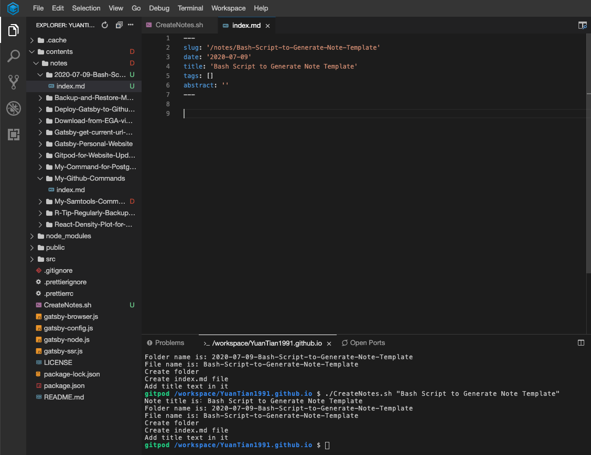

So the problem now is it's quite inconvinient to create new note. I need to click many times, type names for file and folder again and again. I wrote an sript to do that. It's bsically my first time in life to write bash script (and even proper bash code), so the style must be super ugly.

Firstly create a file named `CreateNotes.sh` in main folder. Then make it excutable.
```bash
chmod +x ./CreateNotes.sh
```

What I want is I can input a string as note title, which contains space like a normal sentence. For example **"Bash Script to Generate Note Template"**.

Then the script should be able to firstly get this argument, then using regex to replace all space into `-`, which is for url link and folder name purpose. So above sentence would be turn to **"Bash-Script-to-Generate-Note-Template"**

Also I want to timeStamp generated automatically on current day. So that the folder name could be joined by date and filename. It would help the rank and organize the notes folder.

Some key code is below:
```bash
# take first argument: Bash Script to Generate Note Template
title=$1 

# get current time stamp and format it: 
currentDate=$(date '+%Y-%m-%d') 

# regex replaced space as -: Bash-Script-to-Generate-Note-Template
filename="${title// /-}" 

# create folder name as: "2020-07-09-Bash-Script-to-Generate-Note-Template"
foldername="$currentDate-$filename" 

# create markdown file for writing
file="./contents/notes/$foldername/index.md"
```
After eveything above is done, I can create folder with simply `mkdir`, create file with `touch`. And finally add initial text for that.

The Final code:
```bash
#!/bin/bash
# A bash script help me to easily create folder/file/initialMessage for my personal website

echo "Note title is：$1";

title=$1
currentDate=$(date '+%Y-%m-%d')

filename="${title// /-}"
foldername="$currentDate-$filename"

echo "Folder name is: $foldername"
echo "File name is: $filename"

echo "Create folder"
mkdir "./contents/notes/$foldername"

file="./contents/notes/$foldername/index.md"

echo "Create index.md file"
touch $file

echo "Add title text in it"
echo "---
slug: '/notes/$filename'
date: '$currentDate'
title: '$title'
tags: []
abstract: ''
---
" >>  $file


```

Finally I trid the script in Gitpod, it works well. Just by typing below command
```bash
./CreateNotes.sh "Bash Script to Generate Note Template"
```

A folder, with corresponding file is created. I can directly open and start writing.

