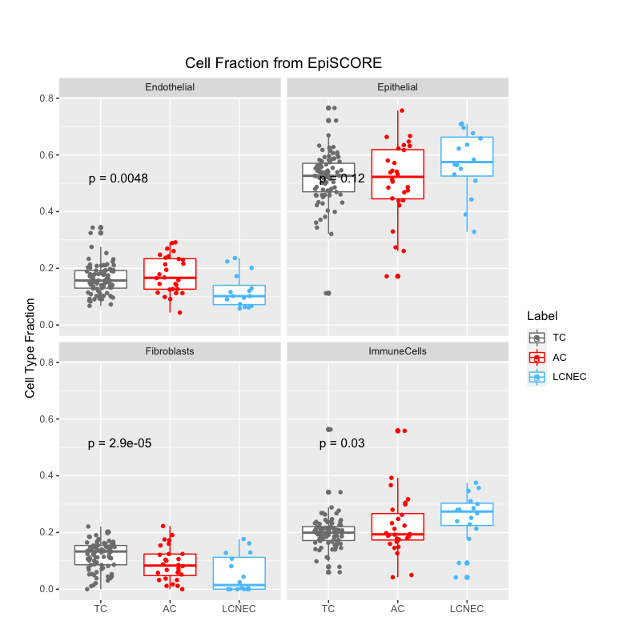

I used to only use pure R code to draw plots, it's not bad, but ggplot2 indeed do much better than I do. But it's not very easy to remember code from ggplot2. So here I record a bit code I used. Or better, form them into functions or even a small personal use R visualisation package in the future.

### Histogram

For example, histogram could be used to check p value quickly.

```r
library('ggplot2')

#head(DEG$pvalue)

#[1] 7.459678e-33 5.611091e-31 5.081911e-23 4.894006e-21 1.068582e-20
#[6] 1.921252e-20

ggplot(DEG, aes(x=pvalue)) + geom_histogram() + theme_minimal() + labs(title="p value histogram")
```


## PCA plot

The [ggfortify](https://cran.r-project.org/web/packages/ggfortify/vignettes/plot_pca.html) is a easy to use and beautiful tool for PCA visualisation. However, it seems the origin data must be data.frame format.

```r
library(ggfortify)

# TPM must be a data frame.
df <- TPM[,1:(ncol(TPM)-1)]
pca_res <- prcomp(df, scale. = TRUE)

autoplot(pca_res, data = TPM, colour = 'Mutation', size=5, main="PCA for Transcripts Per Kilobase Million (TPM Matrix)")
```


## Simple Boxplot

This is non-group boxplot, like showing values across various groups.

```r
library(ggplot2)

df <- data.frame(CF=CF[,1], pheno=RF$cohort)
df$Label<-factor(df$pheno, levels=c("TC", "AC",  "LCNEC")) # Reorder x axis by specify value

p <- ggplot(df, aes(x=Label, y=CF, color=Label)) +
    geom_boxplot(notch=FALSE) +
    geom_jitter(shape=16, position=position_jitter(0.2)) +
    scale_color_manual(values=c("#6c6c6c", "#ff0200", "#4ab7ff")) +
    labs(title="Epithelial", x="", y = "Cell Type Fraction") +
    theme(plot.margin=unit(c(2,2,2,2),"cm"), plot.title = element_text(hjust = 0.5)) +
    theme_light(base_size = 14)
```

The `df` object looks like this:

```r
> head(df)
             CF pheno Label
UCL61 0.6014421    TC    TC
UCL03 0.6345701    AC    AC
UCL04 0.4571514    TC    TC
UCL06 0.5656207    TC    TC
UCL07 0.7100541 LCNEC LCNEC
UCL39 0.7085020 LCNEC LCNEC
>
```


## Group Boxplot

This is a nice way to show a groups of boxplot, for example in my case, I have 4 cell types to show. And for each cell type, there is a list of phenotype to show boxplot.

```r
library("ggplot2")
library("ggpubr")

df <- list()
for(i in colnames(CF)){
    df[[i]] <- data.frame(CF=CF[,i], pheno=RF$cohort, Label=factor(RF$cohort, levels=c("TC", "AC",  "LCNEC")), CellType=i)
}
df <- do.call("rbind", df)

p <- ggplot(df, aes(Label, CF,color=Label)) +
    geom_boxplot(notch=FALSE)+
    geom_jitter(shape=16, position=position_jitter(0.2)) +
    facet_wrap(~CellType) +
    scale_color_manual(values=c("#6c6c6c", "#ff0200", "#4ab7ff")) +
    labs(title="Cell Fraction from EpiSCORE", x="", y = "Cell Type Fraction") +
    theme(plot.margin=unit(c(2,2,2,2),"cm"), plot.title = element_text(hjust = 0.5)) +
    stat_compare_means(method = "anova", label.y = 0.5, label = "p.format")
```
Below is how the `df` looks like:

```r
> dim(df)
[1] 508   4
> head(df)
                        CF pheno Label   CellType
Epithelial.UCL61 0.6014421    TC    TC Epithelial
Epithelial.UCL03 0.6345701    AC    AC Epithelial
Epithelial.UCL04 0.4571514    TC    TC Epithelial
Epithelial.UCL06 0.5656207    TC    TC Epithelial
Epithelial.UCL07 0.7100541 LCNEC LCNEC Epithelial
Epithelial.UCL39 0.7085020 LCNEC LCNEC Epithelial
>
```

Note that here the `stat_compare_means()` function is using Anova method.



## Boxplot with ggarange, alpha, margin twisted.

```R
    oneDMR$middleMethylated <- as.numeric(oneDMR$y1 >= 0.4 & oneDMR$y1 < 0.6)

    pScatter <- ggplot(oneDMR, aes(x=x0, y=y1, color=cellline, alpha=middleMethylated)) +
        geom_point() +
        labs(title='', x=qdapRegex::ex_between(oneDMR$chr[1], "\n", ":")[[1]][1]) +
        scale_color_manual(values=c("#6c6c6c", "#ff0200", "#4ab7ff")) +
        scale_alpha(guide = 'none') +
        theme_bw() +
        theme(plot.margin=unit(c(-0.5, 1, 0.5, 1),"cm"))

    pBoxplot <- ggplot(oneDMR, aes(x=cellline, y=y1, color=cellline)) +
        geom_boxplot(notch=FALSE)+
        geom_jitter(shape=16, position=position_jitter(0.2), aes(alpha = middleMethylated)) +
        scale_color_manual(values=c("#6c6c6c", "#ff0200", "#4ab7ff")) +
        scale_alpha(guide = 'none') +
        labs(title=i, x="", y = "Methylation Status") +
        theme_bw() +
        theme(plot.margin=unit(c(1,1,-0.5,1),"cm"), plot.title = element_text(hjust = 0.5)) +
        stat_compare_means(method = "anova", label.x = 2, label.y = 0.2, label = "p.format")

    A <- ggarrange(pBoxplot, pScatter,
              ncol = 1, nrow = 2,
              heights = c(1, 0.5),
              common.legend = TRUE, legend = "bottom")
```

The oneDMR object is below:

```R
> head(oneDMR)
                                               chr        x0        x1
377 MEG3_Upstream_Merge\nchr14:100824186-100828287 100824186 100824186
379 MEG3_Upstream_Merge\nchr14:100824186-100828287 100824187 100824187
381 MEG3_Upstream_Merge\nchr14:100824186-100828287 100824188 100824188
383 MEG3_Upstream_Merge\nchr14:100824186-100828287 100824189 100824189
385 MEG3_Upstream_Merge\nchr14:100824186-100828287 100824207 100824207
387 MEG3_Upstream_Merge\nchr14:100824186-100828287 100824208 100824208
           y1 strand cellline                 dmr middleMethylated
377 0.3000000      +  GM12878 MEG3_Upstream_Merge                0
379 0.7058824      -  GM12878 MEG3_Upstream_Merge                0
381 0.7000000      +  GM12878 MEG3_Upstream_Merge                0
383 0.7058824      -  GM12878 MEG3_Upstream_Merge                0
385 0.3333333      +  GM12878 MEG3_Upstream_Merge                0
387 0.7857143      -  GM12878 MEG3_Upstream_Merge                0
```

