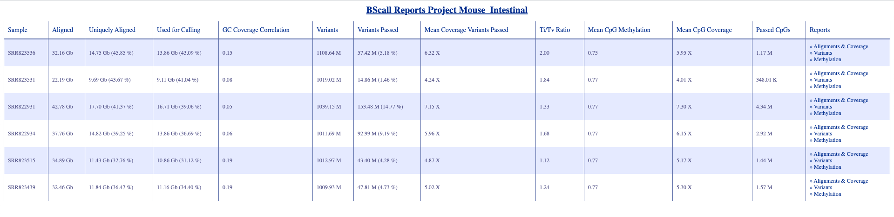

Recently I need to work on some WGBS (whole genome bisulfite sequencing) data, more specificly this one [SRP020633](https://trace.ddbj.nig.ac.jp/DRASearch/study?acc=SRP020633). It's an old data set (2013), which used Illumina Genome Analyzer IIx machine to generate WGBS data. Previously I have experience on Illumina Human Methylation Array, MeDIP-seq, RRBS, and now finally it's my time to try WGBS. If I can crack this one, I will then have experience on all 4 format of data. In nowadays, for every data, there are many many parameters need to be tuned. So "having experience" does not mean I am capable to deal with all these data's related problem confidently, but it's a good start to go through their pipelines, get some general results, and collect some scripts and code for them

It's my first time to deal with Whole WGBS data. Merely I want to at least couple things from my WGBS data.

- One is the beta value for each CpGs sites (and their location)
- Differential CpG Sites between two status, in this case the Stem Cell and Differentialed Cell.
- Differential Methylated Regions

## 1. Software Installation

---

After chating with lab members,  I decide to start with gemBS software, it' s python based software, requires you to input data, and relies on your compiled configuration to work. Firstly I need to install is based on it's [instruction](http://statgen.cnag.cat/gemBS/UserGuide/_build/html/installation.html). Since I always have Python version 3.7 installed, I can directly install the Python Library it requires.

```r
pip install matplotlib multiprocess
```

Then in my personal software folder, I install the software:

```r
git clone --recursive https://github.com/heathsc/gemBS.git
cd gemBS/
python3 setup.py install --user
```

## 2. Perpare Data and Configuration

---

After installation, I need to prepare data (fastq files) and configurations for this for this software. In my case, my **base analysis folder** is `..../BS_Analysis` . The base means where I am going to run the software, this parameter will be used in configuration later. 

### 2.1. Fastq Files (Zipped)

Then firstly I created a folder called BSin this folder, with all downloaded fastq file insides. Like below. We can see roughly one WGBS file size is 10+ GB before unzip. Note that trhe compress method here is `bunzip2`, it's a quite good compress algorithm, could compress large files into much smaller size.

Importantly, **GemBS could deal with .bz2 compressed fastq, so there is no need to unzip them**. I tried once that the unfolder them, the size for one fastq file is 80+GB.

Note that in below code blox, the DownloadFastQ.R script and .xlsx files are not needed, they are just my personal helper scripts. So in short, we just need to put all fastq files (or their zipped files) in one folder in base directory.

```r
(base) regmtyu@SLMSICANBECK01:/Data/Tian/Postdoc/Mouse-Intentinal-Development/BS_Analysis/BS$ ls -lha
total 154G
drwxr-xr-x.  2 regmtyu domain users 4.0K Aug 27 14:50 .
drwxr-xr-x. 10 regmtyu domain users 4.0K Aug 29 15:15 ..
-rw-r--r--.  1 regmtyu domain users 1.7K Aug 27 14:55 DownloadFastQ.R
-rw-r--r--.  1 regmtyu domain users 8.8K Aug 11 23:02 SRP020633.xlsx
-rw-r--r--.  1 regmtyu domain users  17G Aug 27 15:50 SRR822931_1.fastq.bz2
-rw-r--r--.  1 regmtyu domain users  17G Aug 27 15:57 SRR822931_2.fastq.bz2
-rw-r--r--.  1 regmtyu domain users  14G Aug 27 16:21 SRR822934_1.fastq.bz2
-rw-r--r--.  1 regmtyu domain users  14G Aug 27 15:49 SRR822934_2.fastq.bz2
-rw-r--r--.  1 regmtyu domain users  13G Aug 27 15:28 SRR823439_1.fastq.bz2
-rw-r--r--.  1 regmtyu domain users  13G Aug 27 15:47 SRR823439_2.fastq.bz2
-rw-r--r--.  1 regmtyu domain users  14G Aug 27 15:34 SRR823515_1.fastq.bz2
-rw-r--r--.  1 regmtyu domain users  14G Aug 27 16:06 SRR823515_2.fastq.bz2
-rw-r--r--.  1 regmtyu domain users 9.3G Aug 27 15:39 SRR823531_1.fastq.bz2
-rw-r--r--.  1 regmtyu domain users 5.7G Aug 27 15:25 SRR823531_2.fastq.bz2
-rw-r--r--.  1 regmtyu domain users  16G Aug 27 16:24 SRR823536_1.fastq.bz2
-rw-r--r--.  1 regmtyu domain users 9.5G Aug 27 15:38 SRR823536_2.fastq.bz2 
```

### 2.2. Sample Metadata CSV

Then I need to prepare other two files. One is [sample metadata file](http://statgen.cnag.cat/GEMBS/UserGuide/_build/html/pipelineConfig.html#sample-metadata-file), the other is a [configuration file](http://statgen.cnag.cat/GEMBS/UserGuide/_build/html/pipelineConfig.html#pipeline-configuration-file) for GemBS software. The sample metadata is a csv file, which included sample information, tell software how to match each sample to their corresponding fastq file.

Note that:
  1. The last column indicates sample phenotypes, that they are Stem_Cell, or thet are Villus.
  2. This is only for paired sample.

```r
# SampleSheet.csv in base BS_Analysis folder
Barcode,file_id,end_1,end_2,name
SRR822931,SRR822931,SRR822931_1.fastq.bz2,SRR822931_2.fastq.bz2,Stem_Cell_GFP_High
SRR822934,SRR822934,SRR822934_1.fastq.bz2,SRR822934_2.fastq.bz2,Stem_Cell_GFP_High
SRR823439,SRR823439,SRR823439_1.fastq.bz2,SRR823439_2.fastq.bz2,Stem_Cell_GFP_Low
SRR823515,SRR823515,SRR823515_1.fastq.bz2,SRR823515_2.fastq.bz2,Stem_Cell_GFP_Low
SRR823531,SRR823531,SRR823531_1.fastq.bz2,SRR823531_2.fastq.bz2,Villus
SRR823536,SRR823536,SRR823536_1.fastq.bz2,SRR823536_2.fastq.bz2,Villus
```

### 2.3. Configureation File

In short, configuration file is used to instruct the soft, setting parameters. etc. Configuration file need to be created by me, for example use vim to create a file named `myBS.conf` in the base directory.

```r
# Required section
#
# Note that the index and contig_sizes files are generated from the
# reference file if they do not already exist
#
reference = ./reference/Mus_musculus.GRCm38.dna.primary_assembly.fa.gz
index_dir = indexes

# Directory definitions
#
# Note that we can use environment variables ($HOME in this case)
# and previously defined variables can be used in subsequent definitions

base = .

sequence_dir = ${base}/BS    # @SAMPLE and @BARCODE are special
bam_dir = ${base}/mapping/@BARCODE      # variables that are replaced with
bcf_dir = ${base}/calls/@BARCODE        # the sample name or barcode being
extract_dir = ${base}/extract/@BARCODE  # worked on during gemBS operation
report_dir = ${base}/report

# General project info
project = Mouse_Intestinal
species = Mouse

# Default parameters
threads = 30
jobs = 4

[mapping] # Begin mapping specific section

# Include a standard configuration file with parameters
# defined for the IHEC WGBS pipeline
include IHEC_standard.conf

[extract] # extract specific section

make_cpg = True
make_non_cpg = True
make_bedmethyl = True
make_bigwig = True
```

Basically these parameters are self-explainary, note that the `base` parameter `.` means current folder. The sequence_dir may be different for various projects, because in my project, all fastq.bz2 files are located in the same directory, other projects may have their code splitted in different folders.

I did not quite figure out the difference between threads and jobs for now, but I am using a super good server, so 30 thread is not a problem for me. In the mapping stage, the default parameter is to included `IHEC_standard.conf` file. According to the instruction, the point is to ***make it simpler to use the correct parameter settings***, so I included it. Actually, there are not too many parameters needs to be tuned.

### 2.4. Reference Genome

Finally, I need to prepare the reference genome to be mapped. Here I downloaded the mouse genome from [ensembl official website](ftp://ftp.ensembl.org/pub/). In my case, I downloaded the the mouse genome from [this link](ftp://ftp.ensembl.org/pub/release-101/fasta/mus_musculus/dna/). I created a folder called reference in base folder to only put this fastq file in.

That's all, above 4 files are needs to be prepared.

## 3. GemBS Pipeline

---

After installation, now it's time to run GemBS. **Note that all below commands needs to be run in the base folder.**

### 3.1. Prepare, Index, Alignment

These 3 steps are basically one line command job, there are not much parameter needs to be tuned.  First command is gemBS prepare, It's merely for check the files you provided, make sure they are in accord with the requirement of the software.

```r
gemBS prepare -c myBS.conf -t SampleSheet.csv
```

Then if everything is correct, below command could be used to create index of the reference genome I provided. Below command would generate a folder called `indexes` in the base folder, with files with wired postfix like .gem, .ref, ref.fai .etc. I don't think I need to care about them.

```r
gemBS index
```

If you encounter a libcudart.so.7.5 error. After searching online, I can add below two code in `~/.bashrc` to solve this issue.

```r
export LD_LIBRARY_PATH="$LD_LIBRARY_PATH:/usr/local/cuda/lib64"
export CUDA_HOME=/usr/local/cuda
```

Seems these command are meant to employ GPU computing, but my server does not corresponding GPU... Then it works! Amazing! It would take maybe half an hour to prepare the index genome.

It above index step is finished, below command would be used to do alignment. The alignment algorithm is GEM3.

```r
gemBS map
```

Below is some output of mapping, so apparently it run alignment for samples one by one. If I open 30 thread, it would take about 3 hour to finish one sample. I have 6 samples in total.

```r
: Command map started at 2020-08-28 11:08:44.743762
:
: ------------ Mapping Parameters ------------
: Sample barcode    : SRR823536
: Data set          : SRR823536
: No. threads       : 30
: Index             : indexes/Mus_musculus.GRCm38.dna.primary_assembly.BS.gem
: Paired            : True
: Read non stranded : False
: Reverse conversion: None
: Type              : PAIRED
: Input Files       : ./BS/SRR823536_1.fastq.bz2,./BS/SRR823536_2.fastq.bz2
: Output dir        : ./mapping/SRR823536
:
: Bisulfite Mapping...
: Bisulfite Mapping done. Output File: /mnt/254b78b9-76b4-422d-84b1-cc632bff60f7/Tian/Postdoc/Mouse-Intentinal-Development/BS_Analysis/mapping/SRR823536/SRR823536.bam
: Merging process done for SRR823536. Output files generated: /mnt/254b78b9-76b4-422d-84b1-cc632bff60f7/Tian/Postdoc/Mouse-Intentinal-Development/BS_Analysis/mapping/SRR823536/SR
R823536.csi
```

The mapping results would be put in a folder called `mapping`, with each sample in one folder inside. In each folder, I can see the bam file, which is quite large (41 GB).

### 3.2. Methylation Calling and Extract

Now this is the important step, to do methylation calling. As I said before, one key point to do methylation (and possibly all biology research) is to get the matrix, as it's important to do typical downstream analysis like PCA, Deconvolution, Mapping .etc.

The methylation calling step employ `bas_call` to do methylation calling.  After calling, a large BCF file (binary version of VCF file) would be generated for each sample.

```r
$ gemBS call
:
: Command call started at 2020-08-29 00:15:46.298953
:
: ----------- Methylation Calling --------
: Reference       : indexes/Mus_musculus.GRCm38.dna.primary_assembly.gemBS.ref
: Species         : Mouse
: Right Trim      : 0
: Left Trim       : 5
: Chromosomes     : ['1', '2', 'X', '3', '4', '5', '6', '7', '10', '8', '14', '9', '11', '13', '12', '15', '16', '17', 'Y', '18', '19', '@pool_1']
: Threads         : 30
: Sample: SRR822931    Bam: ./mapping/SRR822931/SRR822931.bam
: Sample: SRR822934    Bam: ./mapping/SRR822934/SRR822934.bam
: Sample: SRR823439    Bam: ./mapping/SRR823439/SRR823439.bam
: Sample: SRR823515    Bam: ./mapping/SRR823515/SRR823515.bam
: Sample: SRR823531    Bam: ./mapping/SRR823531/SRR823531.bam
: Sample: SRR823536    Bam: ./mapping/SRR823536/SRR823536.bam
:
: Methylation Calling...
: Methylation call done, samples performed: SRR822931 SRR822934 SRR823439 SRR823515 SRR823531 SRR823536
```

In below code block, I use bcftool to check the status of these bcf files. BCF file is a standard format of file to record variant information. So it's maybe a bit hard to understand. That's why they provided one more function `extract`to get readable results. 

```r
BS_Analysis/calls$ ls
SRR822931  SRR822934  SRR823439  SRR823515  SRR823531  SRR823536
(BS_Analysis/calls$ cd SRR822931
BS_Analysis/calls/SRR822931$ ls *.bcf -lha
-rw-r--r--. 1 regmtyu domain users 17G Aug 29 00:33 SRR822931.bcf
BS_Analysis/calls/SRR822931$ bcftools view SRR822931.bcf | head -n 20
...
... # skipped some head meta data
##FORMAT=<ID=FS,Number=1,Type=Integer,Description="Phred scaled log p-value from Fishers exact test of strand bias">
##bcftools_viewVersion=1.9+htslib-1.9
##bcftools_viewCommand=view SRR822931.bcf; Date=Thu Sep  3 00:10:43 2020
#CHROM	POS	ID	REF	ALT	QUAL	FILTER	INFO	FORMAT	SRR822931
1	3000156	.	C	.	1	fail	CX=TTCTT	GT:FT:DP:MQ:GQ:QD:GL:MC8:AMQ:CS:CG:CX	0/0:q20:0:51:1:1:-0.545794:0,0,0,0,0,0,0,1:43:+:N:NNCTT
1	3000161	.	G	.	2	fail	CX=TAGGG	GT:FT:DP:MQ:GQ:QD:GL:MC8:AMQ:CS:CG:CX	0/0:q20:1:51:2:2:-0.327373:0,0,1,0,0,0,0,0:43:-:N:TAGGG
1	3000162	.	G	.	2	fail	CX=AGGGG	GT:FT:DP:MQ:GQ:QD:GL:MC8:AMQ:CS:CG:CX	0/0:q20:1:51:2:2:-0.327373:0,0,1,0,0,0,0,0:43:-:N:AGGGG
1	3000163	.	G	.	2	fail	CX=GGGGA	GT:FT:DP:MQ:GQ:QD:GL:MC8:AMQ:CS:CG:CX	0/0:q20:1:51:2:2:-0.327373:0,0,1,0,0,0,0,0:43:-:N:GGGGA
1	3000164	.	G	.	2	fail	CX=GGGAA	GT:FT:DP:MQ:GQ:QD:GL:MC8:AMQ:CS:CG:CX	0/0:q20:1:51:2:2:-0.327373:0,0,1,0,0,0,0,0:43:-:N:GGGAA
1	3000169	.	G	.	2	fail	CX=ATGGG	GT:FT:DP:MQ:GQ:QD:GL:MC8:AMQ:CS:CG:CX	0/0:q20:1:51:2:2:-0.327373:0,0,1,0,0,0,0,0:43:-:N:ATGGG
```

Then I run `gemBS extract` just couple seconds all files are generated in `extract` folder. In them I think the most important file is `_cpg.txt.gz` . I can use zcat to check it, now it looks much readable. **The 7th column is exactly the beta value I am looking for! Finally!!**

```r
BS_Analysis/extract/SRR822931$ zcat SRR822931_cpg.txt.gz | head
Contig	Pos0	Pos1	Ref	SRR822931:Call	SRR822931:Flags	SRR822931:Meth	SRR822931:non_conv	SRR822931:conv	SRR822931:support_call	SRR822931:total
1	3000828	3000829	G	G	GQ=23;MQ=60	1.000	1	0	9	9
1	3001008	3001009	G	G	GQ=32;MQ=59	1.000	1	0	12	12
1	3001019	3001020	G	G	GQ=29;MQ=59	1.000	1	0	11	11
1	3003886	3003887	G	G	GQ=17;MQ=60	1.000	2	0	7	7
1	3003899	3003900	G	G	GQ=17;MQ=60	1.000	2	0	7	7
1	3004531	3004532	G	G	GQ=11;MQ=60	0.521	1	1	6	6
1	3006188	3006189	G	G	GQ=29;MQ=53	1.000	9	0	11	11
1	3006882	3006883	G	G	GQ=14;MQ=52	0.841	4	1	8	8
1	3007431	3007432	G	G	GQ=20;MQ=58	0.840	4	1	10	10
```

### 3.3. Generate Report

Finally, by simply run `gemBS map-report` and `gemBS call-report`, the software would automatically generate report for mapping and variant calling. The two reports are html based, could be easily see via browser.Below is the screenshort for Variant Report, it indicates that the read depth is roughtly 6X, seems now my collegues' data quality are 100X?



Above are all work I have done with the GemBS analysis, it is easy to use, however the final result is not that I expected, so I need to find a way to extract the methylation into a large matrix myself.