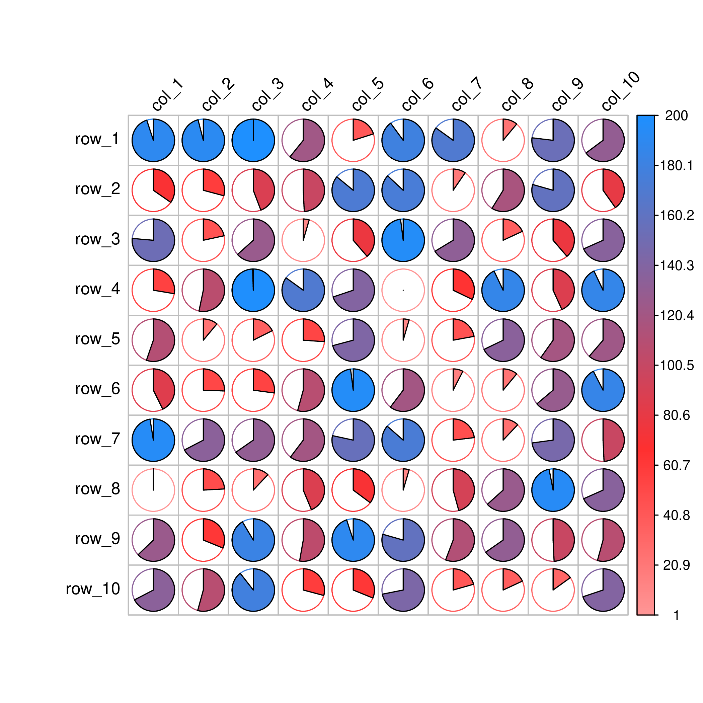
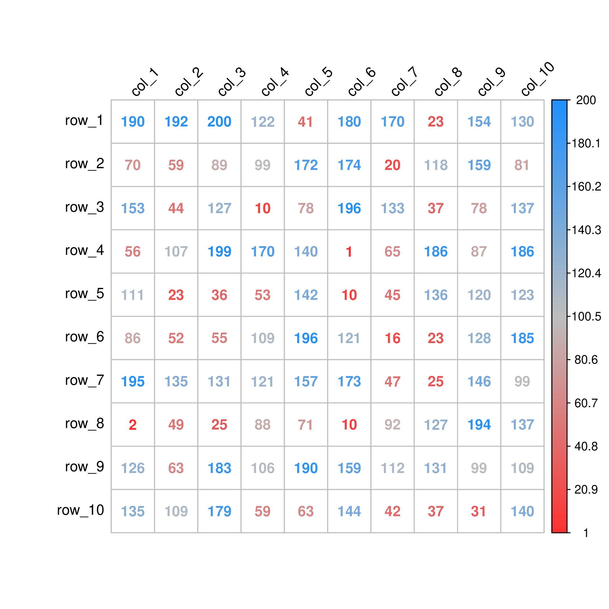

Recently I get a small task to draw a correlation plot between various of variables. After some search, a very good package called [corrplot](https://cran.r-project.org/web/packages/corrplot/index.html) went into my eye, which is so easy to use and so useful.

Though I guess the origin purpose of this package is to create nice "correlation plots" between variables, which means the correlation score should be between -1 to 1. However, the author also allow uses to plot random matrix, without limitation of "correlation value".

So below made some test:
```
> data <- matrix(sample(1:200,replace=T),10,10)
> rownames(data) <- paste("row",1:10,sep="_")
> colnames(data) <- paste("col",1:10,sep="_")
```
Above I generated some random number between 1 to 200, because I find on the internet many people are using it for only positive number plotting.

Then I can use **library corrplot and RColorBrewer** to generate really nice plot in one shot:

```r
corrplot(data, method="circle",is.corr=FALSE,tl.col="black", tl.srt=45, col=colorRampPalette(c("green","white","firebrick1","dodgerblue"))(500))
```


> Note that the right legend label contains actually 4 color but here I only use the last two:  "firebrick1","dodgerblue". Seems corrplot can only generate color from negative value to positive, thus if I only assign two color, only one could be seen. Thus I use 4 colors here so that only the last two works, which is exactly what I want.


Then we can change other format:
```r
corrplot(data, method="pie",is.corr=FALSE,tl.col="black", tl.srt=45, col=colorRampPalette(c("green","white","firebrick1","dodgerblue"))(500))
```


Above code generate pie plot inside each cell, which is nice but I think it's more suitable for correlation plots.

And the last one:
```r
corrplot(data, method="number",is.corr=FALSE,tl.col="black", tl.srt=45,addCoef.col = "black",,  col=colorRampPalette(c("green","white","firebrick1",'gray',"dodgerblue"))(500))
```


This figure prints all number in corresponding significant color, which is what I like most as well.