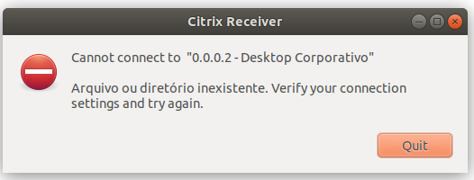
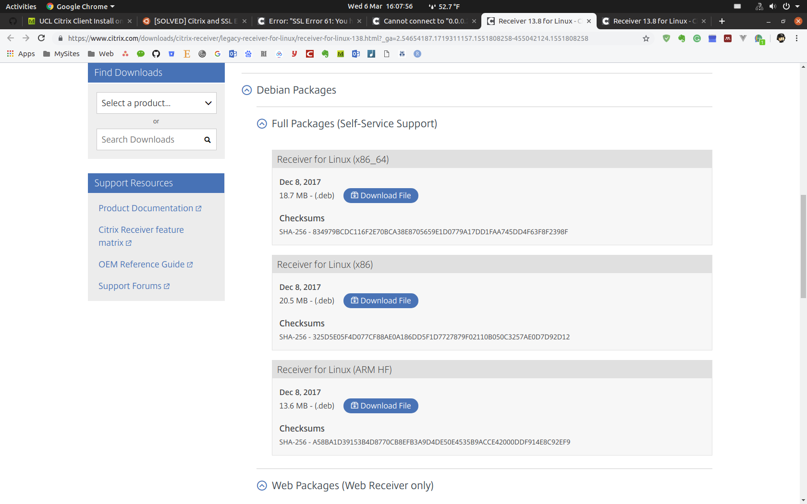

Firstly, I can **only use version 13.8, instead of 13.10**, which is vital and this information was searched from [website](https://discussions.citrix.com/topic/323985-cannot-connect-to-0002-published-app-name-most-distros/). If you install latest version, the is an error like Cannot connect to "0.0.0.2-Desktop Corporativo"



From the [official website](https://www.citrix.com/downloads/citrix-receiver/legacy-receiver-for-linux/receiver-for-linux-138.html), download the 13.8.0 version Receiver linux (X86_64)



Then use commend to install:
```bash
sudo dpkg -i icaclient_13.8.0.10299729_amd64.deb
```
You may encounter error like missing libwebkitgtk .e.g, try fix with below command:
```bash
sudo apt-get install libwebkitgtk-dev
```
Then, still it's not working, with a new error like **"You have not chosen to trust ..."**, Then I found another solution tip from [below website](https://ubuntuforums.org/showthread.php?t=1975705), so use below command:
```bash
sudo ln -s /usr/share/ca-certificates/mozilla/* /opt/Citrix/ICAClient/keystore/cacerts
```
Now it has been successfully installed. When using it, open [UCL's web desktop](https://my.desktop.ucl.ac.uk/Citrix/StoreWeb/), login, click the icon computer, and download one .ica file, click the file, then the remote virtual desktop would be opened.