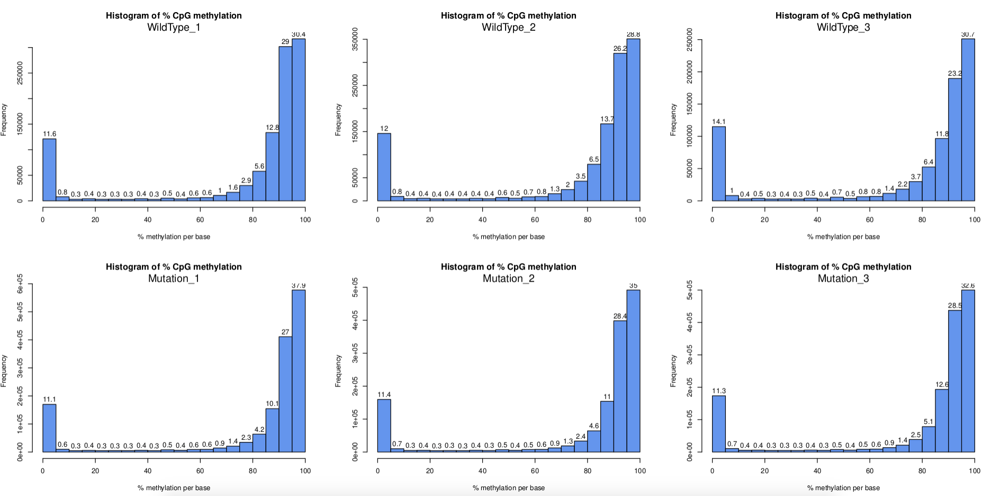
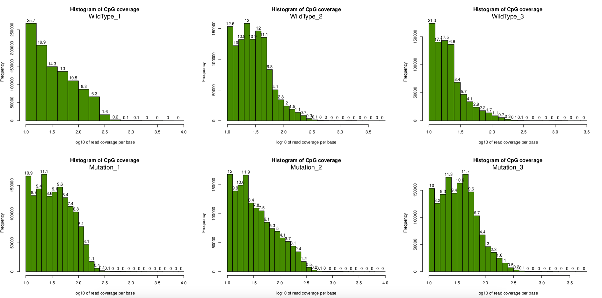
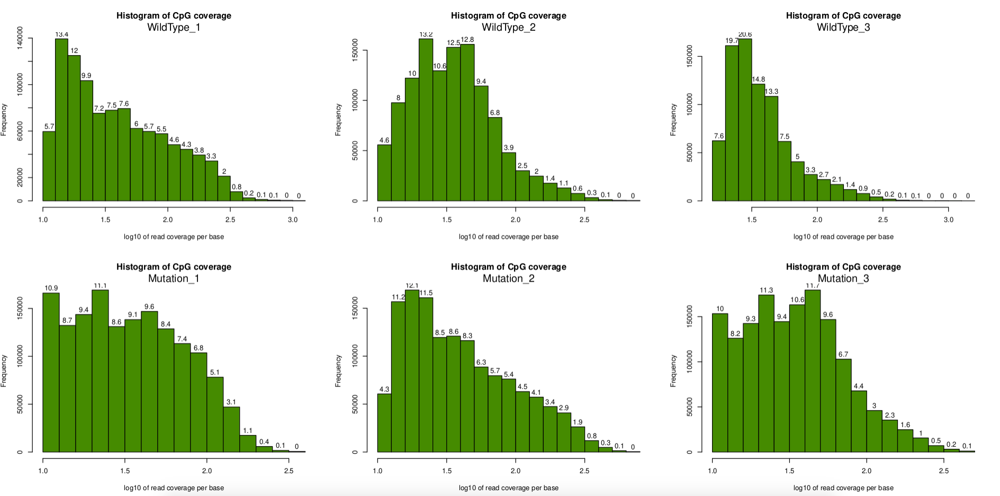

Following in the last document, now what I want to do is to load the preprocessed BAM files into R session, a recommended software is [MethylKit](https://www.bioconductor.org/packages/release/bioc/html/methylKit.html). After a set of actions, the final bam file for each sample looks like below. The folder is in **RRBS-pipeline/1.Preprocess/NUDUP/Ready:**

```jsx
RRBS-pipeline/1.Preprocess/NUDUP/Ready$ ls
Bc-01_S1.sorted.dedup.bam  Bc-03_S3.sorted.dedup.bam  Bc-05_S5.sorted.dedup.bam
Bc-02_S2.sorted.dedup.bam  Bc-04_S4.sorted.dedup.bam  Bc-06_S6.sorted.dedup.bam
```

## 1. Process Bismark Alignment Result

According to methylkit package manual, the first step we should do it process Bismark results, since Bismark only do alignment work, so the function `processBismarkAln` is designed to call CpG's methylation value from these bam file. It would return the results of each sample in a format as `XXX_cpg.txt` format. Below is a script is written do apply this function.

```jsx
# Script to run processBismarkAln
library("methylKit")

directory <- "../1.Preprocess/NUDUP/Ready/"

files <- dir(directory)

# This line is only used to extract Sample Name.
file.name <- as.list(unname(sapply(files,function(x) strsplit(x,split="_")[[1]][1])))

files <- as.list(paste(directory,files,sep=""))

message("Processing Bismark Alignment...")
my.methRaw=processBismarkAln(location=files,
                             sample.id=file.name,
                             assembly="danRer11",
                             save.context=NULL,
                             read.context="CpG",
                             mincov=10,
                             minqual=20,
                             treatment=c(0,0,0,1,1,1),
                             save.folder="./")
```

Above script would take some time, roughly 1 hour for 6 samples. Then for each sample, a cpg.txt file would be generated. I remember GemBS software also would generate this kind of file, which means if I use GemBS file, I can directly input it into Methylkit for future analysis. Also, in above script, I applied some parameter, like `mincov=10`, and `minqual=20`. These are default settings from the software manual.

These cpg.txt loos like below:

```r
Bc-01_CpG.txt
chrBase chr base    strand  coverage    freqC   freqT
1.1110  1   1110    F   40  97.50   2.50
1.1167  1   1167    R   78  87.18   12.82
1.11585 1   11585   F   12  0.00    100.00
1.11603 1   11603   F   12  0.00    100.00
1.11621 1   11621   F   12  0.00    100.00
```

## 2. Read CpG

After CpG calling, then we can try read them all into R session, to form an matrix for downstream analysis. This part of code is:

```r
message("Reading CpG into R with methylKit...")
CpGFiles <- as.list(paste("./",unlist(file.name),"_CpG.txt",sep=""))
sampleName <- c("WildType_1", "WildType_2", "WildType_3", "Mutation_1", "Mutation_2", "Mutation_3")

myobj <- methRead(CpGFiles,
                  sample.id= as.list(sampleName),
                  assembly="danRer11",
                  treatment=c(0,0,0,1,1,1),
                  context="CpG")
```

One amazing part for MethylKit is that we don't need to prepare reference genome ourselves. In above code, the sampleName is important. **And `treatment` parameter indicates case/control status, which is quite important and will be used across the whole project**.

## 3. Density Plot and Coverage Plot

This step is similar to QC plot check in methylation array, here I plotted the density histogram for these samples. MethylKit provided a function to do so:

```r
par(mfrow=c(2,3))
for(i in 1:length(myobj)) getMethylationStats(myobj[[i]],plot=TRUE,both.strands=FALSE)
```



According to above plot, it seems the density plot looks very good, it shows the two peak I have been looking for. **This is possiblly the most convinient function to check density plot for RRBS/WGBS data**. Simiarly, I can get coverage plot:



## 4. Coverage Filtering and Normalisation

This step is important, it will filter CpGs with too low coverage (below 10), or redicularsly high (based on a null distribution). And normalisation would be apply afterward to across all samples to removed bias. The code is below:

```r
message("Filtering Coverage")
filtered.myobj <- filterByCoverage(myobj,lo.count=10,lo.perc=NULL, hi.count=NULL,hi.perc=99.9)
filtered.normed.myobj <- normalizeCoverage(filtered.myobj)
```

After filtering, I tried to plot the coverage again, clearly some very high coverage bases are removed. This step is important, otherwise the comparision analysis later would be hugely biased.



## 5. Create Meth Object

Then finally we can create a `meth` object, this is the first human readable object we can create from methylKit package. The code is simply:

```r
> meth <- unite(filtered.myobj, destrand=FALSE)
> meth
methylBase object with 554917 rows
--------------
  chr start   end strand coverage1 numCs1 numTs1 coverage2 numCs2 numTs2
1   1  1110  1110      +        46     45      1        55     45     10
2   1  1167  1167      -        89     78     11        35     33      2
3   1 12008 12008      +       197      1    196        86      1     85
4   1 12023 12023      +       198      0    198        86      0     86
5   1 12038 12038      +       198      0    198        83      0     83
6   1 12039 12039      -       218      0    218       104      0    104
...
```

Also meth object contains the number of total CpGs we get across all samples:

```r
> dim(meth)
[1] 554917     22
>
```

**A very important step is here, to generate beta matrix, this matrix may not help for DMR/DMP calling, but it's definitly useful for visualisation.** A beta matrix here could allow me to implement a lot of array based algorithm on to sequence based data.

```r
> beta <- percMethylation(meth)/100
> dim(beta)
[1] 554917      6
> head(beta)
      WildType_1 WildType_2 WildType_3 Mutation_1  Mutation_2  Mutation_3
[1,] 0.978260870 0.81818182  0.8333333  0.9302326 0.907216495 0.846153846
[2,] 0.876404494 0.94285714  0.9428571  0.9056604 0.862385321 0.830188679
[3,] 0.005076142 0.01162791  0.0000000  0.0000000 0.003649635 0.005263158
[4,] 0.000000000 0.00000000  0.0000000  0.0000000 0.007272727 0.005263158
[5,] 0.000000000 0.00000000  0.0000000  0.0000000 0.003663004 0.000000000
[6,] 0.000000000 0.00000000  0.0000000  0.0000000 0.006211180 0.000000000
>
```

So above are two very important file generate from methylKit, `meth` and `beta`. A lot of downstream analysis would be done based on them.