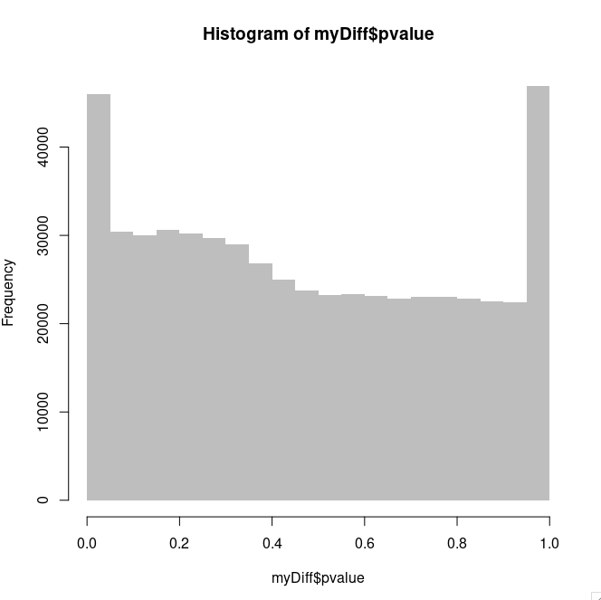
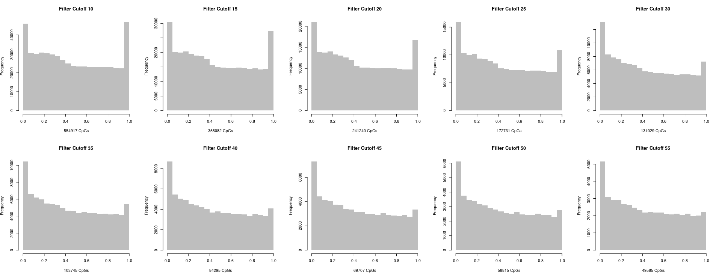
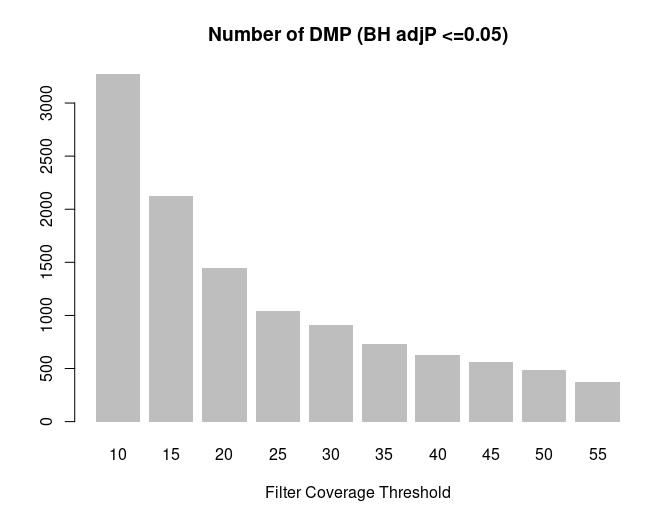
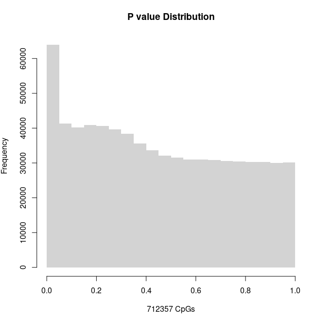
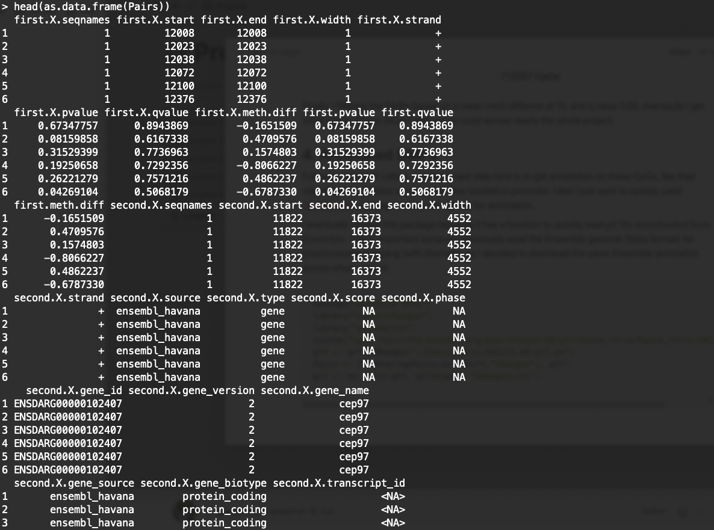

Then here comes to an important point: Differential calling, it's a very common but vital step for nearly all EWAS (Epigenome-wide association study).

## 1. Differential Methylated Probe Calling

Initially I directly applied the methylKit for DMP calling.

```r
myDiff <- calculateDiffMeth(meth, overdispersion="MN", mc.cores=20)
```

**A very serious problem is the P-value distribution is quite weird. It shows a clear Bimodal Pattern.** This is a very good [post](http://varianceexplained.org/statistics/interpreting-pvalue-histogram/) to explain this kind of situation. In another word, this situation happens because maybe there are some low-quality data, or sometimes there are no read counts enriched at all.

So I first try to use `filterCoverage` function provided by methylKit to remove more low-quality probes.



## 2. P value Fix 1: Increase Coverage Filtering Threshold

Then I wrote a function to dynamically filter CpGs' coverage, from 10 to 55, as I expected, as the threshold goes up, the P-value distribution turns to normal: the Anti-conservative p-values shape we are expecting. 



The second thing I want to make sure is: **How many DMPs will be removed if I took a large coverage threshold like 55**? This is an important question, because if after removing improper CpGs I can only receive a very small amount of DMPs, which would be hard for future research. So sad that the below plot shows that if I apply high coverage threshold, only very few DMP I will get... So I basically this solution is not working, at least not working in my scenario.



I personally think this solution should work in one of these 2 situations: (1). The high-bar close to 1 is not too high, thus you may adjust it down by increase the coverage threshold. (2). The data format is something like RNA-seq, which the coverage itself indeed represent the expression value, not like CpG, that matrix value is actually the divide between two coverage value because, in RNA-seq scenario, the null distribution hypothesis assumption should stands.

## 3. P-value Fix 2: Remove all-zero or all-one CpG

The second thought crosses my mind is to find these close-to-1 CpGs, see why they are acting so wired. Then maybe just removed them (after all they are contributed to our DMP right?) Below is my checking code, so across all 554917 CpGs (filtered based on 10 reads coverage), there are 24628 CpG's p-value is completely 1, and among them, nearly all are have totally **0 OR 1** methylation status across all samples.

```r
> index <- which(myDiff$pvalue == 1)
> length(index)
[1] 24628
> sum(rowSums(beta[index,]) %in% c(0,6))
[1] 24351
>
```

**According to the discussion in this [post](https://support.bioconductor.org/p/116411/)**. I decided to remove all these probes. And more importantly, I decided to apply a smaller threshold, like 7, to gain more DMPs eventually. A tricky thing here is that **there are 3 functions in methylKit are all using 10 as default coverage threshold,** so if I want loose the threshold, I need to adjust all of them:

```r
## Firstly is the processBismarkAln function
my.methRaw=processBismarkAln(location=files,
                             sample.id=file.name,
                             assembly="danRer11",
                             save.context=NULL,
                             read.context="CpG",
                             mincov=7, # Position 1
                             minqual=20,
                             treatment=c(0,0,0,1,1,1),
                             save.folder="./")
# ...
## sceond is the methRead function
myobj <- methRead(CpGFiles,
                  sample.id= as.list(sampleName),
                  assembly="danRer11",
                  treatment=c(0,0,0,1,1,1),
                  context="CpG",
                  mincov=7) # Position 2
# ...
# Thirdly is the filterByCoverage function, as I tested before
filtered.myobj <- filterByCoverage(myobj,lo.count=7,lo.perc=NULL, hi.count=NULL,hi.perc=99.9)
```

After the above work (basically redo the work in the [last step](https://yuantian1991.github.io/notes/RRBS-Analysis-2:-MethylKit)), I eventually get 746647 CpGs left. Then below is the code for DMP calling, as I said I removed all totally 1 and totally 0 CpGs:

```r
index <- which(!rowSums(beta) %in% c(0,ncol(beta)))
meth.dmp <- meth[index]
myDiff <- calculateDiffMeth(meth.dmp, overdispersion="MN", mc.cores=40)
```

**Now, we get a very good p-value distribution and an even bigger number of CpG.** The sacrifice here is a comparably low Coverage Threshold and roughly 30000+ CpGs who was supposed to be close to 1 and contribute to ebayes estimation adjustment.



Finally, I filtering the DMPs based on mean meth different at 15, and q value 0.05, eventually I get 3424 CpGs. These 3424 CpGs will be used across nearly the whole project.

## 4. Annotated DMPs

Following the DMP calling, one important step here is to get annotation on this CpGs, like their related genes (if there are any), are they located in the promoter. Here I just want to quickly use `genomation` package to load the .gtf file for annotation. 

I eventually choose this package because it has a function to quickly load **[gtf file downloaded from Ensemble](ftp://ftp.ensembl.org/pub/release-98/gtf)**. This is important because I previously used the Ensemble genome (fasta format) for preprocessing mapping (with Bismark), so I decided to download the same Ensemble annotation across the whole project.

```r
message("Annotate DMPs")
library("GenomicRanges")
library("genomation")
system("wget ftp://ftp.ensembl.org/pub/release-98/gtf/danio_rerio/Danio_rerio.GRCz11.98.gtf.gz")
gff <- gffToGRanges("./Danio_rerio.GRCz11.98.gtf.gz")
grl <- as(split(gff, gff$type), "GRangesList")

Pairs <- findOverlapPairs(as(myDiff,"GRanges"), grl[['gene']])
```

Below is an example how the Pairs looks like, so it joined two GRanges, one is my myDiff, and the other is the gene annotation, in theory they are both generated by Ensembl annotation so should be matching well. In the future I may need to find ways to get TSS, but for now I think this should be good enough as DMP annotation.

