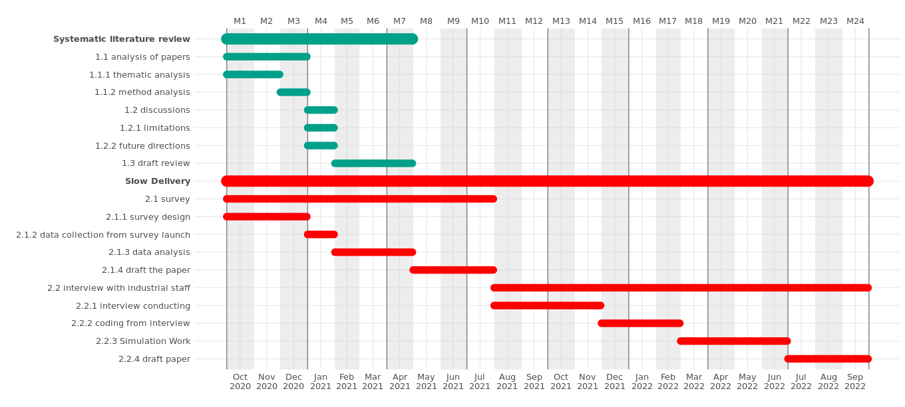

The [R package ganttrify](https://github.com/giocomai/ganttrify) is really suitable for Gantt chart, all we need to do is to compile the time schedual into a csv file, then read it into R, then apply the `ganttrify` function to plot it.

So initially I prepared a CSV file with my Google Sheets, then pasted it into a csv file, then read it and tyde it a bit with `kable` function.

```r
> Gantt <- read.csv("./Gantt.csv",sep="\t")
> knitr::kable(Gantt)


|wp                           |index |activity                           |start_date |end_date   |
|:----------------------------|:-----|:----------------------------------|:----------|:----------|
|Systematic literature review |1.1   |analysis of papers                 |01/10/2020 |31/12/2020 |
|Systematic literature review |1.1.1 |thematic analysis                  |01/10/2020 |30/11/2020 |
|Systematic literature review |1.1.2 |method analysis                    |01/12/2020 |31/12/2020 |
|Systematic literature review |1.2   |discussions                        |01/01/2021 |31/01/2021 |
|Systematic literature review |1.2.1 |limitations                        |01/01/2021 |15/01/2021 |
|Systematic literature review |1.2.2 |future directions                  |16/01/2021 |31/01/2021 |
|Systematic literature review |1.3   |draft review                       |01/02/2021 |30/04/2021 |
|Slow Delivery                |2.1   |survey                             |01/10/2020 |31/07/2021 |
|Slow Delivery                |2.1.1 |survey design                      |01/10/2020 |31/12/2020 |
|Slow Delivery                |2.1.2 |data collection from survey launch |01/01/2021 |31/01/2021 |
|Slow Delivery                |2.1.3 |data analysis                      |01/02/2021 |30/04/2021 |
|Slow Delivery                |2.1.4 |draft the paper                    |01/05/2021 |31/07/2021 |
|Slow Delivery                |2.2   |interview with industrial staff    |01/08/2021 |30/09/2022 |
|Slow Delivery                |2.2.1 |interview conducting               |01/08/2021 |30/11/2021 |
|Slow Delivery                |2.2.2 |coding from interview              |01/12/2021 |28/02/2022 |
|Slow Delivery                |2.2.3 |Simulation Work                    |01/03/2022 |30/06/2022 |
|Slow Delivery                |2.2.4 |draft paper                        |01/07/2022 |30/09/2022 |
```

Note that the time format is not correct, it should be like `2020-02-01` format. So I changed is, also, the **wp**,**activity**, **start_date**, and **end_date** are 4 default columns, I just want to keep that, so I decide to paste the index with the activity column. After I done these actions, I can directly apply ganttrify function to draw the plot. The total code is below. Honestly, if I previously orgnise the excel table better, everything could be even simpler.

```r
library("ganttrify")

Gantt <- read.csv("./Gantt.csv",sep="\t")

Gantt$start_date <- sapply(Gantt$start_date, function(x) paste(rev(strsplit(x,split="/")[[1]]),collapse='-'))
Gantt$end_date <- sapply(Gantt$end_date, function(x) paste(rev(strsplit(x,split="/")[[1]]),collapse='-'))
Gantt$activity <- paste(Gantt$index, Gantt$activity)

ganttrify(project = Gantt,
               by_date = TRUE,
               size_text_relative = 1.1,
               mark_quarters = TRUE,
               month_number = TRUE,
               font_family = "Roboto Condensed")

```

