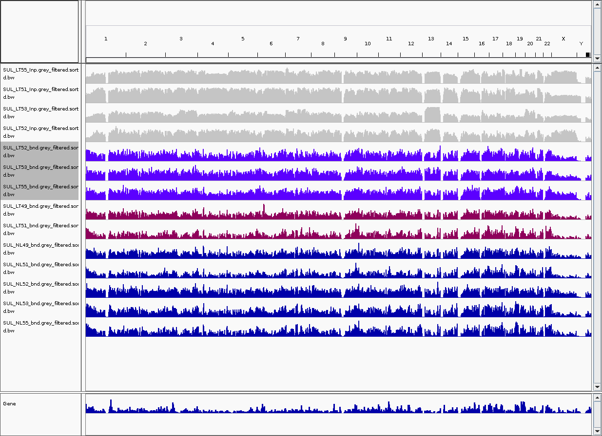

I am not analysing a set of hMeDIP-seq data, it's my first time working on this type of data, so I want to record a bit code and steps I followed here. Also, I want to organize code into a proper pipeline here, automate most works, like seal them into couple R functions, so that I can use them in the future easily. Like what I have done for RRBS and Array data.

## 1. Data Preparation

The works is actually started from a set of splitted fq file. I don't know why they are initially in this status, but it's not good. So I merged those fastq file into each sample with my own script.

Script for Merging fq files based on Sample Name

```r
 # A script I wrote to merge fq files based on pheno-sample-fraction.
 # Author: Yuan Tian

directory <- "../20110401_LewisS_AM_HydrxMeth/"

resultsDir <- "./Merged"
if (!file.exists(resultsDir)) dir.create(resultsDir)

index <- read.csv("../20110401_LewisS_AM_HydrxMeth/index.csv", as.is=TRUE, header=F)
colnames(index) <- c("file", "B", "Sample", "Index")

Samples <- names(table(index$Sample))
Samples <- Samples[Samples != ""]

for(x in Samples)
{
    message(x)
    tmp <- paste(paste(directory, index$file[index$Sample == x], sep=""), collapse=" ")
    tmp <- paste("cat ", tmp, " > ./Merged/", x, ".fq.gz", sep="")
    system(tmp)
}
```

After above code, files are presented into a better format, like below. There are two types of data, **bnds** indicates they are samples with antibody, which means they should have real signals on it. The `Inp` samples are background control samples, they will be used by calling peaks for bnds samples against them.

In my data, there are totally 4 phenotypes, NC(Normal Colon), NL(Normal Liver), TC(Tumour Colon) and LT (Liver Tumour). However, there are only two phenotypes (NC and LT) have Inp samples, so I think later in Peak Calling the only way I can do is to merge Inps togather, into a big `MergedInp.bam`.

```r
(base) regmtyu@SLMSICANBECK01:/Data/Tian/Postdoc/BathCRC/MeDIP-seq/0.Data/Merged$ ls
SUL_CRC2_24NA_hmC_bnd.fq.gz    SUL_CRC2_37NC_hmC_bnd.fq.gz  SUL_LT51_Inp.fq.gz  SUL_LT55_bnd.fq.gz  SUL_NC51_Inp.fq.gz  SUL_NC55_Inp.fq.gz  SUL_NL55_bnd.fq.gz
SUL_CRC2_24NC_hmC_bnd.fq.gz    SUL_CRC2_42NC_hmC_bnd.fq.gz  SUL_LT52_bnd.fq.gz  SUL_LT55_Inp.fq.gz  SUL_NC52_bnd.fq.gz  SUL_NL49_bnd.fq.gz  SUL_TC49_bnd.fq.gz
SUL_CRC2_24NC_hmC_Input.fq.gz  SUL_CRC2_44NC_hmC_bnd.fq.gz  SUL_LT52_Inp.fq.gz  SUL_NC49_bnd.fq.gz  SUL_NC52_Inp.fq.gz  SUL_NL51_bnd.fq.gz  SUL_TC51_bnd.fq.gz
SUL_CRC2_35NC_hmC_bnd.fq.gz    SUL_LT49_bnd.fq.gz           SUL_LT53_bnd.fq.gz  SUL_NC49_Inp.fq.gz  SUL_NC53_bnd.fq.gz  SUL_NL52_bnd.fq.gz  SUL_TC52_bnd.fq.gz
SUL_CRC2_35NC_hmC_Input.fq.gz  SUL_LT51_bnd.fq.gz           SUL_LT53_Inp.fq.gz  SUL_NC51_bnd.fq.gz  SUL_NC53_Inp.fq.gz  SUL_NL53_bnd.fq.gz  SUL_TC53_bnd.fq.gz
```

The initial samples are **not** going to be used here: SUL_CRC2... I guess they are Methylation MeDIP-seq data.

## 2. FastQC Report

This part is merely for generate QC report for fastq file, fastqc command is very easy to use, and merely there are many parameters after that, and they are mostly working well. Below is my code code for fastQC, written in R. Actually there is no need to use R to write it, I do it because I am not good at shell, so I prefer a R script to do everything later.

```r
cmd <- paste0("fastqc --threads " , threads, "  --outdir ./myFastQC " , directory ,"* &> ./myLog/myFastQC.log")
system(cmd)
```

Note that I created a folder to allow fastQC files to put into it.

## 3. Fastp Triming

Fastp is so easy to use in terms of triming, as it's very fast and automatically detect all adapters. Note that we need above fastQC work to make sure if this data is preh64 (a very old data format), or it's preh33. It would be labelled in the html report of fastQC as `encode`.

core code for fastp

```r
cmd <- paste0("parallel --plus 'fastp -h ./myFastp/{/..}.html -j ./myFastp/{/..}.json -i {} -o ./myFastp/{/..}.fastp.fq' ::: ", directory, "* &> ./myLog/myFastp.log")
```

It would take very short time if I use above parallel running.

## 4. Bowtie2 Alignment

There are so many tools now out there but still seems bowtie2 is the main option for medip-seq. So the firstly think I need to do is download index for bowtie2, directly from [official website](http://bowtie-bio.sourceforge.net/bowtie2/index.shtml). I used `GRCh38 no-alt`. Then I wrote a loop in R to run samples one by one.

There the threads parameter is 30. core code for bowtie2 alignment:

```r
message("\n[ Section 3: bowtie2 alignment ] (require bowtie2 installed on server)")
message("!!! Prepare genome from bowtie2 into a folder called Genome in this folder yourself, unzip it.")
if (!file.exists("./myAlignment")) dir.create("./myAlignment")

for(i in dir("./myFastp/", pattern="*.fastp.fq"))
{
    name <- strsplit(i, split="[.]")[[1]][1]
    cmd <- paste0("bowtie2 -p ",threads," -q --local -x ./Genome/GRCh38_noalt_as/GRCh38_noalt_as -U  ./myFastp/", i , " | samtools view -bS - > ./myAlignment/", name,".bam")
     message(cmd)
     system(cmd)
}
```

## 5. Blacklist Removing

This is an important step, I missed this one previously, that I can't get any resonable results at all.

This is a step I ignored before, that I should removed Blacklist Region after mapping. Blacklisted regions are genomic regions with anomalous, unstructured, high signal or read counts in NGS experiments, independent of cell type or experiment. These regions tend to have a very high ratio of multi-mapping to unique mapping reads and a high variance of mappability and simple

mappability filters do not account for them. These regions are often found at repetitive regions (Centromeres, Telomeres, Satellite repeats) and are troublesome for high throughput sequencing aligners and when computing genome wide correlations. These regions also confuse peak callers and result in spurious signal.

There are two ways to find these Blacklist, one is to get pre-defined regions, another way is to get from `GreyListChIP` R pacakge. After my multiple trying, only the GreyListChIP way works. In general, the logic of GreyListChip is to generate null distribution, then find those region **significantly high enriched**, like p value 0.01, then it's likely to be a blacklist region.

I calcualte grey list for all Inp samples, then merged them into one. Then removed blacklist from them:

```r

if (!file.exists("./myGreyList")) dir.create("./myGreyList")

library("GreyListChIP")
library("BSgenome.Hsapiens.UCSC.hg38")

files <- dir("./myAlignment")
files <- unique(sapply(files, function(x) strsplit(x, split="[.]")[[1]][1]))
Inps <- files[grep("Inp",files)]

for(i in Inps)
{
    message(i)
    gl <- greyListBS(BSgenome.Hsapiens.UCSC.hg38, paste0("./myAlignment/",i,".bam"))
    export(gl,con=paste0("./myGreyList/",i,"GreyList.bed"))
}

cmd <- "cat ./myGreyList/* > ./MergedGreyList.bed"
system(cmd)
```

After generation of GreyList, we can use this list to do filtering on our bam file, with bedtool command:

```r
parallel --plus 'bedtools intersect -v -abam {} -b ./MergedGreyList.bed > ./myGreyList/{/.}.grey_filtered.bam' ::: ./myAlignment/*.bam
```

## 6.bigwig IGV visualisation

After removing, I used IGV to check the bam file across human genome.  Below are part of the samples. On the top is a grey Inpu sample, they are generally fine, but they have some gaps across whole genome.

Purple colour are LT samples, the pink colours are two samples labelled as LT, but their plot looks very similar to NL.

In later plot, we can see that LT49 and LT51 indeed looks weird. Maybe they made some mistake when they take sample from patient.



Until here, I think most basic preprocess are done. In theory, we should also remove duplicated reads, however our next step is MACS2 calling, the software will automatically remove those duplicated reads, so we don't need to do it.
