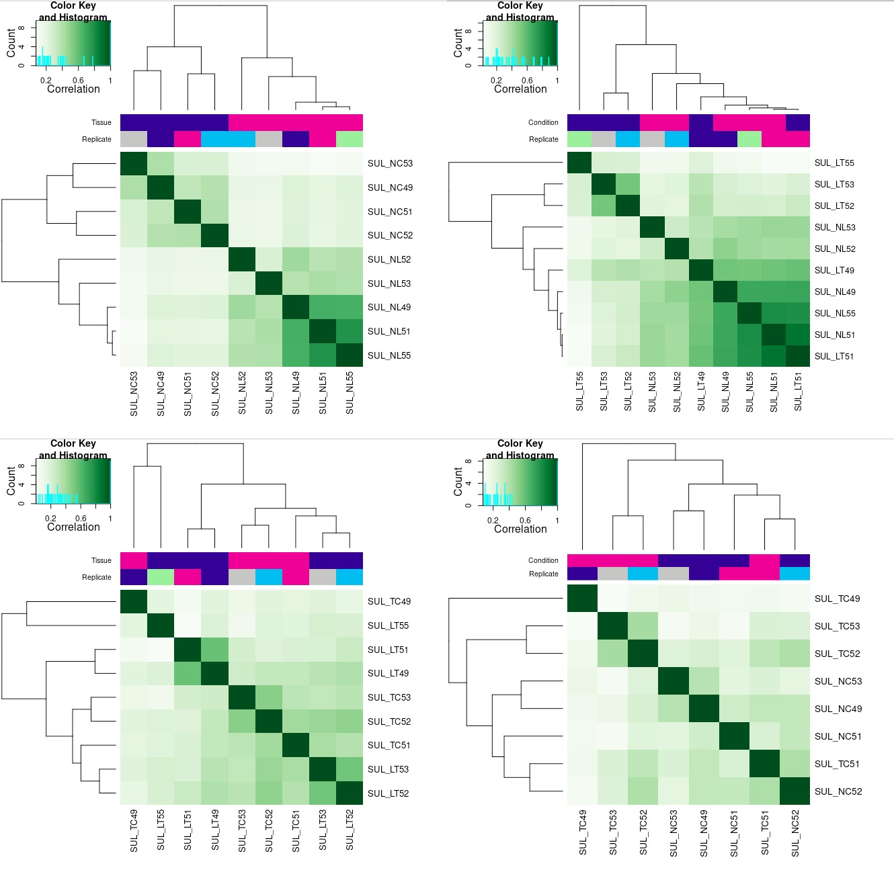
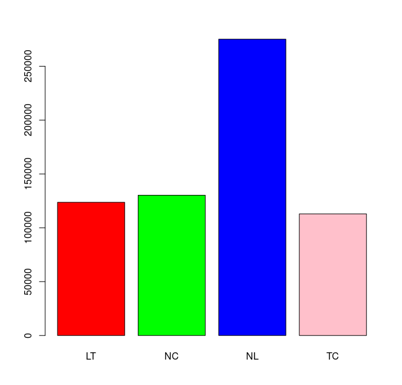
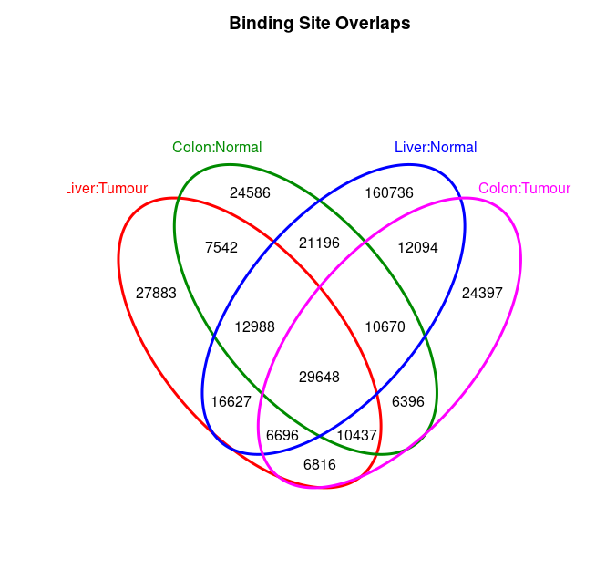
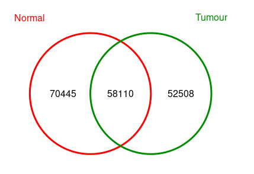

After preprocessing, next I want to call peaks for each bound file. After searching seems there are some tools I can use, like Pepr, MACS2. etc, but since MACS2 is kind of popular and troditional, so I will use it here.

## 1. Peak Calling

### 1.1. Merge Inputs files

Firstly, since I have 4 phenotype (LT, TC, NC, NT), but only 2 of them have Input data, so I decided to merge all Input data togather and use all Bound file to call peak against it. I personally think, if we have proper Input data for each phenotype, we should definitly call peaks on each Input, so it's just a compromisation solution here.

```bash
samtools merge MergedInput.bam `ls ./myGreyList/*_Inp.grey_filtered.bam`

```

### 1.2. Apply peak calling

Then we can start to do peak calling. The key macs2 code is just online:

```bash
macs2 callpeak -t Bound.bam -c Input.bam -f BAM -g hs --outdir macs2 -n SampleName 2> macs2/SampleName-macs2.log
```

The `gs` parameter is vital as it indicates different species genome length, clearly that human and mouse have different genome length. Here I use hs indicate human. This is written in MACS2 manual. Since I want to make things easier and faster, I wrote below R script to do MACS2 calling across all samples automatically and parallel.

```r
# This is script to do MACS2 calling
# Author: Tian

bams <- dir("../1.Preprocess/myGreyList/", pattern="*_bnd.grey_filtered.bam")
bams <- unique(sapply(bams, function(x) strsplit(x,split="[.]")[[1]][1]))

if (!file.exists("./macs2")) dir.create("./macs2")

commands <- list()
for(i in bams) {

    command <- paste0("macs2 callpeak -t ../1.Preprocess/myGreyList/", i, ".grey_filtered.bam -c ../1.Preprocess/MergedInput.bam -f BAM -g hs --outdir macs2 -n ", i, " -B -q 0.1 2>    macs2/", i, "-macs2.log")
    message(command)
    commands <- c(commands, command)
}

runMacs <- function(i)
{
    system(i)
}

library(doParallel)
detectCores()
cl <- makeCluster(18)
registerDoParallel(cl)
getDoParWorkers()

library(foreach)
x <- foreach(i = commands) %dopar% runMacs(i)

registerDoSEQ()
on.exit(stopCluster(cl))
```

## 2. DiffBind

DiffBind could do many things, but in general, I am looking to do couple things as below:

- Find peaks enriched by each phenotype
- Find Unique Peaks for each phenotype
- Find non-unique but differential peaks by each phenotype (hyper- and hypo- separately)

### 2.1. Remove Outlier Sample

So sad that even I have just so little samples, I still need to removed some as they are showing totally weird enrichment pattern for their phenotype. The second plot shows LT49 and LT51 seems wrong, maybe they are wrongly labeled, or during the experiment they did not get the tumour properly, instead they get normal liver samples. Anyway, I think we should remove them



### 2.2. Generate Affinity Matrix

One very useful feature is to generate the affinity matrix, according to vignette, I can generate a matrix like this. In this step, the `dba.count()` function  vital, as it calculate the affinity score based on read counts for every sample, rather than confidence scores for only those peaks called in a specific sample (occupancy scores). In short, the normalised matrix is "comparible" like a proper array matrix.

```r
myDBA <- dba(sampleSheet="./SampleList.csv", dir="./")
myDBA <- dba.count(myDBA)
myDBA <- dba.normalize(myDBA)
dba.peakset(myDBA, bRetrieve=TRUE, writeFile="BindingAffinityMatrix.csv")
```

Eventually I get 441636, which is a good number indeed. Though compared with individual samples, there is a huge decrese of number, but still it's a good number. According to this post, Rory did normalisation across samples, so I think this result should be reliable. **Here one reamining questions is I don't know how the these peaks are selected? Will find out later.**

```r
> myDBA
16 Samples, 441636 sites in matrix:
         ID Tissue Condition Treatment Replicate    Reads FRiP
1  SUL_LT52  Liver    Tumour      5hmC        52 19373481 0.31
2  SUL_LT53  Liver    Tumour      5hmC        53  7815976 0.27
3  SUL_LT55  Liver    Tumour      5hmC        55 25472184 0.23
4  SUL_NC49  Colon    Normal      5hmC        49 12637511 0.31
5  SUL_NC51  Colon    Normal      5hmC        51 12560034 0.32
6  SUL_NC52  Colon    Normal      5hmC        52  8095500 0.29
7  SUL_NC53  Colon    Normal      5hmC        53 15271257 0.29
8  SUL_NL49  Liver    Normal      5hmC        49 10980685 0.38
9  SUL_NL51  Liver    Normal      5hmC        51 18397068 0.40
10 SUL_NL52  Liver    Normal      5hmC        52  4259038 0.34
11 SUL_NL53  Liver    Normal      5hmC        53  1099676 0.25
12 SUL_NL55  Liver    Normal      5hmC        55  9119777 0.39
13 SUL_TC49  Colon    Tumour      5hmC        49  4753209 0.21
14 SUL_TC51  Colon    Tumour      5hmC        51 12451098 0.27
15 SUL_TC52  Colon    Tumour      5hmC        52  7504298 0.31
16 SUL_TC53  Colon    Tumour      5hmC        53  9761884 0.32
```

### 2.3. Get Consensus Peaks for each pheno

Here I want to find out peaks that enriched in each phenotype (LT, TC. etc). The way consensus peak do is for each phenotype, find peaks show certain number of apperance in each phenotype. For example, in below code, `minOverlap=2`, which means I set if a peak exist in two samples across all sample in this phenotype, I assume it's an peak for this phenotype.

```r
message("Generate Overlap Peaks across all Samples")
myDBA <- dba(sampleSheet="./SampleList.csv", dir="./")
myDBA_consensus <- dba.peakset(myDBA, consensus=c(DBA_TISSUE,DBA_CONDITION), minOverlap=2)
consensus <- dba(myDBA_consensus, mask=myDBA_consensus$masks$Consensus, minOverlap=1)
cons.ol <- dba.plotVenn(consensus, consensus$masks$Consensus)
```

Below are consensus generated: so now I get one version of phenotype specific peaks. And even I can get their overlapped status below:

```r
> consensus
4 Samples, 378712 sites in matrix:
            ID Tissue Condition Treatment      Replicate Intervals
1 Liver:Tumour  Liver    Tumour      5hmC       52-53-55    123665
2 Colon:Normal  Colon    Normal      5hmC    49-51-52-53    130233
3 Liver:Normal  Liver    Normal      5hmC 49-51-52-53-55    275147
4 Colon:Tumour  Colon    Tumour      5hmC    49-51-52-53    112944
>
```





Here I am thinking if I can firstly expend these peaks, then find consensus peaks, I should have more peaks with above code.

### 2.4 Occupancy Analysis

In above step, I get the consensus peaks for each phentoype, however, the Venn plot is too mess.

```r
message("Occupancy Analysis between NC and TC")
myDBA <- dba(sampleSheet="./SampleList.csv", dir="./")
NCTC <- dba(myDBA, mask=myDBA$masks$Colon)
NCTC_consensus <- dba.peakset(NCTC, consensus=c(DBA_CONDITION), minOverlap=2)
consensus <- dba(NCTC_consensus, mask=NCTC_consensus$masks$Consensus, minOverlap=1)
dba.plotVenn(consensus, consensus$masks$Consensus)
NCTC.OL <- dba.overlap(consensus, consensus$masks$Consensus)
```

Below is an example of these peaks:

```r
> consensus
2 Samples, 181063 sites in matrix:
      ID Tissue Condition Treatment   Replicate Intervals
1 Normal  Colon    Normal      5hmC 49-51-52-53    130233
2 Tumour  Colon    Tumour      5hmC 49-51-52-53    112944
> head(consensus$peaks[[1]])
   Chr Start   End      Score
1 chr1 20901 21651 0.08584423
2 chr1 26761 27145 0.03783533
3 chr1 29911 30362 0.13396484
4 chr1 31371 31761 0.05202175
5 chr1 35031 35312 0.04776754
6 chr1 83634 84090 0.05267410
>
```

The number is slightly different between below Venn Plot and above `Intervals` because sometimes when calculating overlap peaks, multiple peaks in one peak set could be overlaped with only 1 peak in another peak set.



### 2.5 Differential Analysis

Differential Analysis contains two points: One is normalisation, according to the vignette: "the **safest** method is probably to set `background=TRUE` and `normalize=DBA_NORM_NATIVE`, resulting in the use of background reads and the native normalization method". And the other is batch effect adjustment.

```r
message("Differential Analysis")
myDBA <- dba(sampleSheet="./SampleList.csv", dir="./")
NCTC <- dba(myDBA, mask=myDBA$masks$Colon)

# Get Consensus Peaks
NCTC_consensus <- dba.peakset(NCTC, consensus=c(DBA_CONDITION), minOverlap=2)
consensus <- dba(NCTC_consensus, mask=NCTC_consensus$masks$Consensus, minOverlap=1)
consensus_peaks <- dba.peakset(consensus, bRetrieve=TRUE)

# Count/Normalize with ONLY consensus peaks
NCTC <- dba.count(NCTC, peaks=consensus_peaks, summits=250, bParallel=30)
NCTC <- dba.normalize(NCTC, method=DBA_ALL_METHODS, normalize=DBA_NORM_NATIVE, background=TRUE)

# Find Differential Peaks with batch correction on Replicate.
# The analysis step also will do Blacklist and Greylist removin
NCTC <- dba.contrast(NCTC, design="~Replicate + Condition")
NCTC <- dba.analyze(NCTC, bParallel=40)
rownames(NCTC$binding) <- 1:nrow(NCTC$binding) # This is bug fix provided by package author
NCTC.peaks <- dba.report(NCTC, bCalled=TRUE, th=1)
```

With above code, the `bCalled` parameter is not working because I have generated consensus peaks, if I don't set `peaks` parameter in `dba.count()` I will get Called result for each groups.  I will asses their similarities later. So the result is below, there are 1171 significantly different peaks between two status among 168185 peaks. The number of consensus peak (total peaks for below table) is not as I expected as above Occupancy analysis, I need to find out why.

```r
> knitr::kable(head(NCTC.peaks))

|seqnames |     start|       end| width|strand | Conc| Conc_Tumour| Conc_Normal| Fold| p.value|      FDR|
|:--------|---------:|---------:|-----:|:------|----:|-----------:|-----------:|----:|-------:|--------:|
|chr4     |  86515538|  86516038|   501|*      | 4.41|        5.41|        0.00| 4.71|       0| 0.000192|
|chr10    |   3978236|   3978736|   501|*      | 4.72|        5.64|        1.39| 3.54|       0| 0.000192|
|chr6     |  43543694|  43544194|   501|*      | 5.78|        6.74|        1.82| 3.15|       0| 0.000297|
|chr6     |  54690578|  54691078|   501|*      | 4.08|        5.07|        0.00| 4.18|       0| 0.000620|
|chrX     |  46375722|  46376222|   501|*      | 4.85|        5.81|        0.69| 3.59|       0| 0.000682|
|chr9     | 124981900| 124982400|   501|*      | 4.36|        5.34|        0.00| 4.01|       0| 0.000682|
> sum(NCTC.peaks$FDR <= 0.05)
[1] 1171
>
```

### 2.6. Questions not clear

- There are seems multiple ways to find peaks enriched by each phenotype, Consensus, Occupancy Analysis, Differential Analysis .etc. **I need to make sure I understand perfectly what are their differences, and what are really reliable occupancy peaks.**
- If count and normalisation is the only way to generate affinity scores / matrix, can I generate them separately? As if I do it togather, I may have too few consensus peaks.

## 3. Annotated Peaks

In above section, I successfully get differential peak information from DiffBind, but they are unannotated. Here I found a quick and easy way to do annotation for these peaks, by using `org.Hs.eg.db` and `ChIPpeakAnno` packages.

```r
message("Annotate Regions")
library(org.Hs.eg.db)
library(ChIPpeakAnno)
data(TSS.human.GRCh38)
NCTC.peaks <- annotatePeakInBatch(NCTC.peaks, AnnotationData=TSS.human.GRCh38)
NCTC.peaks <- addGeneIDs(NCTC.peaks, "org.Hs.eg.db", IDs2Add = c("entrez_id", 'symbol'))
```

After annotation, we know where are these peaks, then downstream analysis like GSEA, TSS selection, transcript factor binding site enrichment could consevutively done