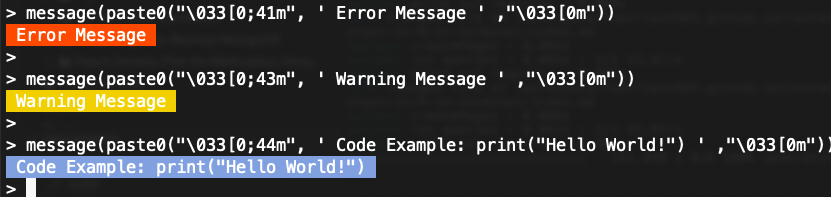

Actually after searching, there are indeed some ways to achive this, merely contributed by [this StackOverflow](https://stackoverflow.com/questions/29861065/coloring-output-in-r-language).

## 1. Directly use Colour Index

I can directly output some colour with some simple code:

```r
for(col in 29:47) {
    cat(paste0("\033[0;", col, "m", txt, "\033[0m  "))
}
```


So I would prefer some below colours:

```r
> message(paste0("\033[0;41m", ' Error Message ' ,"\033[0m"))
> message(paste0("\033[0;43m", ' Warning Message ' ,"\033[0m"))
> message(paste0("\033[0;44m", ' Code Example: print("Hello World!") ' ,"\033[0m"))
```



## 2. Use R package 

A nice package [crayon](https://cran.r-project.org/web/packages/crayon/index.html) is designed for this purpose, I will not use it simply because I don't want to wrap too many pacakges into ChAMP, but it's indeed a good solution for people who have this purpose.

```r
library(crayon)
cat(blue("Hello", "world!\n"))
```

