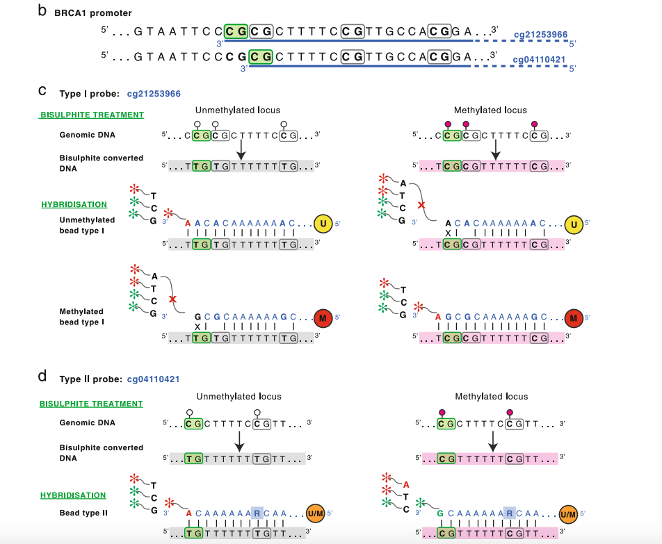

ChAMP is a tool for DNA Methylation array analysis, more specifically, it only work with Illumina Methylation. Previously Ilumina company only have Human Methylation array ([450K](https://emea.support.illumina.com/downloads/infinium_humanmethylation450_product_files.html) and [EPIC](https://emea.support.illumina.com/downloads/infinium-methylationepic-v1-0-product-files.html)), but recently it published [methylation array for Mouse](https://emea.support.illumina.com/downloads/infinium-mouse-methylation-manifest-file-csv.html). So my task here now it to integrate these 3 manifest into ChAMP.

## 1. Issue between illumina file and it's manifest

Manifest contains many information, not all are used by ChAMP, users can get more detail from [here](https://emea.support.illumina.com/content/dam/illumina-support/documents/downloads/productfiles/methylationepic/infinium-methylationepic-manifest-column-headings.pdf). However, **most importantly, it indicates us how to fetch each CpG's methylation value (and unmethylated value) from each IDAT file**. The IDAT file (which could be readed by [R pacakge illuminaio](https://bioconductor.org/packages/release/bioc/html/illuminaio.html)) contains probes that are designed to hybrid with DNA samples' bisulfite conversion bases. **The hard part is: It's not that one probe in IDAT file is designed to match one CpG**. As most people know, there are two types of `Assay` designed to finish this job: Infinium type-I and Infinium type-II. Type-I assay used two probes to match one CpG site, but Type-II assay use only one probe to match one CpG site. The whole methylation chip is mixed with these two type of assay, which means some part of CpGs' methylation status are measured by 2 probes, but some part are measured by just one probe. So obviously the number between probes in chip is NOT equal to number of CpGs eventually we can get.

Secondly, there are two `colour channels` designed for each probe. In short, colour channels are measurement of colour intensity the illumina mechine. So each probe have 2 colour channel.

Third, there are 2 `methylation status`: Methylated and Unmethylated for each CpG site, which means for one CpG in our body, there are a lot of fragments contain this CpG sites are flowing in cell everytime. Some part of these fragments are methylated (which means their C base is attached by a methyl), and the rest are not methylated. Yes there are only two status, Yes or No, there is no middle ground for one fragment (or we can say one CpG). So actually the so call "methylation status" we are trying to estimate is the ratio between methylated fragments and all estimated fragment: **Methylated/(Methylated + Unmethylated)**.

So finally, in summary there are `2 types of assay`, each with `2 colour channel` in IDAT file. And we want to get `2 methylation status` for each CpG site. It took me quite a long time to figure out their relationship ( from various papers), I don't know why there is so little "detailed" information about it, which also means most DNA methylation researcher are purely relying on software's result, instead of question these very down-to-earth detail questions.

## 2. How exactly IDAT probes are matched with CpG Sites

The best paper I found to explain above issue is [this one](https://genomebiology.biomedcentral.com/articles/10.1186/s13059-016-1066-1). And it presented below figure. I don't want to re-type everything here, but this is author's word:




<div style="background-color: #eeeeee;padding: 20px; border-radius: 5px; font-size: 13px; margin-bottom: 10px;margin-top:10px">
"C: DNA methylation measurement with Infinium I probes is carried out by two beads – the unmethylated (U) bead measures the unmethylated signal and methylated (M) bead measures the methylated signal. The unmethylated signal detection for the cg21253966 probe is schematically represented on the left panel. Briefly, the unmethylated bead probe (U) sequence is designed to match bisulphite converted DNA sequence of the unmethylated locus. (Note that cytosines in both the target CpG site and all other CpG sites bound by the 50 bp probe are assumed to be unmethylated and therefore converted to Ts during bisulphite reaction.) <b>The hybridisation of a bisulphite converted unmethylated DNA fragment to the bead enables single base extension and incorporation of a ddNTP labelled nucleotide matching the nucleotide immediately upstream of the target CpG site; in this case incorporation of an A nucleotide and signal detection in the RED channel</b>. Hybridisation of the methylated bead probe (M), on the other hand, results in mismatch at the 3′ end of the probe and inhibition of single base extension. Detection of the methylated signal, shown on the right panel, follows similar steps. D: For Infinium II probes the unmethylated and methylated signals are measured by the same bead (U/M). The bead probe sequence is designed to match bisulphite converted DNA of both the methylated and unmethylated locus. This is achieved by making the cytosine of the target CpG site the single base extension locus and replacing cytosines of all other CpG sites within the probe sequence with degenerate R bases that hybridises to both T (representing unmethylated and converted cytosine) and C (representing methylated and protected cytosine) bases. The unmethylated signal detection for the cg04110421 probe is schematically represented on the left panel. The hybridisation of the bisulphite converted unmethylated DNA fragment enables single base extension and incorporation of ddNTP labelled A nucleotide matching the unmethylated and converted cytosine at the target CpG site and signal detection on the RED channel. The detection of the methylation signal, shown on the right panel, is the same except that in this case single base extension results in incorporation of ddNTP labelled G nucleotide matching the methylated and protected cytosine at the target CpG site and signal detection on the GREEN channel"
</div>

The hard part here is to understand how two Infinum type-I probes could measure one CpG's 2 status. In short for one CpG sites, one "methylated-probe" (probe\_A) would try hybrid the CpG site, if this site is methylated, this probe would have intensity. Let's assumed it would show in RED channel (forget another green colour now), which could be detected later, indicating this CpG's is methylated. So eventually we detected Red\_Channel of probe\_A as CpG's Methylated status. At the same time, there is another "unmethylated\_probe" (probe\_B) would try hybrid the same CpG site, it will only work if this site is NOT methylated. And eventualy, if this site is indeed not methylated, probe\_B would also show Red\_Channel. So now we know, The Red\_Channel of probe\_A indicates methylated, and Red\_Channel of probe\_B indicates Unmethylated status. **For this CpG site, Green\_Channel for both probe\_A and probe\_B are useless for us**.

So how about the second colour, the Green? Yes there are 2 different kinds of type-I assay: The green channel type and red channel type. For the first type, we only check the two probe's green channel for meth/unmeth status. For the second type, we only check the red channel for meth/unmeth status. For each CpG sites, when we are trying to get it's meth/unmeth information from IDAT, we must firstly check it's colour chanenl. Why there are two types of type-I assay? I previuosly googled one word somewhere that it's because of primer design, but since my biological background is weak, I don't fully understand, I will try figure it out in the future.

Then, the Infinium type-II is much easier. Just one probe (matching each CpG site), with two colour channel both useful. While Green channel indicates this CpG site is methylated (C after BS conversion), and Red indicates it's not (T after BS conversion).

## 3 Code to preprocess Manifest

After figuring out above issue, I can now write code to generate "probe 2 CpG annotation". Let's have a look at how the manifest looks like. Below is an example of EPIC array B5 version manifest. There are 3 part in this manifest: `Heading`, `Assay` and `Control`. Heading is not very useful, then Assay contains all information of CpG and Probe. Control are probes that are designed in chip, but merely used to do quality control for each chip.

I firstly address the Assay part. After skipping Header information, I now can read assay into R.
```r
manifest_directory <- "../Manifests/infinium-methylationepic-v-1-0-b5-manifest-file.csv"

skipline <- which(substr(readLines(manifest_directory),1,7) == "[Assay]")
Manifest <- read.csv(manifest_directory, head=T, sep=",", skip=skipline, as.is=T)
```
The Manifest contains too much information, much more than CpG's position or it's probe information, but sometimes included information like gene, TSS status, CpG Island .etc **And for different manifest (version or species), there are different columns of annotation included. For example, I found there is no gene information in Mouse information, but gene is such a commonly used information everyone would ask...**. Here I just focus on CpG-to-Probe mapping, so I just extract below some key columns:

```r
> Anno <- Manifest[,c("IlmnID", "AddressA_ID", "AddressB_ID", "Infinium_Design_Type", "Color_Channel")]
> knitr::kable(head(Anno))


|IlmnID     |AddressA_ID |AddressB_ID |Infinium_Design_Type |Color_Channel |
|:----------|:-----------|:-----------|:--------------------|:-------------|
|cg07881041 |0085713262  |            |II                   |              |
|cg18478105 |0046761277  |0086644198  |I                    |Grn           |
|cg23229610 |0021717843  |            |II                   |              |
|cg03513874 |0029622133  |            |II                   |              |
|cg09835024 |0016745152  |0081631976  |I                    |Red           |
|cg05451842 |0016681196  |            |II                   |              |
```

Above are all information I need for CpG-to-Probe mapping, colour channel, Infinium type, AddressA\_ID and AddressB_ID are 1-2 probes designed for each CpG, and the first column is CpG name world-wide is using. In above code black we already can see 3 types of CpGs:

1. cg07881041 is Infinium type-II assay, so it has only one probe (AddressA\_ID), but two colour chanenls are used for it. So eventually the Green channel (read from Grn\_IDAT file) indicate this CpG's methylation status, and Red channel indicates it's unmethylated status.
2. cg18478105 is Infinium type-I assay, and the colour\_channel for this CpG is Green (Grn), this CpG have 2 probes (AddressA\_ID and AddressB\_ID). So for this CpG, the AddressB\_ID indicates it's methylation status, and AddressA\_ID indicates it's unmethylated status.
3. cg09835024 is Infinium type-I asssay, and the color channel is Red, this CpG have 2 probes (AddressA\_ID and AddressB_\ID). So for this CpG, the AddressB\_ID indicates it's methylated status, and AddressA\_ID indicate it's unmethylated status.

> There is a vital problem here: **How can I know AddressB equals to Methylated? and AddressA equals to Unmethylated? I did not found any document for this**, apart from original minfi package's loading function. I have decided to ask Illumina for answer.

Anyway, below is the core code to convert manifest into CpG information.

```r
message("Extract Annotation for ChAMP from original Illumina Human or Mouse Methylation Array")
message("Read CSV manifest into R.")
skipline <- which(substr(readLines(manifest_directory),1,7) == "[Assay]")
Manifest <- read.csv(manifest_directory, head=T, sep=",", skip=skipline, as.is=T)
    
Anno <- Manifest[,c("IlmnID", "AddressA_ID", "AddressB_ID", "Infinium_Design_Type", "Color_Channel")]
message("Total Rows in this manifest: ", nrow(Anno))
    
message("There are totally 3 types of Probes, Type-II, Type-I-Green and Type-I-Red")
Type_II <- Anno[which(Anno$Infinium_Design_Type=="II"),] # Find Type-II CpGs.
Type_I.Red <- Anno[which(Anno$Infinium_Design_Type == "I" & Anno$Color_Channel=="Red"),] # Find Type-I CpGs with Green Channel
Type_I.Grn <- Anno[which(Anno$Infinium_Design_Type == "I" & Anno$Color_Channel=="Grn"),] # Find Type-I CpGs with Red Channel
    
CpG.ID <- c(as.character(Type_II$IlmnID),as.character(Type_I.Red$IlmnID),as.character(Type_I.Grn$IlmnID))
    
message(paste0("Get mapping index between Manifest and Illuminano pacakge output to generate Methylated Signal"))
M.index <- c(paste("G",Type_II$AddressA_ID, sep="-"),
             paste("R",Type_I.Red$AddressB_ID, sep="-"),
             paste("G",Type_I.Grn$AddressB_ID, sep="-"))
    
message(paste0("Get mapping index between Manifest and Illuminano pacakge output to generate UnMethylated Signal"))
U.index <- c(paste("R",Type_II$AddressA_ID,sep="-"),
             paste("R",Type_I.Red$AddressA_ID,sep="-"),
             paste("G",Type_I.Grn$AddressA_ID,sep="-"))

message("generate Colour Channel distribution")
P.Channal <- c(rep("g+r",nrow(Type_II)),rep("r",nrow(Type_I.Red)),rep("g",nrow(Type_I.Grn)))

message("Merge them into one Data.Frame for future usage.")
ProbeInfo <- data.frame(CpG=CpG.ID, M.index=M.index, U.index=U.index, Channel=P.Channal)
rownames(ProbeInfo) <- ProbeInfo$CpG
```

Now we can have a look at the final `ProbeInfo` object:

```r
> knitr::kable(head(ProbeInfo))


|           |CpG        |M.index      |U.index      |Channel |
|:----------|:----------|:------------|:------------|:-------|
|cg07881041 |cg07881041 |G-0085713262 |R-0085713262 |g+r     |
|cg23229610 |cg23229610 |G-0021717843 |R-0021717843 |g+r     |
|cg03513874 |cg03513874 |G-0029622133 |R-0029622133 |g+r     |
|cg05451842 |cg05451842 |G-0016681196 |R-0016681196 |g+r     |
|cg14797042 |cg14797042 |G-0007767973 |R-0007767973 |g+r     |
|cg09838562 |cg09838562 |G-0025809572 |R-0025809572 |g+r     |
>
> knitr::kable(tail(ProbeInfo))


|           |CpG        |M.index      |U.index      |Channel |
|:----------|:----------|:------------|:------------|:-------|
|cg03736928 |cg03736928 |G-0067692127 |G-0010668981 |g       |
|cg06272054 |cg06272054 |G-0059709585 |G-0075798594 |g       |
|cg07255356 |cg07255356 |G-0096765967 |G-0022689283 |g       |
|cg26501858 |cg26501858 |G-0072705864 |G-0089651984 |g       |
|cg24220897 |cg24220897 |G-0038809193 |G-0041808189 |g       |
|cg12325588 |cg12325588 |G-0035621935 |G-0078754334 |g       |
>
```

So now I organize the origin manifest (which contain 1-2 probes, 2 colour chanenl) into a nice table format. For each CpG, there is `colour-probe` indicates its methylated status (M.index), and another `colour-probe` indicates its unmethylated status (U.index).

It's not a complicated thing at all, but I have wasted couple ways on this small task. I only want to make sure these matching are correct. From my point of view, this is the most important part for manifest, the `Control` is also important, so does other annotated information (gene's CpG Island .etc). I will not discuss them here.