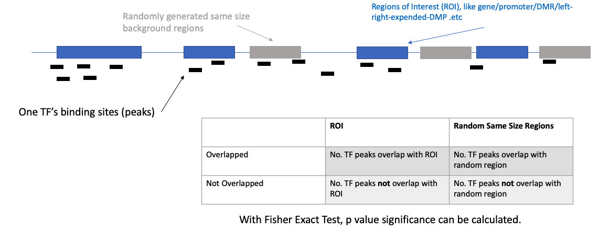
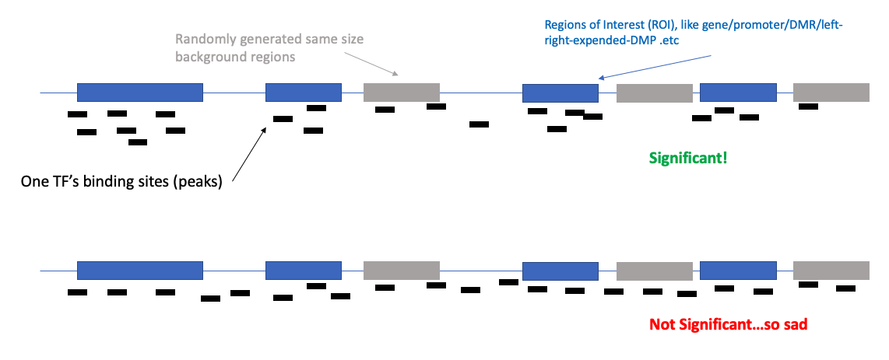
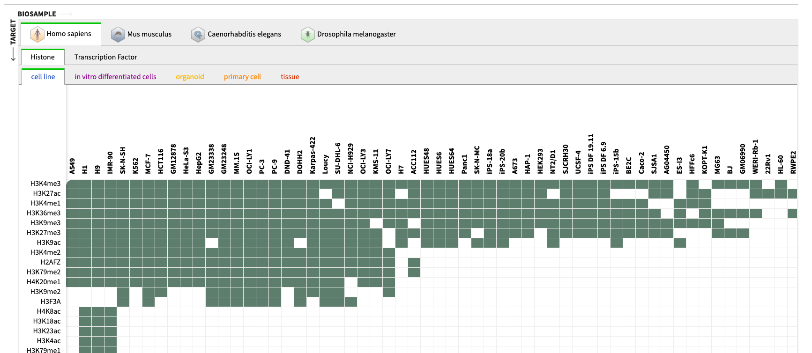

Transcript factor (`TF`) are gene regulators, more specifically they are proteins that would bind on DNA sequence, and influence gene's expresion pattern. For some important transcript factors (like CTCF), they have thousands of sites to bind on DNA sequence. Since many years ago, scientists try to get these binding sites. By using ChIP-seq, scientists get use anti-body to capture all binding sequence of certain TF. Then, these sequence could be mapped to genome, so we know their locations on genome, these location cooridates are Transcript Factor Binding Sites (`TFBS`).

## 1. Transcript Factor Binding Sites Enrichment Analysis (TFEA)

After getting the position, many things are easier after that. From Bioniformatic point of view, if we are analying RNA-seq or DNA methylation, after comparing analysis, we get differential expression genes(DEG) and differential methylated regions(DMR). Then natually we want to know if these regions are highly targeted by some TFs. At this time, if we have certain TF's peaks (it's binding locaion on whole genome), then mapping it with our DMR/DEG. We could see the overlap status.

Surely some statistic method need to be applied here to decided "to what degree" the enrichment of a TF in these regions could be seens as "significantly enriched". Among them, fisher exact test is a popular, which compare the enrichment status of ROI (regions of interest) and random regions. If the ratio varis a lot, it indicates that this TF is highly enriched in these regions.



For example, below I draw two TF enrichment status. Apparently, the second one is not significant because the TF peaks are "too avereagly distributed" across ROI and random regions.



Above is an explaination of algorithm of TF enrichment analysis for one TF, now comes the qustion, **how to get a list of TF's peak information**? Without data, I can do nothing.

## 2. TF Database

ENCODE is a very good project that get Peaks of a lot of histones and TFs for both [Human and Mouse](https://www.encodeproject.org/chip-seq-matrix/?type=Experiment&replicates.library.biosample.donor.organism.scientific_name=Homo%20sapiens&assay_title=Histone%20ChIP-seq&assay_title=Mint-ChIP-seq&status=released). For example, in below figure, each column is a cell type, and each row is a histone. The peaks of this histone/TF could be get by click the green block.



**However, [ENCODE database did not contain too many TFs for Mouse.](https://www.encodeproject.org/chip-seq-matrix/?type=Experiment&replicates.library.biosample.donor.organism.scientific_name=Mus%20musculus&assay_title=TF%20ChIP-seq&status=released)** So I searched a bit. I found some really nice tools: [GTRD](https://academic.oup.com/nar/article/47/D1/D100/5184717), [MethMotif](https://bioinfo-csi.nus.edu.sg/methmotif/index.php) and [TFregulomeR](https://github.com/benoukraflab/TFregulomeR). Both GTRD and MethMotif contains a bigger database than ENCODE. They contains a lot of result processed by themself from public, not like ENCODE who generated and processed all the data itself. So in my idea, I think ENCODE database is still the gold standard, but I want to know if other database is good to use.

## 3. Use TFregulomeR to get TF Peaks

More importantly, I found a very nice R pacakge [TFregulomeR](https://github.com/benoukraflab/TFregulomeR), which could automatically download a lot of TF's Peaks, and as user, we can select cell lines, tissues, species we like from a huge database. Below is a simple way to check of TF I am looking for are in the database.

```R
> library(TFregulomeR)
> all_record <- dataBrowser()
> knitr::kable(head(all_record[,c("species", "organ", "cell_tissue_name", "TF")]))


|species |organ             |cell_tissue_name                                 |TF     |
|:-------|:-----------------|:------------------------------------------------|:------|
|mouse   |brain             |embryonic-stem-cell-derived-neural-progenitors   |Sox3   |
|mouse   |stem_cell         |embryonic-stem-cells                             |Tcf7l1 |
|mouse   |blood_and_lymph   |embryonic-stem-cell-derived-haematopoietic-cells |Tal1   |
|mouse   |blood_and_lymph   |bone-marrow-drived-macrophages                   |Bcl6   |
|mouse   |connective_tissue |3T3-L1-derived-adipocytes                        |Pparg  |
|mouse   |connective_tissue |3T3-L1-derived-adipocytes                        |Ctcf   |
```

We can quickly check how many TF in certain organ or cell. For example, there are 88 TFs you can use if you research human stem cell. Or like me, who is researching mouse intestine, there are 11 TFs I can use.

```r
> length(which(all_record$species == "human" & all_record$organ == "stem_cell"))
[1] 88
> length(which(all_record$species == "mouse" & all_record$organ == "intestine"))
[1] 11
```

**However, I noticed that even the `organ` is the same, the `cell_tissue_name` maybe not.** For example in below table, all of them are from "mouse intestine", but some cell is villus, some are distal-small-intestine .etc.

```R
> index <- which(all_record$species == "mouse" & all_record$organ == "intestine")
> knitr::kable(all_record[index ,c("species", "organ", "cell_tissue_name", "TF")])


|     |species |organ     |cell_tissue_name                          |TF     |
|:----|:-------|:---------|:-----------------------------------------|:------|
|115  |mouse   |intestine |intestinal-villus                         |Cdx2   |
|261  |mouse   |intestine |small-intestine                           |Ctcf   |
|456  |mouse   |intestine |intestine                                 |Ctcf   |
|483  |mouse   |intestine |villus                                    |Cdx2   |
|484  |mouse   |intestine |villus                                    |Hnf4a  |
|724  |mouse   |intestine |jejunal-crypt-intestinal-epithelial-cells |Yy1    |
|842  |mouse   |intestine |intestinal-crypt-cells                    |E2f3   |
|843  |mouse   |intestine |intestinal-villus                         |E2f3   |
|1006 |mouse   |intestine |crypt-cells                               |Tcf7l2 |
|1076 |mouse   |intestine |duodenum-and-jejunum                      |Vdr    |
|1345 |mouse   |intestine |distal-small-intestine                    |Atoh1  |
>
```

So eventually I can get peaks by using `loadPeaks()` function, like below the full code. After below for loop, all above 11 TF's peaks will be saved in TFPeaks object. Note that the parameter `includeMotifOnly` I would prefer to set FLASE, other wise it will only get Motif binding avaliable peaks. The number of peaks would be much less.

```r
library(TFregulomeR)

all_record <- dataBrowser()
index <- which(all_record$species == "mouse" & all_record$organ == "intestine")
mm10Intestine <- all_record[index ,c("species", "organ", "cell_tissue_name", "TF")]

TFPeaks <- list()
for(i in mm10Intestine$ID) {
    TFPeaks[[i]] <- loadPeaks(id = i, includeMotifOnly = FALSE)
}
```

Then we can check how many peaks each TF have (CTCF seems quite popular here):
```r
> knitr::kable(cbind(mm10Intestine$ID, matrix(unlist(lapply(TFPeaks, function(x) nrow(x))))[,1]))


|                                                                 |      |
|:----------------------------------------------------------------|:-----|
|GTRD-EXP000895_MMU_intestinal-villus_CDX2                        |7733  |
|GTRD-EXP011053_MMU_small-intestine_CTCF                          |39894 |
|GTRD-EXP031037_MMU_intestine_CTCF                                |39760 |
|GTRD-EXP031180_MMU_villus_CDX2                                   |3544  |
|GTRD-EXP031181_MMU_villus_HNF4A                                  |18151 |
|GTRD-EXP032837_MMU_jejunal-crypt-intestinal-epithelial-cells_YY1 |1024  |
|GTRD-EXP033438_MMU_intestinal-crypt-cells_E2F3                   |14899 |
|GTRD-EXP033440_MMU_intestinal-villus_E2F3                        |2976  |
|GTRD-EXP034520_MMU_crypt-cells_TCF7L2                            |3042  |
|GTRD-EXP035023_MMU_duodenum-and-jejunum_VDR                      |15384 |
|GTRD-EXP037469_MMU_distal-small-intestine_ATOH1                  |8826  |
```

The format of these peaks are very nice, easy for downstream use. The `tag_fold_change`, according to the pacakge vignette, is:

> "For each peak region, we also provide its tag (read) fold change (fifth column of returned peaks). This read enrichment value is obtained from MACS2 and denotes the fold change of reads in TF ChIP-seq compared to input ChIP-seq."

```r
> knitr::kable(head(TFPeaks[[1]]))


|chr  |    start|      end|id                                                           | tag_fold_change|
|:----|--------:|--------:|:------------------------------------------------------------|---------------:|
|chr1 |  4801643|  4801644|GTRD-EXP000895_MMU_intestinal-villus_CDX2_peaks_with_motif_1 |            9.78|
|chr1 |  5108863|  5108864|GTRD-EXP000895_MMU_intestinal-villus_CDX2_peaks_with_motif_2 |           45.83|
|chr1 |  6906544|  6906545|GTRD-EXP000895_MMU_intestinal-villus_CDX2_peaks_with_motif_3 |           12.22|
|chr1 |  7311316|  7311317|GTRD-EXP000895_MMU_intestinal-villus_CDX2_peaks_with_motif_4 |           13.44|
|chr1 |  9127956|  9127957|GTRD-EXP000895_MMU_intestinal-villus_CDX2_peaks_with_motif_5 |           13.75|
|chr1 | 10124232| 10124233|GTRD-EXP000895_MMU_intestinal-villus_CDX2_peaks_with_motif_6 |           19.55|
```

A very important final word, the TFregulomeR's TF peaks are for `hg38` and `mm10` genome.