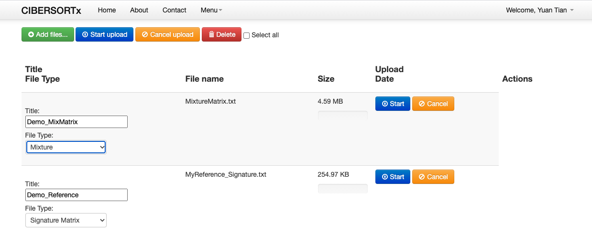
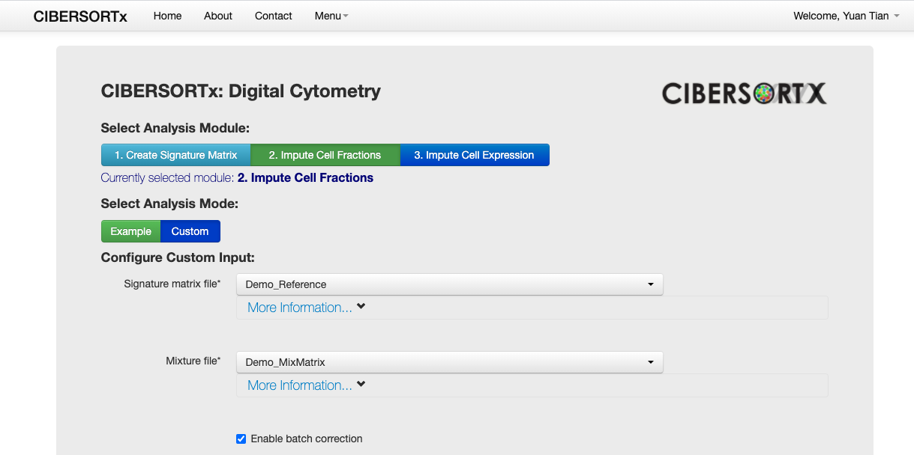
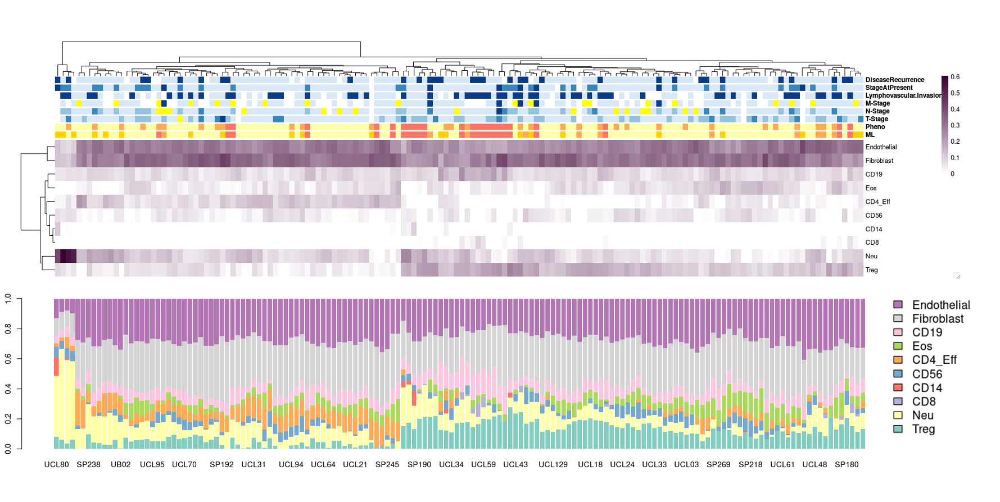

MethylCIBERSORT is a pacakge for cell-type deconvolution, which is published [here](https://www.nature.com/articles/s41467-018-05570-1). Actually this is a package will do "preprocessing" work like feature selection for your array matrix, the actual calcultion work would be done by online CIBERSORT tool, which means you will use the tool locally to generate matrix files, then upload these 2 files to a online tool, then download deconvoluted result from online tool. Not a usual way an R package work.

However, after my exploration, I found a very important asset for MethylCIBERSORT is that it contains a very comprehensive "Signature Matrix", which is selected feature from pure cell type. These Signature Matrixes should have very good distingwish capability between cells, so they are the "reference" we will use like a troditional "reference-based" cell deconvolution method.

## 1. Installation

I don't know why, but MethylCIBERSORT could only be [downloaded from here](https://zenodo.org/record/1284582#.YAVxJJP7TIF). I suspect the reason is it's too big to be uploaded to Github. The way to install it is to download it, uzip, then use R command to install the tar.gz file in it. Before install, I need to install below dependence packages. Actually maybe there are more packages reuiqred, but my R has a lot of packages installed already, so it only give me error for below packages missing, you may need to install more according to R software error.

```r
install.packages(c("caret", "glmnet", "NMF")) # you may need to install more.
```

Below command is to install MethylCIBERSORT, it should be run in bash (**NOT R**):

```r
R CMD INSTALL MethylCIBERSORT_0.2.0.tar.gz
```

Another file in the unzip folder MethylCIBERSORT_ReadMe.html is the vignette.

## 2. Generate your own Signature Matrix for Cell Deconvolution

After Installation, we can load the pacakge and start to use it. Actually, **from my point of view, methylCIBERSORT is working on feature selection**, which means if you have purified cell fraction files, it will use linear regression (more likely to be ElasticNet, I did not confirm) to find those most informative signatures (CpG,Gene .etc) between these cell lines. This is exactly the same idea for all reference-based deconvolution method: Finding purified cell type data to create reference.

Then, it provided a simple function to help you to extract those CpGs from your cell-mixed matrix (like your own methylation array from whole blood samples .etc).

So to use this MethylCIBERSORT, you MUST have 2 things:
1. Purified Cell Type Data Matrix (like purified cell type methylation array data). MethylCIBERSORT provided a dataset which contains some immune cell, I will use this for below example, but surely if you are researching some special tissues, you need to find purified cell methylation matrix youself.
2. Your cell-type-mixed data. It's just a commonly 450K or EPIC array, just make sure you know which tissue/organ these samples are collected from.

Here I used a data "DiscoveryCohort" as example, which is a 450K array, contains 180 samples, which is the cell-type-mixed data I have. Then I used `StromalMatrix_V2` data provided by MethylCIBERSORT, which can be directly loaded like `data("StromalMatrix_V2")` after library the pacakge.

```R
library("MethylCIBERSORT")
load("./DiscoveryCohort.rda")

Mat <- DiscoveryCombat # my mixed methylation matrix

data("StromalMatrix_V2")
```

After loading, there are two objects `Stromal_v2`, which is a 450K array that contains 56 purified cell type methylation data (I don't know where they get it, but should easy to findout in the paper.). And `Stromal_v2.pheno`, which is just a vector of cell type name. So we know there are totally 10 cell types in this purified data. If you don't want some of the cell type, for example you just want to immune cell type, you can manually remove Fibroblast by remove them from the pheno vector and the data matrix. Here I will use all of them.

```r
> dim(Stromal_v2)
[1] 485512     56
>
> Stromal_v2[1:5,1:5]
             CD8+_105   CD8+_218   CD8+_261  CD19+_105  CD19+_218
cg00050873 0.88965720 0.88614481 0.89683232 0.90059915 0.91742305
cg00212031 0.05752678 0.03849633 0.03442000 0.06256428 0.03902189
cg00213748 0.58824708 0.72637851 0.80246393 0.83202063 0.81064210
cg00214611 0.05572998 0.04033069 0.03420544 0.04098908 0.03885103
cg00455876 0.76414553 0.77637772 0.82970298 0.80984834 0.75935411
> 
> Stromal_v2.pheno
 [1] "CD8"         "CD8"         "CD8"         "CD19"        "CD19"
 [6] "CD19"        "CD14"        "CD14"        "CD14"        "CD56"
[11] "CD56"        "CD56"        "CD8"         "CD8"         "CD8"
[16] "CD19"        "CD19"        "CD19"        "CD14"        "CD14"
[21] "CD14"        "CD56"        "CD56"        "CD56"        "Neu"
[26] "Neu"         "Neu"         "Neu"         "Neu"         "Neu"
[31] "Eos"         "Eos"         "Eos"         "Eos"         "Eos"
[36] "Eos"         "CD4_Eff"     "Treg"        "CD4_Eff"     "CD4_Eff"
[41] "CD4_Eff"     "Treg"        "CD4_Eff"     "Treg"        "CD4_Eff"
[46] "Treg"        "Fibroblast"  "Fibroblast"  "Fibroblast"  "Fibroblast"
[51] "Endothelial" "Endothelial" "Endothelial" "Endothelial" "Endothelial"
[56] "Endothelial"
>
```

Then we need to intersect our own matrix rowname (CpG) with this purified cell matrix a bit, so make sure all generated signatures are exist in our matrix. Because sometimes our filtering step, quality control steps will remove some CpGs, but they all exist in this Stromal_v2 data, so if later a signatures exist in these CpGs, it would not exist in our data.

```r
Int <- intersect(rownames(Mat), rownames(Stromal_v2))
Mat <- Mat[match(Int, rownames(Mat)),]
Stromal_v2 <- Stromal_v2[match(Int, rownames(Stromal_v2)),]
```

Then we can calcualte the signatures matrix (reference) from this purified data. I used nearly all default parameter, the `sigName` is the name of exported file (I assigned MyReference here). After calculation, a file called `MyReference_Signature.txt` will be generated on this folder. This is one of the file we will upload to CIBERSORT online later.

```r
RefData <- Stromal_v2
RefPheno <- Stromal_v2.pheno

Signature <- FeatureSelect.V4(CellLines.matrix = NULL,
                              Heatmap = FALSE,
                              export = TRUE,
                              sigName = "MyReference",
                              Stroma.matrix = RefData,
                              deltaBeta = 0.2,
                              FDR = 0.01,
                              MaxDMRs = 100,
                              Phenotype.stroma = RefPheno)
```
Then final step, use below function to get your MixMatrix, which is actually just select a subset of your methylation matrix based on the reference you just created (you can do it manually without this function). Below code will generate another file we need in the folder, called `MixtureMatrix`.

```r
Prep.CancerType(Beta = Mat, Probes = rownames(Signature$SignatureMatrix), fname = "MixtureMatrix")
```

## 3. Use CIBERSORT online for deconvolution

The online tool is [this one](https://cibersortx.stanford.edu/index.php). I have no idea why the lab created a online tool for this job instead of a R pacakge...well, I now have no chance to see what they are coding behind. Anyway, firstly we need to upload these two matrix, like blow, select them, give them a name, then press start.



Then: 

1. Select "Run CIBERSORTx" from Menu. To start to run our data.
2. In the page, select the second one "1. Impute Cell Fraction".
3. Then select "Custom" in below, to use our own uploaded data.
4. I am not sure about following many parameters, but I just selected batch correction (with defatul batch correction setting).



Then you can go to "Job Result" page to see the result. It would take maybe 5-10 mins to get the result, then you can download the CSV file, which should contains all the cell fraction.

Below is my visualisation of the result:



## 4. Use prepared Signature Matrix

**This is an very important feature for MethylCIBERSORT, that it provided a long list of signatures**, which could be get by below code. The object `Signatures` contains the prepared reference (not purified rwo methylation data), for a lot of organ and cancer. Personally I think it's very good, largly benifited our work.

```r
library("MethylCIBERSORT")
data("V2_Signatures")
```

Below are signature contains in this object, you may check which reference is in accord with your research. For example, my data is about Lung carcinoma and LCNEC, so I can use `lung_NSCLC_adenocarcinoma_v2_Signature.txt` and `lung_NSCLC_large.cell_v2_Signature.txt`.

```r
> knitr::kable(matrix(c(names(Signatures)),ncol=3))


|                                               |                                                    |                                              |
|:----------------------------------------------|:---------------------------------------------------|:---------------------------------------------|
|acute_myeloid_leukaemia_v2_Signature.txt       |kidney_v2_Signature.txt                             |MethylCIBERSORT_KoestlerRuns_v2_Signature.txt |
|B_cell_leukemia_v2_Signature.txt               |large_intestine_v2_Signature.txt                    |Myeloma_v2_Signature.txt                      |
|B_cell_lymphoma_v2_Signature.txt               |liver_v2_Signature.txt                              |neuroblastoma_v2_Signature.txt                |
|biliary_tract_v2_Signature.txt                 |lung_NSCLC_adenocarcinoma_v2_Signature.txt          |not.specified_v2_Signature.txt                |
|bladder_v2_Signature.txt                       |lung_NSCLC_large.cell_v2_Signature.txt              |oesophagus_v2_Signature.txt                   |
|breast_v2_Signature.txt                        |lung_NSCLC_not.specified_v2_Signature.txt           |ovary_v2_Signature.txt                        |
|Burkitt_lymphoma_v2_Signature.txt              |lung_NSCLC_squamous_cell_carcinoma_v2_Signature.txt |pancreas_v2_Signature.txt                     |
|chronic_myeloid_leukaemia_v2_Signature.txt     |lung_small_cell_carcinoma_v2_Signature.txt          |prostate_v2_Signature.txt                     |
|endometrium_v2_Signature.txt                   |lymphoblastic_leukemia_v2_Signature.txt             |sarcoma_v2_Signature.txt                      |
|Glioma_v2_Signature.txt                        |lymphoblastic_T_cell_leukaemia_v2_Signature.txt     |soft_tissue_other_v2_Signature.txt            |
|haematopoietic_neoplasm.other_v2_Signature.txt |lymphoid_neoplasm.other_v2_Signature.txt            |stomach_v2_Signature.txt                      |
|head.and.neck_v2_Signature.txt                 |melanoma_v2_Signature.txt                           |T_cell_leukemia_v2_Signature.txt              |
|Hodgkin_lymphoma_v2_Signature.txt              |mesothelioma_v2_Signature.txt                       |thyroid_v2_Signature.txt                      |
```

Each signatures is well prepared. like below is the head 6 row for lung_NSCLC_adenocarcinoma_v2_Signature.txt. Note that first column "Cancer" is purifed correponding cell type's methylation value (in below case, it's the purifed lung NSCLC adenocarcinoma cancer cell), you just need to can treat it as a cell type. It means after your deconvolution, you will have colon as "Cancer", which indicates the fraction of "cancer cell" in your mixed matrix. 

```r
> knitr::kable(head(Signatures$lung_NSCLC_adenocarcinoma_v2_Signature.txt))


|NAME       |   Cancer|     CD14|     CD19|  CD4_Eff|     CD56|      CD8| Endothelial|       Eos| Fibroblast|       Neu|     Treg|
|:----------|--------:|--------:|--------:|--------:|--------:|--------:|-----------:|---------:|----------:|---------:|--------:|
|cg08462017 | 49.88034| 56.35251| 55.21799| 25.91377| 55.47009| 54.30028|    45.23166| 53.270201|   48.81308| 53.552690| 19.14463|
|cg00027570 | 88.91362| 85.15549| 83.38408| 11.94099| 48.12991| 16.41943|    76.41173| 88.119608|   88.10889| 86.660785| 11.22104|
|cg00656410 | 95.49160| 92.77664| 95.21987| 94.39093| 59.36857| 82.24071|    96.08532| 95.452797|   95.88234| 94.856858| 94.43086|
|cg01554529 | 96.65773| 33.74366| 94.03253| 96.95019| 94.14457| 95.15506|    97.06747|  5.892855|   96.39383|  7.854713| 96.37149|
|cg01943221 | 94.32218| 75.36597| 56.63856| 60.84383| 72.60968| 47.40565|    96.86826| 91.248507|   94.32562| 91.284044| 65.76366|
|cg03396826 | 95.33345| 78.46352| 93.00160| 90.18293| 10.96672| 46.11765|    93.19458| 15.362624|   95.50772| 31.337663| 86.19129|
>
```

To use these signature, it's much easier, like below, I used two signatures prepared by MethylCIBERSORT, just write.table() these signatures, and create MixMatrix correpondingly, the rest is the same as above, upload to CIBERSORT, run it, get result.

```r
library("MethylCIBERSORT")
load("./DiscoveryCohort.rda")

Mat <- DiscoveryCombat

data("V2_Signatures")

Carcinoma <- Signatures$lung_NSCLC_adenocarcinoma_v2_Signature.txt
write.table(Carcinoma, file = "./Carcinoma_Signature.txt", sep = "\t", row.names = FALSE, quote = FALSE )
Prep.CancerType(Beta = Mat, Probes = Carcinoma$NAME, fname = "CarcinomaMixtureMatrix")

LCNEC <- Signatures$lung_NSCLC_large.cell_v2_Signature.txt
write.table(LCNEC, file = "./LCNEC_Signature.txt", sep = "\t", row.names = FALSE, quote = FALSE )
Prep.CancerType(Beta = Mat, Probes = LCNEC$NAME, fname = "LCNECMixtureMatrix")
```