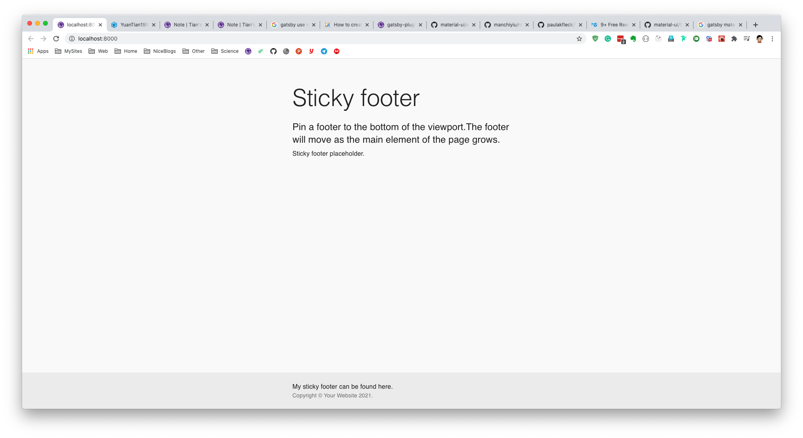
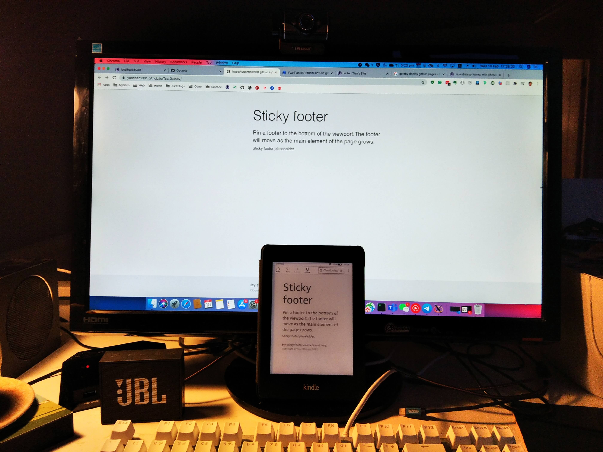
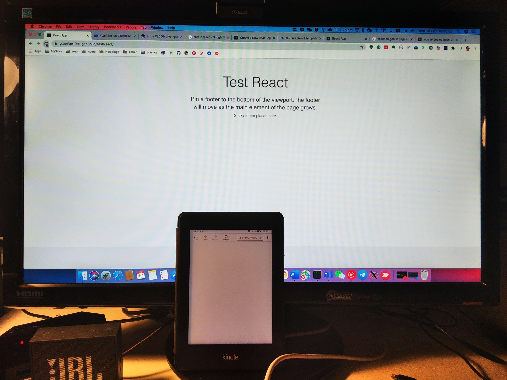

The thing started because I want to code a Kindle Browser avalibale RSS reader, similar to [Reabble](https://reabble.com/en/) or [Kindle Article Reader](https://github.com/paulakfleck/kindle-article-reader). I developed everything quickly with pure react, nearly to be finished. However, after my deployment of my website on Github page, I can not use Kindle Browser to access it. It shows blank page without anything. The website looks fine if I use computer/mobile_phone browser to check it.

However, I found that [my Blog website](https://yuantian1991.github.io/) is working properly on Kindle Browser, which is Gatsby based and Github deployed. Thus I am now very curious why my react developed thing is not working. It could be something related to development stack (Gatsby or React), or it could be related Github branch (master or gh-page). Here I want to quickly create some Gatsby and React project to test it. Surely there are also other possibilities like some of my npm library used in project is not supported by Kindle Browser.

## 1. Deploy Gatsby Webstie on Github master branch

### 1.1. Create Gatsby Website

Firstly, I want to create a Gatsby project quickly and deploy it on Github master branch. I used below command to create website.

```bash
gatsby new TestGatsby https://github.com/gatsbyjs/gatsby-starter-hello-world
```

Then I can enter the folder and start project:
```bash

cd TestGatsby
gatsby develop
```

### 1.2. Use Material UI on Gatsby

Then the Gatsby is working on http://localhost:8000/. Now I want to slightly modify the home page, with material-UI. It's simple, just firstly add 2 libraries:

```bash
npm install gatsby-plugin-material-ui -s
npm install @material-ui/core -s
```

Then add it in `gatsby-config.js` file:

```javascript
// gatsby-config.js file

module.exports = {
  /* Your site config here */
  plugins: [`gatsby-plugin-material-ui`],
}

```

Finally copy paste some material UI code to replace the index.js file in pages folder. For example I used [this example](https://github.com/mui-org/material-ui/blob/master/docs/src/pages/getting-started/templates/sticky-footer/StickyFooter.js).

Now the webpage looks like below:



### 1.3. Deploy website on github page

Now I want to deploy it on my Github page. There are two types of Github page, one is named as https://yourGithubName.github.io, which is unique and could be seen as your main github page. And the other type is https://yourGithubName.github.io/youRepoName, which could be multiple can could be seen as projects URLs under your name. So here I will deploy it on the second kind of Github page.

Firstly I created a project with same name: `TestGatsby`, then pushed the code to `master` branch.

```bash
git init
git add .
git commit -m "first commit"
git remote add origin https://github.com/YuanTian1991/TestGatsby.git
git push -u origin master
```

Now the code has been pushed on `master` branch of my github repo. Now it's time to deploy it with `gh-pages` branch and make it internet avalibale.

Firstly the library related is :

```bash
npm install gh-pages --save-dev
```

Then again modify the `gatsby-config.js`:

```js
pathPrefix: "/reponame",
```

Add below code in `package.json`, in the script part.

```json
"deploy": "gatsby build --prefix-paths && gh-pages -d public"
```

Finally, in the project folder, use below command. The website will be build and pushed to Github branch `gh-pages`

```bash
npm run deploy
```

Now I can see the webpage works for both Kindle and computer browser on https://yuantian1991.github.io/TestGatsby/



Now I know gatsby works. Then I will try use React.

## 2. Deploy React Webstie on Github master branch

## 2.1. Create React Website

I used most common way to create it:

```bash
npx create-react-app testreact # Capital letter is not allowed
```

Then I can start it like this:
```bash
cd testreact
npm run start
```

## 2.1. Use Material UI library on React

Then again I use Material UI here.

```bash
npm install @material-ui/core -s
```

Then in `src` folder, I created a `pages` folder, and created a `Home.js` file in it. Again I directly copied code on [this url](https://github.com/mui-org/material-ui/blob/master/docs/src/pages/getting-started/templates/sticky-footer/StickyFooter.js) onto the file. Finally modify the App.js file, comment most code in it, import Home.js object, and render it.

```javascript
// App.js

import './App.css';

import Home from './pages/Home'

function App() {
  return (
    <div className="App">
      <Home />
    </div>
  );
}

export default App;
```

## 2.2. Deploy React website on github page

Again I created a repo in my Github: TestReact, and pushed the code into master branch. Then I want to deploy the React website on Github page. Firstly I need to install the library:

```bash
npm install gh-pages --save
```

Then modify the script part in pacakge.json:

```json
...
  "scripts": {
    "start": "react-scripts start",
    "build": "react-scripts build",
    "test": "react-scripts test",
    "eject": "react-scripts eject",
    "predeploy": "npm run build", // These two lines
    "deploy": "gh-pages -d build"
  },
  ...
```

Importantly, I need to add one line in package.json, I am actually not very sure what is means, but I guess it's something to make the router working properly.

```json
 "homepage": "http://YuanTian1991.github.io/TestReact",
```

Then run below code helps me for the deployment:

```bash
npm run deploy
```

The website did not openned automatically (show 404 error), I fixed it by randomly selected a theme in repo setting. If the page is blank, you can try above code one more time .etc (I fixed it by this way, I don't know why...)

**Then! I surprisingly found that the webpage ONLY works for computer browser. The kindle browser shows blank, but a title in tab.**




---

That's all, I now confirmed that the reason my website is not working is because I used pure react, instead of Gatsby. I don't know why, but I think in the future **I will prefer more to use Gatsby for most project**.