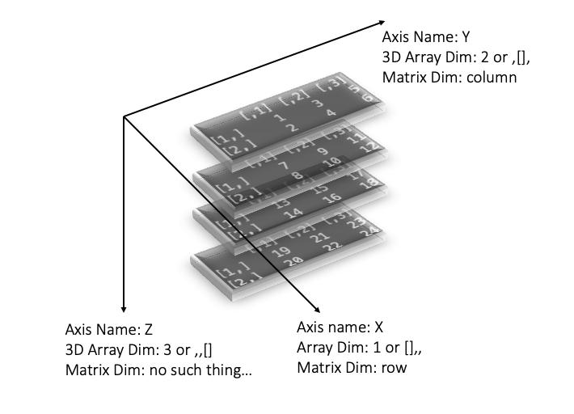
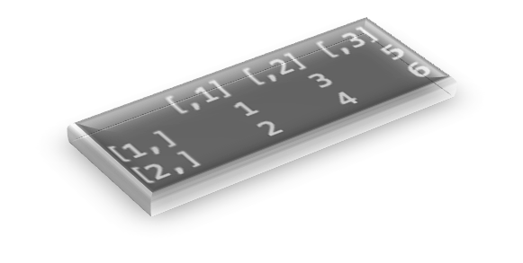
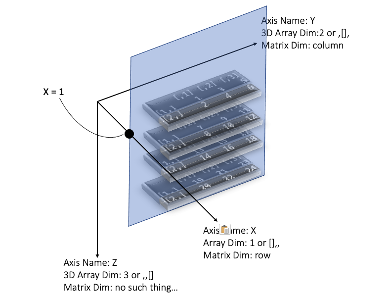
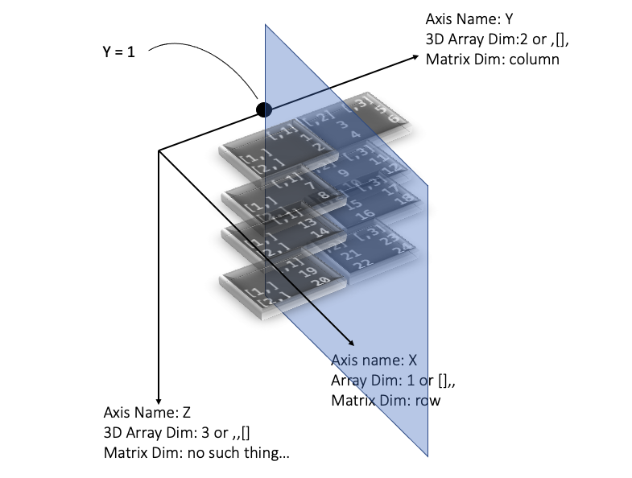
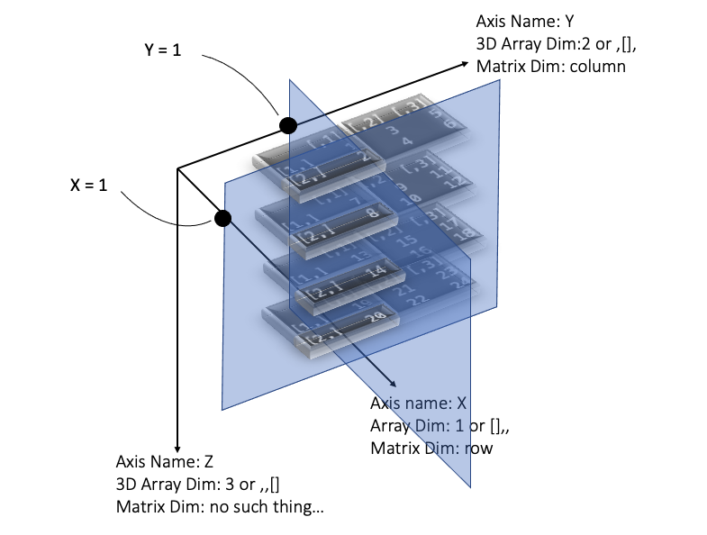

The thing started my wife ask me how to understand 3-dimension matrix created by `array()` function in R. We know that if there are only 2 dimentions, they are x-axis and y-axis in a plot. And in R (or any other terminal tool), it looks like rows and columns. For example, below I created a two array data. (In most case, I always call them as matrix or data.frame, maybe I have been wrong for very long time...haha)

```R
> d2 <- array(1:(4 * 5), c(4,5))
> d2
     [,1] [,2] [,3] [,4] [,5]
[1,]    1    5    9   13   17
[2,]    2    6   10   14   18
[3,]    3    7   11   15   19
[4,]    4    8   12   16   20
```

Other functions like `matrix()`, `data.frame()` .etc can reach similar results. In short, in above example, we get a 2-dimension data structure with rows and columns. Then as we know, `apply()` function is a very nice way to quickly iterate rows or columns.

```R
> test <- apply(d2, 1, function(x) print(x))
[1]  1  5  9 13 17
[1]  2  6 10 14 18
[1]  3  7 11 15 19
[1]  4  8 12 16 20
>
> test <- apply(d2, 2, function(x) print(x))
[1] 1 2 3 4
[1] 5 6 7 8
[1]  9 10 11 12
[1] 13 14 15 16
[1] 17 18 19 20
>
```

Then here comes the important part. I know many people are "memorying" that the second parameter in `apply()` function decided the dimention it iterates, including me before. So we all think that 1 indicates rows, and 2 indicates columns right? So there comes two vital questions: 
* 1. How the second parameter works for multi-dimention arrays? If you have 3 dimension, then what the "first" dimension (1) iteration result will be?
* 2. What will `apply(d2, c(1,2), function(x) print(x))` output?

---

## Visualisation of 3-Dimension Array

So I want to visualis the 3-Dimension array a bit. I firstly created a 3D array here. I defined a 3D array with 3 dimensions as 2, 3, 4 separately. The purposed is if dimensions have different value, it's easier for me to find which one is which.

```R
d3 <- array(1:c(2 * 3 * 4), c(2, 3, 4))
```

Then let's have a look what it looks like below. Seems we can see there are 4 matrix, that there is a `,,1` at the beginning of each, so we can guess out that the `,,` indicates 3 dimensions, and `,,[]`, the third value after the second comma indicates the third dimension. There are 4 matrixes here because previous I definded the three dimensions as `c(2, 3, 4)`. The only the third dimension have 4 elements. The first dimension should only have 2 elements, while the second dimension should only have 3 dimension.

```R
> d3
, , 1

     [,1] [,2] [,3]
[1,]    1    3    5
[2,]    2    4    6

, , 2

     [,1] [,2] [,3]
[1,]    7    9   11
[2,]    8   10   12

, , 3

     [,1] [,2] [,3]
[1,]   13   15   17
[2,]   14   16   18

, , 4

     [,1] [,2] [,3]
[1,]   19   21   23
[2,]   20   22   24

>
```

Above is still hard for us to understand the 3D strucuture of the data. And even, later we want to see how `apply()` function works on it. So I decided to visualise it. In below figure, I just screenshort above 4 matrix, then rotated a bit via Powerpoint. Now we can clearly see the 3 dimentions. In above plot there are 3 axises, normally in 2-dimension matrixes, we normally only can see two axis (X and Y), we named them as row and column in 2-dimension. Howeverm in 3D situation, we need add one more axis (I named as Z here), which does NOT have a a name in 2D situation. That's why I can't simply call it as "hight" or "tall" or anything.



On very interesting thing is, I think in above figure, the 3 dimensions actually have many names in different scenarios. For example, as I labelled in above plot, **name `X`, `Y`, `Z` are named by me**, which means maybe for other people, they prefer to think the `Y` axis in my plot should be labelled as `X`. 

**However, in R language, it has defind the three dimensions.** For example, in my plot it shows, the third dimension (`Z` axis) is the one vertical to floor. So it means, if you are selecting a 3D array by the thid dimensions (`Z` axis). You are actually selecting a horizontal slice of plate in my figure.
```R
> d3[,,1]
```


## One Dimension Selection with 3D array

It's so common in R that we need select certain rows or certain columns when we working on 2-D matrix. In above example, we have shown that if things turn to 3D, it's harder for us to select just via one dimension: It actualy select a plate, or in other word, a slice of 2D matrix. Here I will give more examples.

So now we can infer, if we now use `apply()` function here as the third dimensions, it wil cut all data horizontally into 4 slices, then iterate each matrix.

```R
> test <- apply(d3, c(3), function(x) print(x))
     [,1] [,2] [,3]
[1,]    1    3    5
[2,]    2    4    6
     [,1] [,2] [,3]
[1,]    7    9   11
[2,]    8   10   12
     [,1] [,2] [,3]
[1,]   13   15   17
[2,]   14   16   18
     [,1] [,2] [,3]
[1,]   19   21   23
[2,]   20   22   24
>
```

<div style="margin: 50px" >
</div

Now we know how and what exactly the third (Z) axis is, and how can we iterate it via loop. So what `d3[1,,]` return? By checking the plot, we can infer that we can get another slice, but not horizontally, but vertically and parallel to the `wall` created by Y and Z axis. Like below, when we run `d3[1,,]`, we are setting x axis as 1, while no restricion for y or z axis. So it can be seen as a vertical slice plate was cut through x axis, but parallel with the wall created by y and z axises. So eventually we can get a 2-dimension matrix on that vertical slice.



```R
> d3[1,,]
     [,1] [,2] [,3] [,4]
[1,]    1    7   13   19
[2,]    3    9   15   21
[3,]    5   11   17   23
>
```

The same logic could works for y axis. If we select `d3[,1,]`, you can image we are selecting a slice plate parallel to the wall created by X and Z axis. And it will return a 2-d matrix:



```R
> d3[,1,]
     [,1] [,2] [,3] [,4]
[1,]    1    7   13   19
[2,]    2    8   14   20
>
```

Have you considered, why when we select `d3[,1,]`, it returns as above matrix instead of: 

```R
     [,1] [,2]
[1,]    1    2
[2,]    7    8
[3,]   13   14
[4,]   19   20
```

Above matrix seems more obvious from my figure, why there is a rotation here? My understand is there is a ranking priority between the 3 dimensions. The X axis has highest priority, so if X axis exist, which means we are selecting on x axis, the returned matrix will take x aixs as rows and the other axis as columns. Thus in my above example, then Y=1, the X axis (2 vlaues) will be set a rows and Z axis (4 values) will be set as columns. So eventually a 2 by 4 matrix is returned. If X axis is not exist, say `d3[1,,]`, Y axis have higher priority over Z aixs, it it will return Y axis as row, and Z axis as columns.

---

In short, for me, it's not easy to select even one dimension from 3D array. 

* It's more like cutting slices into a 3D object and get pieces of plates from them. 
* The returned matrix may be rotated based on priorities of different dimensions. 
* It's hard to match names between them. Make sure you are correctly matched them everytime you are using 3D array.
    * 1): The second parameter `c(1,2,3)` in `apply()`; 
    * 2): `d3[*,*,*]` in raw R code; 
    * 3): Names like row, column, other like higher. 
    * 4): Other common names like X/Y/Z axis.

**All these cause potential programming bugs for analyser**.


## Two Dimension Selection with 3D array

Then we can have a look how to select 2 Dimensions togather from 3D array. In other word, what code like `apply(d3, c(1,2) function(x) print(x))` would retrun? When we use `apply()` function, it will create a index list based on our parameter setting. When we set the second parameter as `c(1)`, it will return: `d3[1,,]`, `d3[2,,]` . So if we set the parameter as `c(1,2)`. It will return:


    d3[1,1,], d3[2,1,], d3[1,2,], d3[2,2,], d3[1,3,], d3[2,3,]


As you can see ,it's just the combination of the first (x) and second (y) dimensions, There are only 2 value in first dimensions, and there are only 3 dimensions in second dimensions, so there are totally 2*3=6 combinations. Then the apply() function will fetch data based on these 2-D index one by one, and iterate the whole data. Now what would be returned if both X and Y axis are selected? Yes a vector across Z axis. You can image a drill into the 3D object. Below I draw an example of `d3[2,1,]`:



The code is below:

```R
> test <- apply(d3, c(1,2), function(x) print(x))
[1]  1  7 13 19
[1]  2  8 14 20 # Above plot shows this one: X=2 & Y=1
[1]  3  9 15 21
[1]  4 10 16 22
[1]  5 11 17 23
[1]  6 12 18 24
>
```

## Summary

So now we know the key point of working on 3-Dimension array, we MUST clearly know what each dimension represent for. In other word, you don't need draw it, but you MUST have a very clear mind of above 3-D plot in you head. Any tiny bug in dimension selection here will cause the whole calculation wrong.
