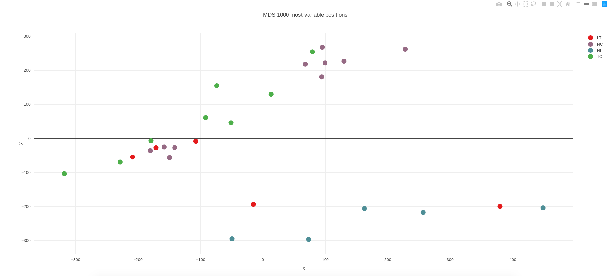

The thing starts as I have a set of BAM files, some of them are low quality samples. So I want to have a quick quality check on them. Apart from troditional `fastQC` or `fastp` way, plots like `MDS`, `PCA`, `tSNE`, `Heatmap`, `Dendrogram` are quite useful for quality check. **However, one vital problem is, normally we need a matrix data to plot above plots, so eventually I get this question: How to get a "value" matrix from a set of BAM files?**

After searching online, I think one answer close to my requirement is [multiBamSummary](https://deeptools.readthedocs.io/en/develop/content/tools/multiBamSummary.html#:~:text=multiBamSummary%20computes%20the%20read%20coverages,the%20BED%2Dfile%20mode%20instead.) from deepTool. It computes the read coverages for genomic regions for typically two or more BAM files. In other words, it will count reads for all bam files into small region bins, and return a matrix-similar result, with rows as bins and columns as each sample (bam file). Note that deepTool actually provided another function [plotPCA](https://deeptools.readthedocs.io/en/develop/content/tools/plotPCA.html) as downstream function of `multiBamSummary`, it could generate a PCA plot based on the result fo multiBamSummary. However, I perfer to create wheel myself, as a matrix would alow me to do more things, but a PCA PNG plot can't help me much. 

So the solution is firstly get readCount matrix from multiBamSummary, then try plot some quality check plot based on the result.

## Get Read Count matrix from multiBamSummary

The code is below works nicely, **remember that BAM files MUST be indexed**. My [this post](https://yuantian1991.github.io/notes/My-Samtools-Command) suggested a quick way to do sorting and indexing parallelly.

```bash
multiBamSummary bins --bamfiles ./myBam/* -o results.npz -bl ./myMergedGreyList.bed -p 30 --outRawCounts readCounts.tab
```
There are many parameters for multiBamSummary, above are some key I will use:

* **--bamfiles**: indicates location of bam files. For example in above code, I directly specified all bam files in one folder
* **-o**: output of default result results.npz, which is a compressed numpy array (.npz), I guess it's useful for python numpy users.
* **-bl**: a blacklist bed file for removing. If you have you can specify it. But actually think normally black list only count for a very small fraction across genome. It should not make much differece for PCA/Heatmap .etc. Normally I think I don't need this parameter, because I normally do GreyList filtering myself with `GreyListChIP` and `bedtools intersect`.
* **-p**: parallel thread, luckily I have a good computational server...
* **--outRawCounts**: This is returned readCounts in txt format, convinient for people like me who don't use python.

After running, we can have a look what the result looks like, below I read into the `readCounts.tab` file and printed the first 6 columns. Totally for my dataset, there are 46 columns.

```R
> readCount <- read.csv("./readCounts.tab", header=TRUE, stringsAsFactors=FALSE, sep="\t" ,quote="'")
> knitr::kable(readCount[1:5,1:6])

|X.chr                | start|   end| LT49_bnd.grey_filtered.sorted.bam| LT51_bnd.grey_filtered.sorted.bam| LT51_Inp.grey_filtered.sorted.bam|
|:--------------------|-----:|-----:|---------------------------------:|---------------------------------:|---------------------------------:|
|chr19_KI270917v1_alt |     0| 10000|                                 1|                                 2|                                 4|
|chr19_KI270917v1_alt | 10000| 20000|                                 1|                                 0|                                 1|
|chr19_KI270917v1_alt | 20000| 30000|                                 2|                                 2|                                 2|
|chr19_KI270917v1_alt | 30000| 40000|                                 0|                                 2|                                 1|
|chr19_KI270917v1_alt | 40000| 50000|                                 0|                                 1|                                 2|
>
```

## Plotly MDS plot

Now I want to visualise it with a MDS plot, it's plot to show clustering status between samples. Firstly I need to normalise it a bit, just like other data type, raw read count data varis a lot. So I use `edgeR` pacakge's `cpm` function to convert origin read count into count per million. Also it's better to remove row all 0, they will fail functions like PCA.



Full code:

```R
# A script to calcualte PCA on bam files.
# Author: Tian

readCount <- read.csv("./readCounts.tab", header=TRUE, stringsAsFactors=FALSE, sep="\t" ,quote="'")

library("edgeR")
CountMatrix <- readCount[,4:ncol(readCount)]
colnames(CountMatrix) <- sapply(colnames(CountMatrix), function(x) strsplit(x, split="[.]")[[1]][1])
myCPM <- cpm(CountMatrix)
# Removed all 0 column here
myCPM <- myCPM[apply(myCPM, 1, var) != 0, ]

## ====== PCA Plot ======

TPM <- cbind(as.data.frame(t(myCPM)), label=substr(colnames(myCPM),1,8))

library(ggfortify)
df <- TPM[,1:(ncol(TPM)-1)]
pca_res <- prcomp(df, scale. = TRUE)
autoplot(pca_res, data = TPM, colour = 'label', size=2, main="PCA for all samples")

## ====== MDS Plot ======

library(plotly)
library(RColorBrewer)

pheno <- substr(colnames(CountMatrix),1,8) 
beta <- as.matrix(myCPM)

o <- order(-matrixStats::rowVars(beta))[1:1000]
d <- dist(t(beta[o,]))

fit <- cmdscale(d)
col <- brewer.pal(8, "Dark2")[as.factor(pheno)]
color_number <- nlevels(pheno)
        pal <- RColorBrewer::brewer.pal(color_number, "Set1")
        data <- data.frame(x=fit[,1],y=fit[,2],pheno=pheno,Sample_Name=colnames(beta))
        p <- plot_ly(data = data, x = ~x, y = ~y, text=~Sample_Name, color = ~pheno,colors = ~pal, type="scatter", mode = "markers", marker=list(size=15))
        m = list(l = 100,r = 50,b = 50,t = 100,pad = 10)
        p <- layout(p, title = 'MDS 1000 most variable positions',margin=m)


```