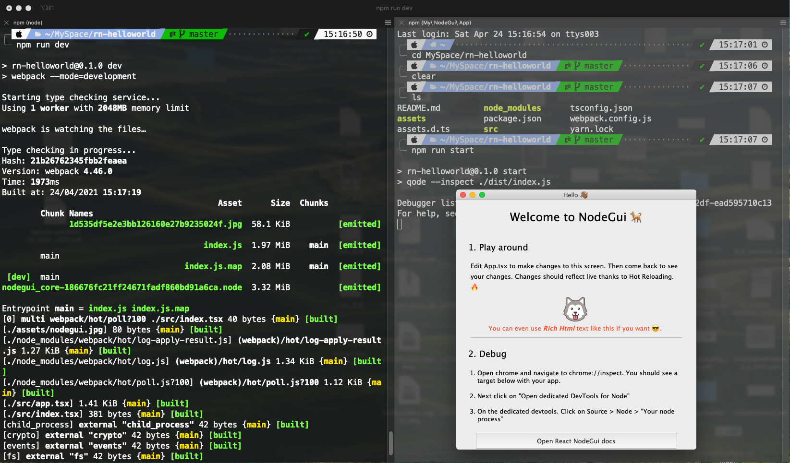

So my task here is to create a cross-platform apps, which means I hope I just need to write the code once, then the created app could be used on Mac, Windows, and Linux. Since I am only good at React, so I start searching possible solutions to create cross-platform Apps with React. There are two options looks appearing to me: [Electron](https://www.electronjs.org/) and [React NodeGUI](https://react.nodegui.org/).

Electron has proved itself for years, there are many cool Apps are build on it, like Slack/VScode. The second one (React NodeGUI) is a new tool, which claim it build native Apps, compared with Hybrid ones from Electron. However, on the home page, React NodeGUI also claimed that it's more suitable for simple small project, while electron is stil more suitable for big projects. Today I took some time to try the Hello World Demo for React NodeGUI.

## 1. Start the project

Following the suggestion given on the quick start page. I created an app with below code:

```bash
create-react-app --template react-nodegui rn-helloworld
```

It tooks sometime to finish above code. My node version is 14.15.0, and npm version is 7.5.2. And my Mac is quite good, so not sure how long it will take for others to create the project. After creation. I navigate into the folder. Try to start the project, **Note that there to start the development node, based on my test, you need to start with two commands at the same time, which means you better have two terminals openned at the same time**. The first terminal run command:

```bash
npm run dev
```
After the first terminal finished at certain stage (don't close it). Run below command in the second terminal window:

```bash
npm start
```

In below example, I openned two terminal and after running above two code separately, the App started nicely.



## 2. Packing into Apps

But I soon encountered problem, when I was trying to pack Apps. According two the official manual, I can use nodegui/packer to create apps after development. **nodegui-packer can create corresponding apps for each system, instead of create 3 apps all at once.** It means, if I finish the coding, I need to set up the development env on Mac first, then the nodegui-packer will create the Apps for Mac for me. Then I need to shift the env to Linux, run the same thing again, the nodegui-packer will them create the Linux version app for me. Finally, I need to do the same for Windows. It means I need to have at least 3 dev environment everytime I want to build the cross-platfrom Apps. Well...it's not exactly what I though, but some what acceptable, because we need machine to test our release verison Apps right?

However, I then encounter problem as the verison of key packages are too old for packing.

```json
{
  "name": "rn-helloworld",
  "version": "0.1.0",
  "private": true,
  "dependencies": {
    "@babel/core": "^7.7.7",
    "@babel/preset-env": "^7.7.7",
    "@babel/preset-react": "^7.7.4",
    "@babel/preset-typescript": "^7.7.7",
    "@nodegui/nodegui": "^0.12.1", // outdated
    "@nodegui/react-nodegui": "^0.4.0", // outdated
    "@types/node": "^12.12.22",
    "@types/react": "^16.9.17",
    "@types/webpack-env": "^1.14.1",
    "babel-loader": "^8.0.6",
    "clean-webpack-plugin": "^3.0.0",
    "file-loader": "^5.0.2",
    "fork-ts-checker-webpack-plugin": "^3.1.1",
    "native-addon-loader": "^2.0.1",
    "open": "^7.0.0",
    "react": "^16.12.0", // outdated
    "react-dom": "^17.0.2",
    "react-scripts": "4.0.3",
    "typescript": "^3.7.4",
    "webpack": "^4.41.4",
    "webpack-cli": "^3.3.10"
  },
```
For example, the latest nodegui-packer requires the @nodegui/nodegui verison should be above 0.15, but the starter repo is still using 0.12.1 version, which is clearly outdated. The result is when I was trying the nodegui-packer command, it's totally not working and can't be installed into the proejct. I personally think the starter code should be updated a bit.

So I updated some packages version, I update them because nodegui-packer requires the version of nodegui, and version of nodegui requires react 17, so I have to at least update them, not sure if there are more I should update: 

```json
{
  "name": "rn-helloworld",
  "version": "0.1.0",
  "private": true,
  "dependencies": {
    ...
    "@nodegui/nodegui": "^0.30.2",
    "@nodegui/react-nodegui": "^0.12.0",
    ...
    "react": "^17.0.2",
    ...
  },
```

Then I deleted the yarn.lock and node_modules, then rerun `npm install --force`. Then finally I can install the nodegui-packer into the project:

```bash
npm install --save-dev @nodegui/packer
```

Then by running below two code, I can generate the Apps for Mac version, the fist code seems just created a folder for app location:

```bash
npx nodegui-packer --init helloworld
```

Then everytime I want to rebuild the app, I run below code:

```bash
npm run build
npx nodegui-packer --pack ./dist
```

Then the created app would be located in rn-helloworld/deploy/darwin/build.


Note that the size of the created app is 64MB, which is not as small as I expected...

## Summary

The demo code of React NodeGUI works for me, however it seems some packages in the official demo code is already outdated, I don't know if there is enough support for this project. Also though it claims it create native apps, but the size of App is still big. I think I will use electron for development.