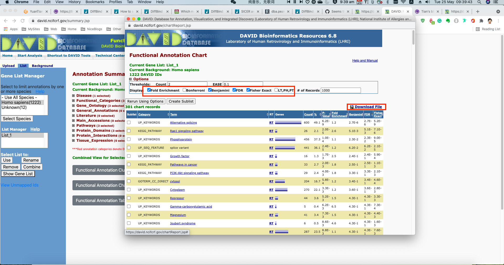
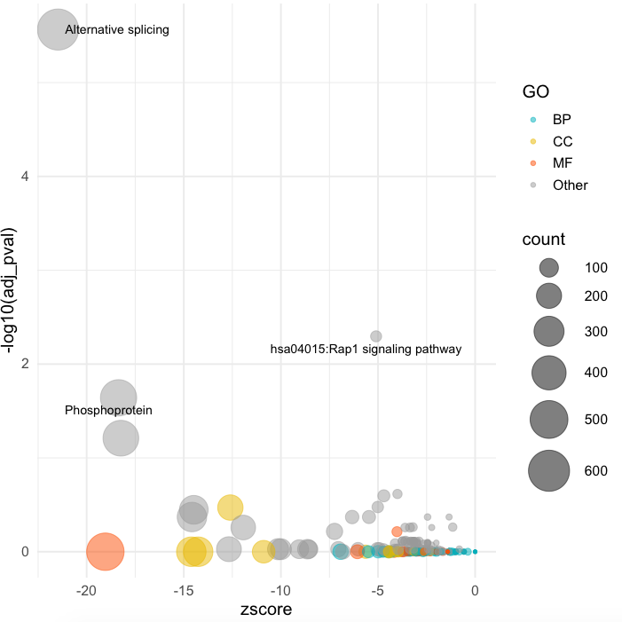

So for a long time, I want to find a way to address my GO problem in my life forever. However, eventually I did not found one, some R packages seems not working, and some other online tools are too hard to understand for me. So eventaully I found David online tool is a good choice. It's easy to use, easy to implement, and with ggplot2 I can draw nice plot quickly.

## 1. Prepare gene list
Firstly, we need to prepare our gene list to David, no P value is need, in my case, I directly used **clipr** to copy the object into system clipboard, which is so easy and nice. clipr could directly past across server, like [my previous post said](https://yuantian1991.github.io/notes/Copy-R-objects-into-Clipboard).

```r
df <- TCLT.volcano$df
tmp <- df[df$FDR <= 0.05 & !is.na(df$symbol), ]
clipr::write_clip(tmp$feature)
```

The gene feature is **Entrz_ID** here, you may use other gene name like Esemble name, Symbol .etc:

```r
> head(tmp$feature)
[1] "105374119" "109729182" "727897"    "441478"    "406961"    "100423037"
```

## 2. Paste into David
Then I paste it into [David online tool](https://david.ncifcrf.gov/summary.jsp).


Then select **Functional Annotation Chart**, slightly modify the parameters, like ask to return Fold Change for visualisation. etc. Then select **Retrun Using Options**. Finally on the top-right there is button showing Download File, which is [a URL](https://david.ncifcrf.gov/data/download/chart_76DCEA0A1F3F1621931945429.txt) we can directly load via R.



## 3. Calcualte Z-Score with GOplot R pacakge

Finally we can directly load the URL content for visualisation. Firstly I want to calculate the z-score for each enriched pathway. Here I use the **circle_dat()** function from [GoPlot](https://wencke.github.io/) package.

```r
library("GOplot")

David <- read.csv("https://david.ncifcrf.gov/data/download/chart_AA6917612AEE1620101903486.txt", sep="\t")

goDavid <- David[,c("Category", "Term", "Genes", "FDR")]
colnames(goDavid) <- c("category", "term", "genes", "adj_pval")
geneList <- tmp[,c("feature", "Fold", "p.value", "FDR")]
colnames(geneList) <- c("ID", "logFC", "P.Value", "adj.P.Val")
circ <- circle_dat(goDavid, geneList)
```

After calculation, the circ object looks like below:
```r
> head(circ)
     category                 term count  genes      logFC     adj_pval
1 UP_KEYWORDS Alternative splicing   600 730112 -0.9857185 2.719938e-06
2 UP_KEYWORDS Alternative splicing   600  23604  1.2144389 2.719938e-06
3 UP_KEYWORDS Alternative splicing   600 340371 -1.6496193 2.719938e-06
4 UP_KEYWORDS Alternative splicing   600   9180 -3.9085765 2.719938e-06
5 UP_KEYWORDS Alternative splicing   600 348093 -1.4192143 2.719938e-06
6 UP_KEYWORDS Alternative splicing   600   9187 -3.7186476 2.719938e-06
     zscore
1 -21.47386
2 -21.47386
3 -21.47386
4 -21.47386
5 -21.47386
6 -21.47386
>
```

Note that we should only keep unique rows. Like running below two code. Also, I annotated BP/CC/MF.

```r
df <- circ[,c("category", "term", "count", "adj_pval", "zscore")]
df <- unique(df)
df$GO <- "Other"
df$GO[df$category == "GOTERM_BP_DIRECT"] <- "BP"
df$GO[df$category == "GOTERM_CC_DIRECT"] <- "CC"
df$GO[df$category == "GOTERM_MF_DIRECT"] <- "MF"
```

## 4. Draw bubble plot with ggplot2

Finally, I use ggplot to draw simple bubble plot:

```r
library("ggplot2")
library("ggrepel")

ggplot(df, aes(x = zscore, y = -log10(adj_pval))) +
  geom_point(aes(color = GO, size = count), alpha = 0.5) +
  scale_color_manual(values = c("#00AFBB", "#E7B800", "#FC4E07", "#999999")) +
  scale_size(range = c(1, 15)) +  # Adjust the range of points size
  theme_minimal(base_size = 14) +
  geom_text_repel(data = df[df$adj_pval <= 0.05, ], aes(label = term),
                  size = 3.5, box.padding = unit(0.35, "lines"), point.padding = unit(0.3,"lines"))
```

