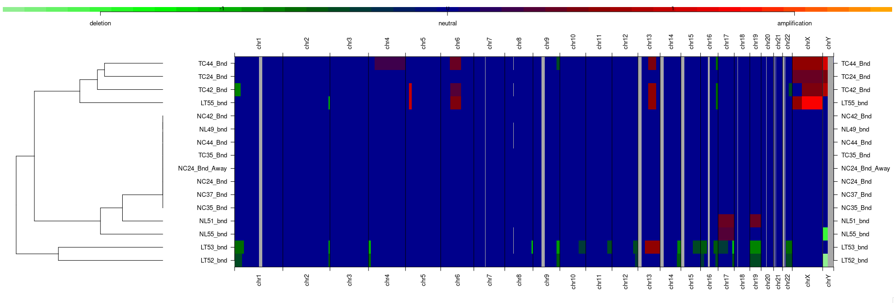
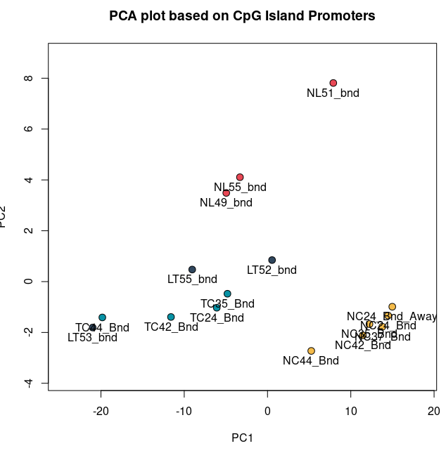

I want to compare 3 methods: [QSEA](http://bioconductor.org/packages/release/bioc/html/qsea.html), DiffBind, and [MAnorm2](https://github.com/tushiqi/MAnorm2). This is the first post about QSEA, QSEA is an important benck mark, because it will not require peak calling, so in my idea it will return all peaks as I expected. QSEA comprises functionality for data normalization that accounts for the effect of CNVs on the read-counts as well as for the detection and annotation of differently methylated regions (DMRs). That's perfect and exactly what I want. One very important feature for QSEA is that it does not require peak calling. So I assume it will take all enriched fragments into consideration. That's really important and fit my assumption.

Honestly I think QSEA is not very famous, and there are less discussion on platforms like BiStars, but I still think it worth trying. 

## 1. Load BAM files

Firstly I need to prepare a SampleSheet data frame like below:

```r
> knitr::kable(SampleSheet)

|   |sample_name   |group        |file_name                                                              |input_files                                                       |
|:--|:-------------|:------------|:----------------------------------------------------------------------|:-----------------------------------------------------------------|
|3  |LT52_bnd      |Liver-Tumour |../13.PreparedJoinData/myBigWig/LT52_bnd.grey_filtered.sorted.bam      |../13.PreparedJoinData/myBigWig/LT52_Inp.grey_filtered.sorted.bam |
|4  |LT53_bnd      |Liver-Tumour |../13.PreparedJoinData/myBigWig/LT53_bnd.grey_filtered.sorted.bam      |../13.PreparedJoinData/myBigWig/LT53_Inp.grey_filtered.sorted.bam |
|5  |LT55_bnd      |Liver-Tumour |../13.PreparedJoinData/myBigWig/LT55_bnd.grey_filtered.sorted.bam      |../13.PreparedJoinData/myBigWig/LT55_Inp.grey_filtered.sorted.bam |
|6  |NL49_bnd      |Liver-Normal |../13.PreparedJoinData/myBigWig/NL49_bnd.grey_filtered.sorted.bam      |../13.PreparedJoinData/myBigWig/NC24_Inp.grey_filtered.sorted.bam |
|7  |NL51_bnd      |Liver-Normal |../13.PreparedJoinData/myBigWig/NL51_bnd.grey_filtered.sorted.bam      |../13.PreparedJoinData/myBigWig/NC24_Inp.grey_filtered.sorted.bam |
|8  |NL55_bnd      |Liver-Normal |../13.PreparedJoinData/myBigWig/NL55_bnd.grey_filtered.sorted.bam      |../13.PreparedJoinData/myBigWig/NC24_Inp.grey_filtered.sorted.bam |
|10 |NC42_Bnd      |Colon-Normal |../13.PreparedJoinData/myBigWig/NC42_Bnd.grey_filtered.sorted.bam      |../13.PreparedJoinData/myBigWig/NC24_Inp.grey_filtered.sorted.bam |
|11 |NC44_Bnd      |Colon-Normal |../13.PreparedJoinData/myBigWig/NC44_Bnd.grey_filtered.sorted.bam      |../13.PreparedJoinData/myBigWig/NC24_Inp.grey_filtered.sorted.bam |
|12 |TC24_Bnd      |Colon-Tumour |../13.PreparedJoinData/myBigWig/TC24_Bnd.grey_filtered.sorted.bam      |../13.PreparedJoinData/myBigWig/TC35_Inp.grey_filtered.sorted.bam |
|13 |TC35_Bnd      |Colon-Tumour |../13.PreparedJoinData/myBigWig/TC35_Bnd.grey_filtered.sorted.bam      |../13.PreparedJoinData/myBigWig/TC35_Inp.grey_filtered.sorted.bam |
|14 |TC42_Bnd      |Colon-Tumour |../13.PreparedJoinData/myBigWig/TC42_Bnd.grey_filtered.sorted.bam      |../13.PreparedJoinData/myBigWig/TC42_Inp.grey_filtered.sorted.bam |
|15 |TC44_Bnd      |Colon-Tumour |../13.PreparedJoinData/myBigWig/TC44_Bnd.grey_filtered.sorted.bam      |../13.PreparedJoinData/myBigWig/TC42_Inp.grey_filtered.sorted.bam |
|16 |NC24_Bnd_Away |Colon-Normal |../13.PreparedJoinData/myBigWig/NC24_Bnd_Away.grey_filtered.sorted.bam |../13.PreparedJoinData/myBigWig/NC24_Inp.grey_filtered.sorted.bam |
|17 |NC24_Bnd      |Colon-Normal |../13.PreparedJoinData/myBigWig/NC24_Bnd.grey_filtered.sorted.bam      |../13.PreparedJoinData/myBigWig/NC24_Inp.grey_filtered.sorted.bam |
|18 |NC37_Bnd      |Colon-Normal |../13.PreparedJoinData/myBigWig/NC37_Bnd.grey_filtered.sorted.bam      |../13.PreparedJoinData/myBigWig/NC24_Inp.grey_filtered.sorted.bam |
|19 |NC35_Bnd      |Colon-Normal |../13.PreparedJoinData/myBigWig/NC35_Bnd.grey_filtered.sorted.bam      |../13.PreparedJoinData/myBigWig/NC35_Inp.grey_filtered.sorted.bam |
>
```

As above information shows, there is no requirement for peak information. Basically I just went through the vignette. First step is to created QSEA Set:

```r
qseaSet <- createQseaSet(sampleTable=SampleSheet,
                         BSgenome="BSgenome.Hsapiens.UCSC.hg38",
                         chr.select=paste0("chr", c(1:22, "X", "Y")),
                         window_size=500)
```

Here the `[chr.select](http://chr.select)` is vital and must be selected like this, otherwise there would have a error later. I set the window-size as 500 because in DiffBind I also used this threshold, I think it's a reasonable window-frame.

## 2. Add attribtues

Then QSEA need to do some calculation based on the QSEA objects we just created in last step. Like:

- Calcualte Coverage: `addCoverage()`
- Copy Number Aberation: `addCNV()`. This step is important, for example, the `normal_idx` parameter should be normal/control samples in my data set, which need to be set by me manually.
- Scaling Library Factor QSEA accounts for differences in sequencing depth and library: `addLibraryFactors()`
- The average CpG density per fragment for each genomic window: `addPatternDensity()`. **This function is failed in my test, I am trying to fix it...**
- Offset for regions without CpG: `addOffset()`

```r
# This should be the step to generate count, which means number of reads mapped on one window.
qseaSet <- addCoverage(qseaSet, uniquePos=TRUE, paired=FALSE,fragment_length=36, parallel=TRUE)

# Calculate CNV note that here I am calculating the CNA compared to NC.
qseaSet <- addCNV(qseaSet, file_name="file_name",
                  window_size=1000000, paired=FALSE,
                  fragment_length=36,
                  parallel=TRUE, MeDIP=FALSE,
                  normal_idx=which(substr(SampleSheet$sample_name,1,2) == "NC"))

qseaSet <- addLibraryFactors(qseaSet)

# Failed in my test
qseaSet <- addPatternDensity(qseaSet, "CG", name="CpG")

qseaSet <- addOffset(qseaSet, enrichmentPattern = "CpG")
```

Besides, there is a function to use CpG density to estimate the relative enrichment, I am thinking if this step suitable for hMeDIP-seq.

## 3. CNA Plot

Amazingly, QSEA provided a CNA calculation function. And the result looks interesting as TC have chromosome applification strongly in chrY, while LT have chromosome deletion in some chromosomes. I don't know if I have other tools to validate this result but this is important and what I want.

```r
plotCNV(qseaSet)
```



The code is simple and nice, but the key things is I want get the exactly coodinates of these fragments.

And also QSEA provided a function to draw PCA plot, which is nice and helps me to make sure everything is correct.

```r
data(annotation, package="MEDIPSData")
CGIprom=intersect(ROIs[["CpG Island"]], ROIs[["TSS"]],ignore.strand=TRUE)
pca_cgi=getPCA(qseaSet, ROIs=CGIprom)
myCol <- c("#f4bb4a", "#0892a5", "#30475e", "#e84855")
names(myCol) <- c("NC", "TC", "LT", "NL")
myCol <- myCol[substr(SampleSheet$sample_name,1,2)]
plotPCA(pca_cgi, bg=myCol, main="PCA plot based on CpG Island Promoters")
```



## 4. Export expected

The export solution is what I like, very simple and directly, but seems the CNV's name is wrong, and beta export failed because of CpG density calculation failed I think...

```r
M <- makeTable(qs=qseaSet, samples=getSampleNames(qseaSet), groupMeans=getSampleGroups(qseaSet), CNV=TRUE, norm_method=c("counts", "nrpm"))
```

So sad... I have a feeling that this package is what I want, but there are seems too many bugs in it.