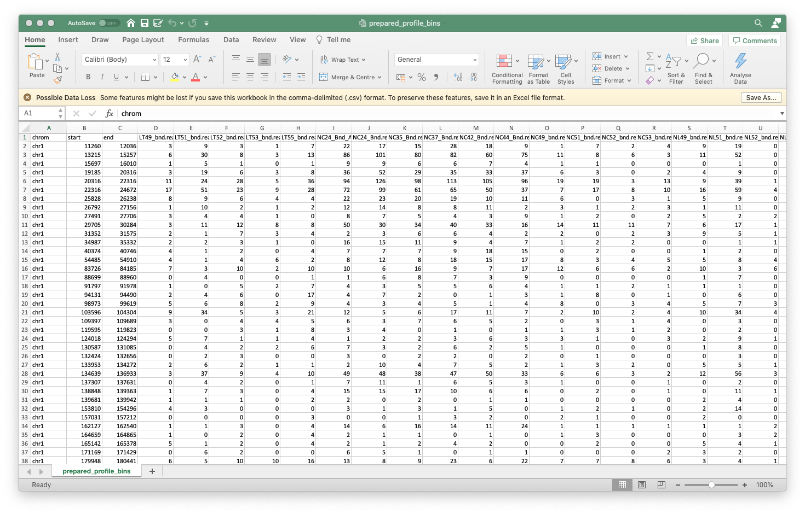

The third method I am trying here now is [MAnorm2](https://github.com/tushiqi/MAnorm2), developed by my PhD classmate Shiqi Tu. According to the introduction, this package merely focus on normalisastion and differential calling, which is what I want. Note that MAnorm2 take MACS_1.4.2-generated bed file as input, thus I assume it only take sig-peaks from MACS_1.4.2 as peaks.

## 1. Software Installation

Firstly I need to install the software, which is actually a two-step work, install MAnorm2 R package, and [MAnorm2_utils](https://github.com/tushiqi/MAnorm2_utils) python software for data preparation. The way to install MAnorm2 is:

```bash
git clone https://github.com/tushiqi/MAnorm2.git
cd MAnorm2/dist
R CMD INSTALL MAnorm2_1.1.0.tar.gz
```

And the way to install MAnorm2_utils is:

```bash
pip install MAnorm2_utils
```

## 2. Prepare Input Table

MAnorm2_utils is working as a "data-preparation" too, which tool reads (bam converted bed file), peaks (from MACS_1.4.2)  and summit (from MACS_1.4.2 as well). Not easy to prepare...

### 2.1 BED format peak files

Honestly, MACS_1.4.2 version nearly died out, that I can't find much information about it. By reading [this post](https://groups.google.com/g/macs-announcement/c/2ARZwLHzI28), I know that MACS2 is no longer generate bed file for narrow peak calling, instead it will return .narrowPeakl file. Also, by downloading origin version of MACS1.4.2, and check the README file, I found the definition of the 5th column in origin bed file:

```bash
2. NAME_peaks.bed is BED format file which contains the peak
 locations. You can load it to UCSC genome browser or Affymetrix IGB
 software. The 5th column in this file is the -10*log10pvalue of peak
 region.
```

Finally, by reading [this post](https://hbctraining.github.io/Intro-to-ChIPseq/lessons/05_peak_calling_macs.html), I know that in narrowPeak file, the 8th column is the 10*log10pvalue. So it means I just need to extract the column [1, 2, 3, 4, 8] from my narrowPeak files (generated by MACS2), then it should works for MAnorm2.

```bash
# This is a script to convert MACS2 narrowPeak files to MACS1.4.2 bed file
# Author: Tian

files <- dir("../14.PeakCalling/macs2_strict/", pattern="*.narrowPeak", full.names=T)
file_names <- dir("../14.PeakCalling/macs2_strict/", pattern="*.narrowPeak")
file_names <- as.vector(sapply(file_names, function(x) strsplit(x, split="_peaks")[[1]][1]))

baseDir <- "./bed/"
if (!file.exists(baseDir)) dir.create(baseDir)

for(i in 1:length(files)) {
    df <- read.csv(files[i], sep="\t", header=F)
    write.table(df[,c(1,2,3,4,8)], file=paste0(baseDir, file_names[i], '_peaks.bed'), quote=F, row.names=F, col.names=F, sep="\t")
}
```

```r
> head(narrowPeak_file_from_MACS2)
    V1     V2     V3              V4 V5 V6      V7       V8      V9 V10
1 chr1  29927  30204 TC53_bnd_peak_1 88  . 7.59360 11.74890 8.88844 149
2 chr1 180061 180296 TC53_bnd_peak_2 45  . 5.14796  6.98471 4.57548  23
3 chr1 196305 196540 TC53_bnd_peak_3 36  . 4.57597  5.90069 3.62210 187
4 chr1 200355 200688 TC53_bnd_peak_4 83  . 6.40890 11.12940 8.31881 199
5 chr1 201337 201572 TC53_bnd_peak_5 49  . 5.45709  7.43798 4.99346 118
6 chr1 806028 806263 TC53_bnd_peak_6 34  . 4.47944  5.66349 3.42953 130
> 
> head(converted_bed_file_for_MAnorm2)
    V1     V2     V3              V4       V8
1 chr1  29927  30204 TC53_bnd_peak_1 11.74890
2 chr1 180061 180296 TC53_bnd_peak_2  6.98471
3 chr1 196305 196540 TC53_bnd_peak_3  5.90069
4 chr1 200355 200688 TC53_bnd_peak_4 11.12940
5 chr1 201337 201572 TC53_bnd_peak_5  7.43798
6 chr1 806028 806263 TC53_bnd_peak_6  5.66349
>
```

### 2.2 Convert BAM files to reads.bed

Secondly, I need to convert the origin bam files into sam, then into reads, with `sam2bed` tool provided by MAnorm2_utils. Firstly I converted my bam files into sam.

```bash
parallel --plus 'samtools view -h {} -o {...}.sam' ::: *.bam
```

Then, use the `sam2bed` as below:

```bash
parallel --plus 'sam2bed -i {} -o {...}.bed' ::: *.sam
```

Now I have got the reads.bed for MAnorm2_utils input, an example is below:

```bash
chr1    10908   10944   SRR871541.13121323  1   +
chr1    11236   11272   SRR871541.5778899   1   +
chr1    11328   11364   SRR871541.3338  1   -
chr1    11712   11748   SRR871541.8892517   1   +
chr1    11798   11834   SRR871541.5776278   1   +
chr1    11810   11846   SRR871541.3348  1   -
chr1    11832   11868   SRR871541.3349  1   -
chr1    11930   11966   SRR871541.3352  1   -
chr1    12012   12048   SRR871541.3355  1   -
chr1    12100   12136   SRR871541.3356  1   -
chr1    12225   12261   SRR871541.3358  1   +
```

I noticed that seems Input.bed file is not used for MAnorm2 input, not sure why? I think they are important as control.

### 2.3 Create InputTable with profile_bins

Finally, I can run the `profile_bins` function, which should read in bam (have been converted into read.bed), peaks (narrowPeak converted bed), summit (generated by MACS2) to generate a table for MAnorm2.

I formed a file called `param`, added information of my files, which listed my peaks, reads, labs, summits. And the result name is "prepared". In my case, the files are single-end sequenced.

```bash
peaks=./bed//LT49_bnd_peaks.bed,./bed//LT51_bnd_peaks.bed,./bed//LT52_bnd_peaks.bed,./bed//LT53_bnd_peaks.bed,./bed//LT55_bnd_peaks.bed,./bed//NC24_Bnd_Away_peaks.bed,./bed//NC24_Bnd_peaks.bed,./bed//NC35_Bnd_peaks.bed,./bed//NC37_Bnd_peaks.bed,./bed//NC42_Bnd_peaks.bed,./bed//NC44_Bnd_peaks.bed,./bed//NC49_bnd_peaks.bed,./bed//NC51_bnd_peaks.bed,./bed//NC52_bnd_peaks.bed,./bed//NC53_bnd_peaks.bed,./bed//NL49_bnd_peaks.bed,./bed//NL51_bnd_peaks.bed,./bed//NL52_bnd_peaks.bed,./bed//NL53_bnd_peaks.bed,./bed//NL55_bnd_peaks.bed,./bed//TC24_Bnd_peaks.bed,./bed//TC35_Bnd_peaks.bed,./bed//TC42_Bnd_peaks.bed,./bed//TC44_Bnd_peaks.bed,./bed//TC49_bnd_peaks.bed,./bed//TC51_bnd_peaks.bed,./bed//TC52_bnd_peaks.bed,./bed//TC53_bnd_peaks.bed
reads=./sam//LT49_bnd.bed,./sam//LT51_bnd.bed,./sam//LT52_bnd.bed,./sam//LT53_bnd.bed,./sam//LT55_bnd.bed,./sam//NC24_Bnd_Away.bed,./sam//NC24_Bnd.bed,./sam//NC35_Bnd.bed,./sam//NC37_Bnd.bed,./sam//NC42_Bnd.bed,./sam//NC44_Bnd.bed,./sam//NC49_bnd.bed,./sam//NC51_bnd.bed,./sam//NC52_bnd.bed,./sam//NC53_bnd.bed,./sam//NL49_bnd.bed,./sam//NL51_bnd.bed,./sam//NL52_bnd.bed,./sam//NL53_bnd.bed,./sam//NL55_bnd.bed,./sam//TC24_Bnd.bed,./sam//TC35_Bnd.bed,./sam//TC42_Bnd.bed,./sam//TC44_Bnd.bed,./sam//TC49_bnd.bed,./sam//TC51_bnd.bed,./sam//TC52_bnd.bed,./sam//TC53_bnd.bed
labs=LT49_bnd,LT51_bnd,LT52_bnd,LT53_bnd,LT55_bnd,NC24_Bnd_Away,NC24_Bnd,NC35_Bnd,NC37_Bnd,NC42_Bnd,NC44_Bnd,NC49_bnd,NC51_bnd,NC52_bnd,NC53_bnd,NL49_bnd,NL51_bnd,NL52_bnd,NL53_bnd,NL55_bnd,TC24_Bnd,TC35_Bnd,TC42_Bnd,TC44_Bnd,TC49_bnd,TC51_bnd,TC52_bnd,TC53_bnd
n=prepared
summits=./summit//LT49_bnd_summits.bed,./summit//LT51_bnd_summits.bed,./summit//LT52_bnd_summits.bed,./summit//LT53_bnd_summits.bed,./summit//LT55_bnd_summits.bed,./summit//NC24_Bnd_Away_summits.bed,./summit//NC24_Bnd_summits.bed,./summit//NC35_Bnd_summits.bed,./summit//NC37_Bnd_summits.bed,./summit//NC42_Bnd_summits.bed,./summit//NC44_Bnd_summits.bed,./summit//NC49_bnd_summits.bed,./summit//NC51_bnd_summits.bed,./summit//NC52_bnd_summits.bed,./summit//NC53_bnd_summits.bed,./summit//NL49_bnd_summits.bed,./summit//NL51_bnd_summits.bed,./summit//NL52_bnd_summits.bed,./summit//NL53_bnd_summits.bed,./summit//NL55_bnd_summits.bed,./summit//TC24_Bnd_summits.bed,./summit//TC35_Bnd_summits.bed,./summit//TC42_Bnd_summits.bed,./summit//TC44_Bnd_summits.bed,./summit//TC49_bnd_summits.bed,./summit//TC51_bnd_summits.bed,./summit//TC52_bnd_summits.bed,./summit//TC53_bnd_summits.bed
keep-dup=1
```

Finally, below command worked

```bash
profile_bins --parameters=./param
```

The `prepared_profile_bins.xls` file is what I need for MAnorm2 import.

