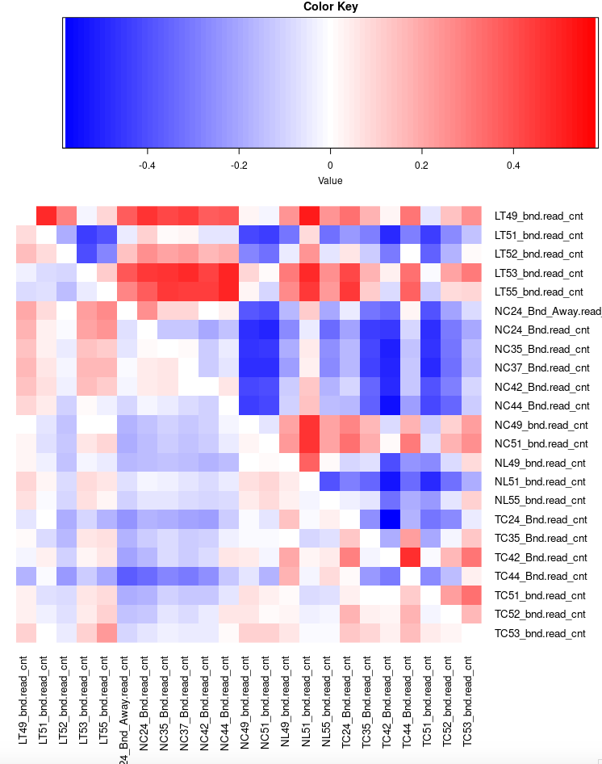
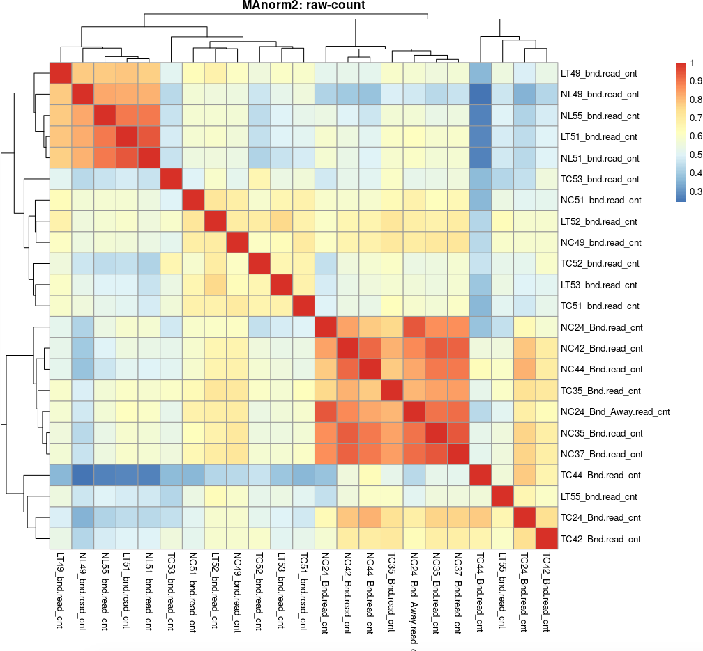
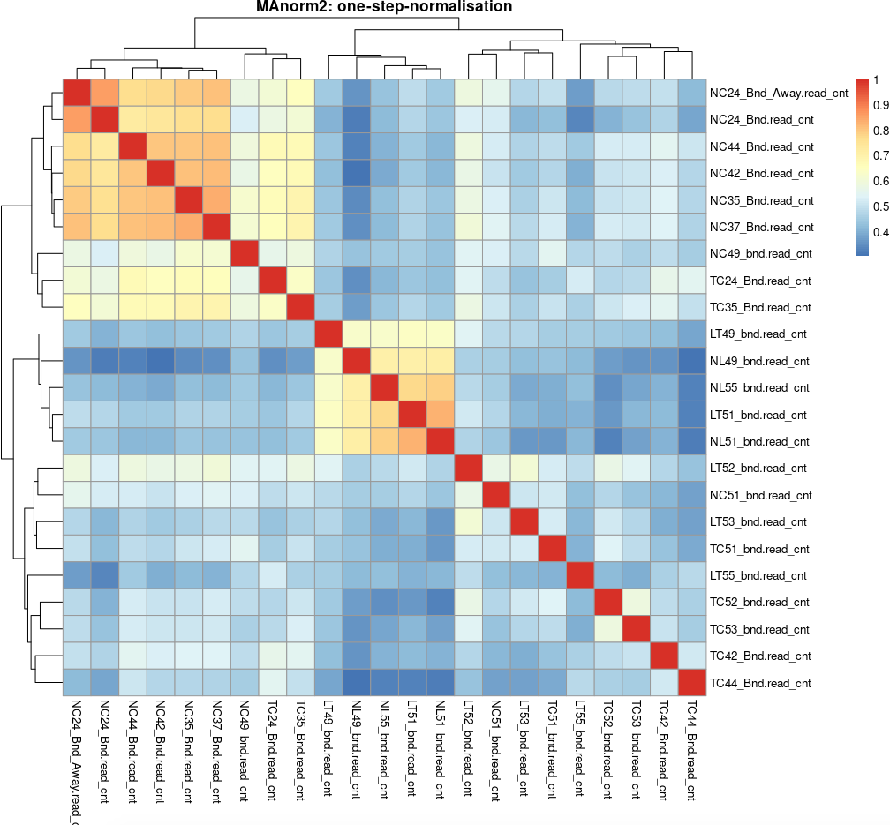

After [preparation work with MAnorm2_utils](https://yuantian1991.github.io/notes/MAnorm2-package-for-hMeDIP-seq-data), now I can load the data into MAnorm2 for analysis. The vignette I found is by open it locally on my computer as:

```r
browseVignettes("MAnorm2")
```

## 1. Normalisation

To load the data into MAnorm2, I just need to read the prepared file (prepared_profile_bins.csv) into R. However, I don't know why the loading function is not working, thus I have to re-save it into csv, then use read.csv(). Not a big deal.

> Note that the author told me **the xls file is actually a text document**, that can be read by read.table() or read.csv() directly.

The code for loading is this one

```r
library("MAnorm2"
# The excel file can't be read by readxl, so I re-saved it into csv.
pb <- read.csv("./prepared_profile_bins.csv", sep=",")
```

### 1.1 One-step normalisation

So as far as I know, I can do **one-step normalisation**, or **two-step normalisation**. One-step normalisation means it will take one sample (or calcualte average across all samples) as "baseline", then remove the overall M-A trend associated with their common peak regions between each sample against the baseline. I personally think it's easy to implement, **but did not consider group condition**. But anyway, the code is below:

```r
# One-step normalisation
one_step_norm <- normalize(pb, count = grep('cnt',colnames(pb)), occupancy = grep('occupancy',colnames(pb)), baseline="pseudo-reference")

# Seems only one-step normalisation can plot below
plot(attr(one_step_norm, "MA.cor"), symbreaks = TRUE, margins = c(10, 1), cexRow = 1, cexCol = 1)
```

After normalisation, samples are comparable between each other. And the MA.cor plot (I don't know the more professional name...) blow indicates the effect of normalisation. According to the vigentte, the lighter color the better. **This is not a correlation plot**, just indicates the variance (difference) should be normalised between samples.



Then I manually calcualted the correlation heatmap below. It looks reasonable to me, I already know that LT51 and LT49 are two contaiminated samples. Suprisingly, I found NC49, which was identified as a sample not clustering with most NC samples because of preprocessing batch and quality issue, are now clearly groups with NC groups, this is a shocking result to me, because both DiffBind and QSEA can't give me this. The first side is the raw count's clustering heatmap, honestly much worse than the second one.




Without digging into code, I can't clearly say that MAnorm2's normalisation is better than QSEA or DiffBind, but to me, it's indeed grouped samples in same pheno togather, with just one-step normalisation.

## 1.2 Two-step normalisation

As the vignette recommanded, I prefer to use two-step normalisation method. It will fistly do normalisation within-group, to remove variance for samples in samde phenotype. Then do between-group normalisation. Sounds like suitable for samples have high variance, like mine.

I wrote a look to solve it, so the `norm` object will save each time's within-group normalisation results. Then the result will be organized into `conds` with `bioConds()` function.

```r
# Firstly perform one-step normalisation for each group, in my case 4 pheno.
conds <- list()
for(i in c("NC", "TC", "LT", "NL")) {

    message("within-group normalization for ", i)

    countIndex <- intersect(grep("cnt", colnames(pb)), grep(i, colnames(pb)))
    occupancyIndex <- intersect(grep("occupancy", colnames(pb)), grep(i, colnames(pb)))

    if(i == "NC") {
        norm <- normalize(pb, count = countIndex, occupancy = occupancyIndex)
    } else {
        norm <- normalize(norm, count = countIndex, occupancy = occupancyIndex)
    }

    conds[[i]] <- bioCond(norm[countIndex], norm[occupancyIndex], name = i)
}
```

Note that a very useful feature is `summary(conds[[x]])` could check the pheno's status. Like how much genomic intervals occupied by the condition, and stats like mean and median. So I quickly checked my 4 phenotypes:

```r
> summary(conds[["NC"]])

Biological condition NC:
570869 genomic intervals with 8 profiles

Occupancy states:
343207 (60.1%) of the genomic intervals occupied by the condition

Summary of mean signal intensities at the genomic intervals:
   Min. 1st Qu.  Median    Mean 3rd Qu.    Max.
 -1.353   1.373   2.304   2.403   3.353   8.751

...

> summary(conds[["TC"]])

Biological condition TC:
570869 genomic intervals with 7 profiles

Occupancy states:
147812 (25.9%) of the genomic intervals occupied by the condition

Summary of mean signal intensities at the genomic intervals:
   Min. 1st Qu.  Median    Mean 3rd Qu.    Max.
-0.7186  0.4843  1.1652  1.3228  2.0252  6.7152

Summary of standard deviations of signal intensities at the genomic intervals:
   Min. 1st Qu.  Median    Mean 3rd Qu.    Max.
 0.0723  0.8007  1.0446  1.0497  1.2819  3.2681

...

> summary(conds[["LT"]])

Biological condition LT:
570869 genomic intervals with 5 profiles

Occupancy states:
243718 (42.7%) of the genomic intervals occupied by the condition

Summary of mean signal intensities at the genomic intervals:
   Min. 1st Qu.  Median    Mean 3rd Qu.    Max.
-0.9125  0.4808  1.1856  1.2917  2.0129  6.1973

Summary of standard deviations of signal intensities at the genomic intervals:
   Min. 1st Qu.  Median    Mean 3rd Qu.    Max.
0.04139 0.75732 1.04839 1.05869 1.35746 2.84766

...

> summary(conds[["NL"]])

Biological condition NL:
570869 genomic intervals with 3 profiles

Occupancy states:
212115 (37.2%) of the genomic intervals occupied by the condition

Summary of mean signal intensities at the genomic intervals:
   Min. 1st Qu.  Median    Mean 3rd Qu.    Max.
-0.8845  0.5077  1.6349  1.6685  2.7150  6.6694

Summary of standard deviations of signal intensities at the genomic intervals:
     Min.   1st Qu.    Median      Mean   3rd Qu.      Max.
0.0006521 0.3655651 0.6997107 0.7495489 1.0379378 3.0839296
```

Well, here I have a question for ChIP-seq, for example in my case, when "LT" has 42.7% occupancy, higher than TC (25.9%) or NL (37.2%), why it's mean value seems lower than the rest two?

Then perform two-step normalisation as:

```r
# Then perform two-step normalisation between groups.
conds <- normBioCond(conds, baseline="pseudo-reference")
```
Note that I suggest to use **baseline="pseudo-reference"**, if you have more than five samples. Because based on my test, without setting this, the data distribution was changed hugely.

So I believe this the result of two-step norm. I checked bit, seem the normalised result is still stored in `conds` object, instead of returned. So I fetched it myself out, so does the occupancy information for each pheno.

```r
myNorm <- do.call("cbind", lapply(conds, function(x) x$norm.signal))
myOccupancy <- do.call("cbind", lapply(conds, function(x) x$occupancy))
```

Also I checked the correlation heatmap, it's nearly similar to the one-step norm. Until this step, I got the normalised matrix for visualisation.