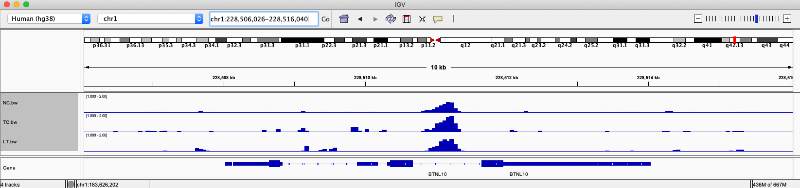
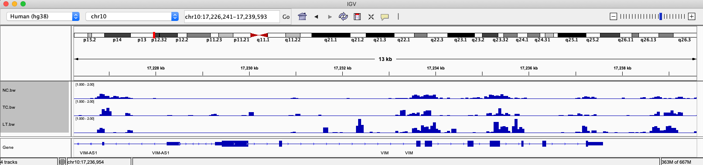
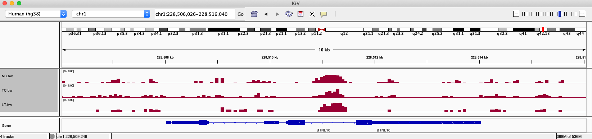
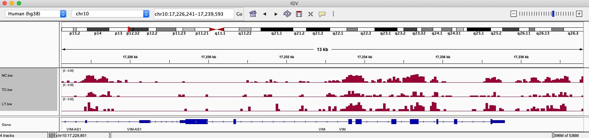

The things is I am working on some hMeDIP-seq data, which is a kind of ChIP-seq data but is designed to capture hydroxyMethylation signals. I have 3-4 phenotypes in it, so apparently I want to find a way to compare between these phenotypes.

A troditional way for ChIP-seq analysis is firstly using Peak Calling software like MACS2, SICER for peak identification for **each sample**. Then these peaks in each sample will be merged into conensus peaks, which means a peak would appread in multiple samples, to increase the reliability, until this step, we actually still **NOT** have speicific intensity information for each peak in each sample, because different samples have different sequence depth, and maybe other bias. Finally, **normalisation** would be done by softwares like DiffBind, MAnorm2 .etc. In theory, after normalisation, we can do downstream analysis, like differential peak finding .etc.

During my analysis, I am using [MAnorm2](https://github.com/tushiqi/MAnorm2) for normalisation, it works well and returned me normalised matrix for downstream analysis. **However, when I was checking the IGV plot, it shows another way**.

## 1. Mismatch between IGV plot and normalised result

Below is a subset of gene list I discovered that should have higher mean 5hmC value in NC and LT phenotype, but lower value in TC phenotype.

```r
|                              | AllCount| NC.MeanValue| TC.MeanValue| LT.MeanValue|
|:-----------------------------|--------:|------------:|------------:|------------:|
...
|chr1-BTNL10                   |       24|    1.9539123|    1.1080244|    1.6104720|
|chr10-VIM                     |      153|    0.8124961|    0.5232620|    0.8462570|
...
```

To visualise it, I merged all samples in each phenotype togather, then generated bigwig file with `bamCompare` software. The generated bigwig files were imported into IGV, in IGV I checked the status of these genes, however, the status is not as I expected.

Below is BTNL10 gene's IGV plot:


Below is VIM gene's IGV plot:


I can't see clear trend that NC/LT are higher than TC. I think the reaon is that IGV's normalisation is not good enough for visualisation.

## 2. Call peak without cutoff

Now the question is, how can I get correct Bigwig for visualisation? My idea is:

### 2.1. MACS2 for all peaks

MACS2 would defautly return only q value <= 0.05 peaks. However, these peaks are only top-intensity peaks among all, if we only focus on them, a large fraction of lower-intensity peaks will be missed. Second reason is the bigwig format defatuly use 50 bp width, in other work, for a bigwig file, it cuts whole genome into 50 bp, then cound reads mapped on it. The bigwig could be seen as a "summary" of bam files, it is generated for IGV (or USCS) visaulisation. So if I set width of MACS2 as 50, the peak resolute I will get should be similar as troditional big-wig generation tools like **bamCoverage** or **bamCompare**.

Below is my command for peak calling.

```bash
macs2 callpeak --bw 50 -t boundPath -c inputFile -f BAM -g 3.0e9 --outdir macs2_bin50 -n name -B -q 1 2> macs2_bin50/name -macs2.log
```

After calling, I will got a series of huge .narrowPeak matrix for each sample.

### 2.2. MAnorm2 normalisation

After calling, it's time to load them all into a software for normalisation. In terms of this task, I prefer MAnorm2, though DiffBind also works in this case based on my test. MAnorm2 is not very easy to run, I detaily described it in [another post](https://yuantian1991.github.io/notes/MAnorm2-package-for-hMeDIP-seq-data). In this case, some parameters should be set in param.bash profile:

```bash
peaks=...
labs=...
n=SmallBin
summits=...
keep-dup=1
fix-bin-size
typical-bin-size=50
```
By setting like this, MAnorm2 will also take 50 bp as width for normalisation.

### 2.3. Convert normalised matrix into bigwig

After MAnorm2 normalisation, we can get a hudge matrix, in my case I got 39,065,425 Peaks. (By the way, if we use MACS2 q value 0.05 as cutoff, I only got 468,289 peaks, these are only high-intensity peaks, that's the reason I always want to keep all peaks, as those lower-intensity peaks also have value to be analyed). **Here comes the important part: How to convert normalised scores back to bigwig file. Note that the scores provided by MAnorm2 are normalised read counts.**

The matrix after normalisation looks like below:

```R
> dim(M_SmallBin)
[1] 39065425       37
> M_SmallBin[1:5,1:5]
  chrom start   end LT52_bnd.read_cnt LT53_bnd.read_cnt
1  chr1 10922 10972        -0.1829227         0.1123974
2  chr1 10972 11022        -0.1829227         0.1123974
3  chr1 11022 11072        -0.1829227         0.1123974
4  chr1 11072 11122        -0.1829227         0.1123974
5  chr1 11122 11172        -0.1829227         0.1123974
>
```

Firstly I merged all same phenotype into one column, by average the scores in each sample.

1. **Write out score into bed files**

Firstly, each pheno's 5hmC score was write out into a bed file. Note that chrom, start, end columns **must** be kept.

```r
write.table(Peaks[,c("chrom", "start", "end", "NC.avgValue")], file="NC.bed", quote=F, col.names=F, row.names=F, sep="\t")
```

2. **Sort bed files**

Actually I don't know why we need to sort it... but I encountered problem in next step, which tells me the bed files need to be sorted. So this is the code. And also, I don't actually know the difference between bed and bedGraph. To me they are both txt files, not binary. So, actually you can name them whatever you want.

```bash
sort -k1,1 -k2,2n NC.bed > NC.bedGraph
```

3. **Convert bedgraph into bw**

To finish this step, I found some software for help: [fetchchromsizes](https://anaconda.org/bioconda/ucsc-fetchchromsizes), [bedclip](https://anaconda.org/bioconda/ucsc-bedclip), and the main program we are going to use - [bedGraphToBigWig](https://anaconda.org/bioconda/ucsc-bedgraphtobigwig). I installed them with conda, and encountered some problems indeed, eventualy solved with the help of [this post](https://www.biostars.org/p/432589/). After installation, below three commands are to be used to convert the bed (or bedGraph) files into bigwig:

```bash
## Creaeted hg38 referenece.
fetchChromSizes hg38 > hg38.chrom.sizes

## Clip (remove) peaks outside of above reference range.
bedClip NC.bedGraph hg38.chrom.sizes NC_cliped.bedGraph

## Finally, convert the bedGraph file to bigwig, based on hg38 reference.
bedGraphToBigWig NC_cliped.bedGraph hg38.chrom.sizes NC.bw
```

## 3. Adjusted IGV Plot

After above steps, use IGV to load these files into software, now the plot very much like the analysis results:






I suspect other softwares also work, like DiffBind, but I did not try. The bigwig file eventually shows the log2(readcount) from MAnorm2, but importantly the trend (height) is comparable in IGV plot.