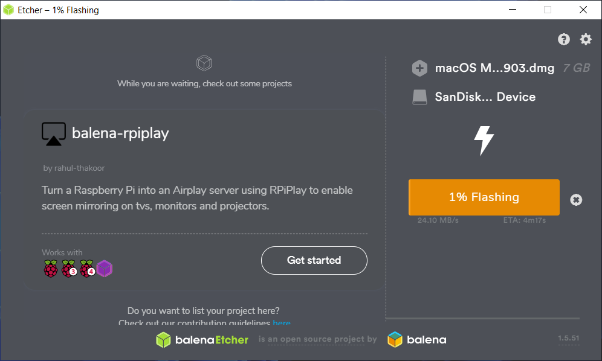
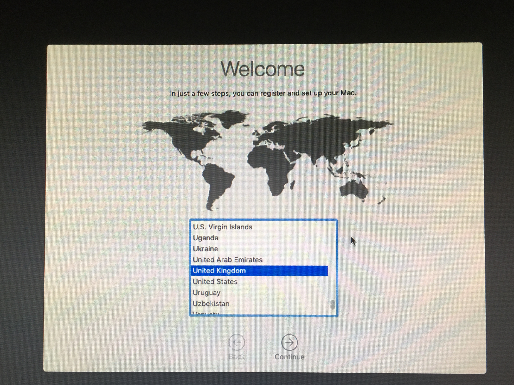

I broke my Hackintosh roughtly 1 week ago, when I was trying to upgrade from Catalina to Monterey. After using one week Ubuntu, I still want to use Mac. So I managed to find a tutorial to install it back...After trying various system, the only one **currently** works is the Mojave OS version...I will still try install newer versions in the future, but here is just a quick record how do I do it.

My machine was bought from a taobao shop recommanded by [this post](https://zhuanlan.zhihu.com/p/65263547). It has a I7-8750H CPU. And the machine version is S200.

## 1. Flash Mojave system into USB

Firstly download system from [here](https://mirrors.dtops.cc/ISO/MacOS/10.14/). **More specifically, download macOS Mojave 10.14.4(18E226) Installer with Clover 4903**, as the tutoral I found indicated. I tried other system options, but not working as easy as this one...Most likely to be the EFI is wrong.

After downloading, use balenaEtcher to flash the download DMG into USB. No moficiation is needed.



## 2. Boot Installation from USB

Insert USB into my machine (S200), when the computer start, press ESC/F2/F12, to enter BIOS setting, change:
* Secure Boot -> Disabled
* VT-d -> Enabled
* Quiet Boot -> Enabled
* Fast Boot -> Disabled
* CSM Support -> Disabled
* Set USB start as option 1 to boost.

Then restart the machine, Clover option should be able to be seen. There is an option called `Boot macOS Install from Install macOS Mojave`, select this one, start the installation. This action will trigger some code on a black terminal-similar background. After a while, Apple icon will show. After select language, a small install toolbox will shown.

**Firstly erase the disk**, select `Disk Utility` to erase the whole SSD. In my case, it's "HP SSD EX900 500GB Media". I rename it as "Mac", the format is "APFS", and Scheme is "GUID Partition Map". Note that is you can't find the Scheme option, click the down-select button beside "View". Then erase.


**Secondly change date and time**, after above step, if you want to install now, it will trigger an error as "This copy of the Install macOS Mojave application is damaged". That's because some time version issue. The solution for this bug is to click "Utilities" then "Terminal". Modify the time as:

```bash
date 102523382016 # Modify the time back to year 2016, when Mojave was released.
```

Then quite terminal (need to click "Terminal" then "quite"). Select **Install macOS**. I am not very sure what this step mean, but it looks like some "preparation" and "hardware check" for MacOS installation.

## 3. Install Mac

After section 2, now we can start to install Mac. The restarted computer should show 3 main big icon options: "Booy macOS Install from Install macOS Mojave", "Boot macOS Install Prebooter from Preboot", and third **"Boot macOS Install from Mac"**. Under these three big icon options, there are some small icon options below **and above**.

Press "o", then select "Configs->". These are configure options provided by the DMG we downloaded. Select **Config_UHD630_HDMI_part** (or other UHD630 options). Then return to main screen, select "Boot macOS Install from Mac". start installation.

In my understanding, this step is installing the system to computer, **but the booter is still on the USB.** Based on my test, the internet is not working here, but it's easy to fix later.

During the installation, there will have some restart steps, always select the new option: **"Boot macOS from Mac"**. Note that te configure step above may only need once, in future selection after reboot, I don't need to re-modify config.



## 4. Copy EFI to SSD

After installation, now we can enter the system everytime by select the third option "Boot macOS from Mac". However, still it's actually boosting from USB. Then we need to copy-paste EFI to location computer, so we don't need to always use the system with the USB is plugged.

In my case, I prepared above USB, with **Clover Configurator** included. Open this software, select "Mount EFI" on the left, then on the bottom mount the two EFI, one is for the Mac, and the other is for USB, copy the USB one to the Mac one.

## 5. Fix wifi

Now there is no wifi, there are 3 kexts: `AirportBrcmFixup.kext`, `BrcmFirmwareData.kext` and `BrcmPatchRAM2.kext`. Find them for example download online, then copy them to Mac EFI: Clover/kexts/other, then restart the computer the wifi would work.


That's all. A simple guild for my S200 machine. In the future I will try find more configuration for newer version Mac system.