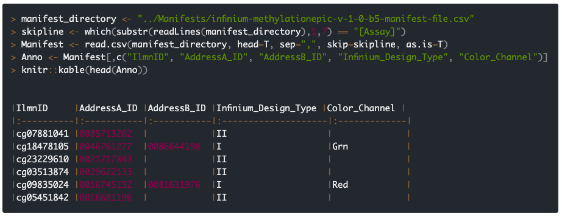

After years of maintain of ChAMP, I am tired of changing manifest over and over again. So here I formated a bit my previous function to automatically preprocess raw manifest downloaded from illumina. For example, the EPIC array manifest is [here](https://emea.support.illumina.com/array/array_kits/infinium-methylationepic-beadchip-kit/downloads.html). And mouse manifest is [here](https://emea.support.illumina.com/array/array_kits/infinium-mouse-methylation-beadchip-kit/downloads.html).

Manifest is the most important file for DNA methylation array research, as it provided mapping information between probes to CpGs. However, those information are not well organised, that I need to read them into R, format a bit, generate a object called `probeInfo` for future IDAT file loading usage. [champ.PrepareManifest()](https://github.com/YuanTian1991/ChAMPLite/blob/master/R/champ.PrepareManifest.R) is a function will be used in the future to do this work, even if illumina release more and more manifest, it should be able to handle them.

---

## Function Usage

```R
myManifest <- champ.PrepareManifest(manifestPath="./infinium-methylationepic-v-1-0-b5-manifest-file.csv", skip='auto')
```

*Parameters:*

* **manifestPath**: path to illumina raw manifest. It can be used for online file, for example [EPIC_B5](https://s3.eu-west-1.wasabisys.com/tian-champ-manifest/IlluminaManifest/infinium-methylationepic-v-1-0-b5-manifest-file.csv), [Mouse_v2](https://s3.eu-west-1.wasabisys.com/tian-champ-manifest/IlluminaManifest/MouseMethylation-12v1-0_A2.csv) and [450K](https://s3.eu-west-1.wasabisys.com/tian-champ-manifest/IlluminaManifest/humanmethylation450_15017482_v1-2.csv), these are three manifest I downloaded and uploaded to S3 service, convinient for download or directly loading.

* **skip**: Illumina version manifest contains a lot of extra information. They key information is stored after \[Assay\] and \[Controls\]. This function will automatically identify lines of these two markers, and read correct information between them. However, user may also identify their own skip lines, for example if you are using customed manifest. This value must be "auto", or a two length integer array like `c(7, 865927)`.

*Outputs:*

* **probeInfo**: A data frame contains colour channel, probe information for each CpG, will be used in champ.import() or champ.load() to extract methylated/unmethylated information.

* **controlProbes**: A data frame contains all control probes, which will be used in future quality check, detected P value generation .etc.

---

In theory this function support customed manifest. The manifest must contain following columns: "IlmnID", "AddressA_ID", "AddressB_ID", "Infinium_Design_Type", "Color_Channel". **If there is no control probes, just set skip parameter as c(0,0)**.

Actually, the manifest contains much more information than above columns, but they are mostly CpG's annotation, like what genes they are related, if they are SNPs .etc. The complete column explaination can be found [here](https://emea.support.illumina.com/content/dam/illumina-support/documents/downloads/productfiles/methylationepic/infinium-methylationepic-manifest-column-headings.pdf). We will process these information later in other functions, or directly use other annotations for array analysis, like [this one](https://zwdzwd.github.io/InfiniumAnnotation) recommanded by illumina staff.

## 1. Convert probe information.

In the manifest, there are two parts, one is CpG information, and the other is Control probes. Firstly, champ.PrepareManifest() will parse probe-2-CpG information. Importantly, DNA methylation array contains 2 types of probes, Type-II and Type-I. They are using different design to capture CpG information from DNA. Even, there are two types of Type-I probes, one is based on Red channel, and the other is based on Green chanel. Thus, to prepare probe information, these 3 types of CpGs need to be separately preprocessed.



### 1.1. Type-II Probe to CpG mapping

We can see that for Type-II CpG (cg07881041) above, there is only a AddressA_ID, which means for Type-II CpG, there is only one probe (AddressA_ID) designed to attach both methylation and unmethylation CpG. Different methylation status will be reflected in colour channel. More specifically, **AddressA_ID in Red Chanel = Unmethylated, AddressA_ID in Green Chanel = methylated**. 

Thus, for Type-II probes, I create index `G-0085713262` to indicate the methylation status of CpG cg07881041. Vise-versa, `R-0085713262` indicates unmethylation status for this CpG.

### 1.2. Type-I Probe to CpG mapping

As we can see, in above manifest, for Type-I CpGs, there is a colour-channel labelled. cg18478105 is labelled Grn, while cg09835024 is labelled Red. According to [some paper](https://www.ncbi.nlm.nih.gov/pmc/articles/PMC5389466/), this is because "colour channels of Type I probes are entirely dependent on the extension base, A and T bases are both labeled with red and C (complementary to G) is labeled with green fluorophores."

> I don't quite understand this, since for a long time, I think array probe only estimate T (unmethylated CpG, will be bisulfite-converted to T) or C (methylated CpG, will not be bisulfite-converted, remain as C). So in this case, I think just one colour possibility should exist. However, according to the author, actually, Type-I probe may integrate with A, T, or C.

But anyway, for Type-I probe, both methylated and unmethylated signals are reflected by same colour, but in different probes (AddressA_ID and AddressB_ID). Below is my organised Colour-Probe information. `mIndex` represent methylated signal for each CpG. And `uIndex` represent unmethylated signal for each CpG.

```R
    mIndex <- c(paste("G", typeII$AddressA_ID, sep = "-"),
                paste("R", typeIRed$AddressB_ID, sep = "-"),
                paste("G", typeIGrn$AddressB_ID, sep = "-"))

    uIndex <- c(paste("R", typeII$AddressA_ID, sep = "-"),
                paste("R", typeIRed$AddressA_ID, sep = "-"),
                paste("G", typeIGrn$AddressA_ID, sep = "-"))
```

After organising, eventually champ.PrepareManifest() will return an object as this:

```R
> head(myManifest$probeInfo)
                  CpG     mIndex     uIndex channel
cg07881041 cg07881041 G-85713262 R-85713262     g+r
cg23229610 cg23229610 G-21717843 R-21717843     g+r
cg03513874 cg03513874 G-29622133 R-29622133     g+r
cg05451842 cg05451842 G-16681196 R-16681196     g+r
cg14797042 cg14797042  G-7767973  R-7767973     g+r
cg09838562 cg09838562 G-25809572 R-25809572     g+r
> dim(myManifest$probeInfo)
[1] 865918      4
>
```

This is much simpler version of data.frame, with all three information (CpG name, Colour channel, and Probe) organised. Totally there are 865918 CpGs in EPIC array, without any filtering.

## 2. Prepare Control Probe samples.

Finally, this function will also extract all control probes in manifest, which will be used in future quality control steps.

```R
> head(myManifest$controlProbes)
     probe     type colour         value
1 21630339 STAINING    -99      DNP(20K)
2 24669308 STAINING    -99    Biotin(5K)
3 27630314 STAINING    Red    DNP (High)
4 34648333 STAINING   Blue  Biotin (Bkg)
5 41666334 STAINING  Green Biotin (High)
6 43603326 STAINING Purple     DNP (Bkg)
> dim(myManifest$controlProbes)
[1] 635   4
>
```

In methylation array, there are many types of control probes:
```R
> table(myManifest$controlProbes$type)

 BISULFITE CONVERSION I BISULFITE CONVERSION II               EXTENSION
                     10                       4                       4
          HYBRIDIZATION                NEGATIVE         NON-POLYMORPHIC
                      3                     411                       9
                 NORM_A                  NORM_C                  NORM_G
                     27                      58                      27
                 NORM_T             RESTORATION           SPECIFICITY I
                     58                       1                      12
         SPECIFICITY II                STAINING          TARGET REMOVAL
                      3                       6                       2
```