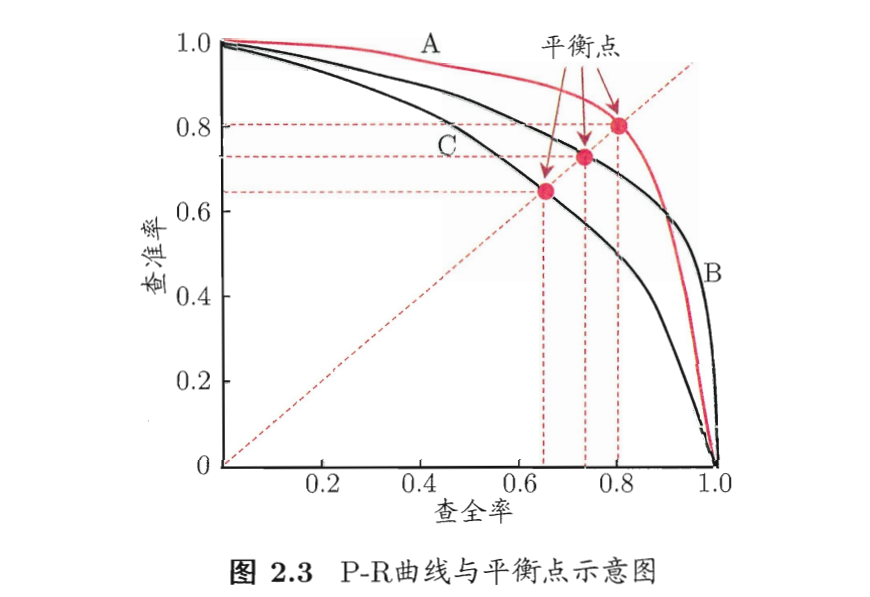

This is the second chapter of this ["watermelon book"](https://github.com/Mikoto10032/DeepLearning/blob/master/books/%E6%9C%BA%E5%99%A8%E5%AD%A6%E4%B9%A0%E5%91%A8%E5%BF%97%E5%8D%8E.pdf). It's about **Model Selection**, which means critiral we should follow to judge if a model is good or not after we trained the machine learning model.

## 1. Overfit and Underfit

Overfit means the model captured **too detail features** from training samples, that it perform well on training data, but not well on test data. We hope a good model have the capability of **generalization**, which means it should be able to learn "general" features from training data. then apply these feature on future test data.

Another issue is underfit, it directly means the model is good enough, and can't capture correact (or enough) feature for model creation. Generally, underfit is easiler to deal with, can be improved by actions like: expend more in decision tree; increase iteration number in neual network .etc

## 2. Estimate Approach

### 2.1. Cross Validation

Cross Validation is a common way to separate whole sampls into multiple training and testing sets. For example, divide whole samples into 10 groups, then each time select one group as testing, and the other 9 as training. Then, we need to train 10 models and test 10 times on each group. The final result is the mean value among 10 test data. Above sample is 10-fold cross validation.

I have used leave-one-out in my research, which can be used to **reclassify samples**, for example, test if histopathology classification is correct enough. However, if there are too many samples, leave-one-out apprently is not suitable.

### 2.2. Performance Measure

For regression tasks, the most common measurement is `mean squared error`: $E(f;D) = 1/m * \sum(f(x_i) - y_i)^2$

`Error Rate` is $E=a/m$, $m$ is total samples, $a$ is number of wrongly identifed samples among $m$. 

`Accuracy` is $1 - Error Rate$.

There are two kinds of error. Error happen on training data is called "training error", while error happen on new samples is called "generalization error"

`Precision` means among all samples estimated TRUE, how many of them are really TRUE.

`Recall` means among all samples are really TRUE, how many of them are identified TRUE.

Normally, you can't each both high Precision and high recall at the same time. Based on precision and recall, a plot called P-R plot can be generated as below. The way to judge a model good or not is to see if this model's P-R curve and "cover" other curves. There are many packages in R to draw this curve, for example [PRROC](https://cran.r-project.org/web/packages/PRROC/vignettes/PRROC.pdf).

After drawing P-R curve, we may need to find some ways to "compare" different curves (models). There are couple options here.
* **Break-Even Point (BEP)**. The point P == R. So we can compare different curves by comparing this point.
* **$F1$ and $F_\beta$**. $F_{\beta}$ is important as it can adjust peference between P and R. For example, higher P is vital for advertisement, while higher R is vital for criminal searching.

$$
F_ {\beta } = \frac{(1+\beta ^ {2})\times P\times R}{(\beta ^ {2}\times P)+R}
$$

In the future, when I train a model, it's good to use $F_\beta$ to select a poper model.

### 2.3. ROC and AUC

Another quite important figure for machine learning model estimation is ROC (Receiver Operating Characteristic) curve. To me this plot is quite similar to P-R curve. AUC means area under curve.

In theory, we hope the model to reach left-top coordinate, which means false rate is 0, but true rate is 100%. Again there are many packages to draw ROC and AUC.

### 2.4. Cost Sensitive Error Rate and Cost Line

In reality, different "mistake" have different cost. For example, one mis-diagnose may lead to death of patient. In this case, we should focus on Recall instead of Precision. The way to prevent this mistake is apply cost function. The idea is simple, which is more likely to add "penalty" on each kind of mistake. Then when we calculate Cost Sensitive Error Rate, include these cost/penalty. In this case, troditional ROC curve is not working here, instead we can draw Cost Line plot as below:

The x axis and y axis for above plot is called Positive Probability (正概率代价) and Normalised Cost (归一化代价). The fomular is not complex. I did not found any tool in R to draw this plot.

## Summary

These are some commonly used plot and measurement for machine learning model selection. In the future, for example champ.MachineLearning(), I will try draw these plot for people to estimate the performance.