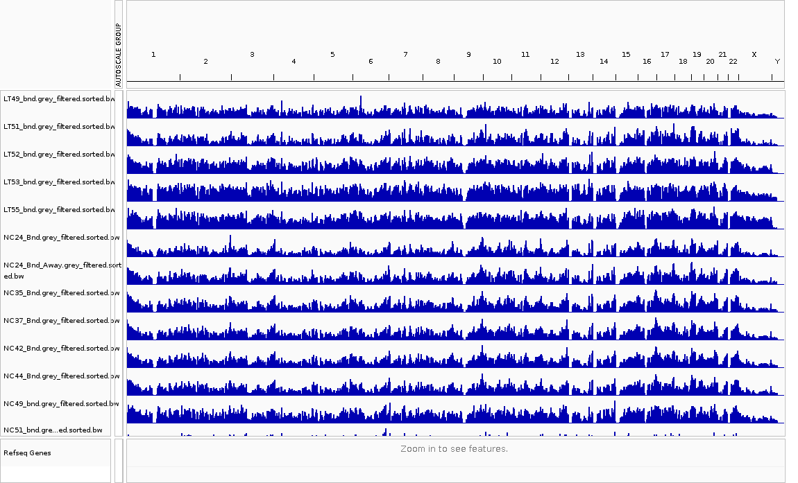

ChIP-seq is a technical to use anti-body to pull down target genome segments then use high-throughput sequencing to analysis attached location of these segments (reads). I started to work on it since April last year and now it's time to write it up. In this note I record a bit the preprocessing steps for the ChIP-seq data. Mere, it includes:

0. Input Requirement
1. Quality Control with fastQC/multiQC
2. Adapter Trimming
3. Alignment
4. GreyList Removing
5. BigWig Generation (optional)
6. Peak Calling

Note that I chained them up with a single one R script.

## 0. Input Requirement

Fistly I am here to specify input requirement. Just three things:

```R
fqDir <- "../S01_RawFastQ/5hmC"
SampleSheet <- read.csv("../S01_RawFastQ/5hmC/5hmC_Sample_Table.csv", sep="\t")
outputPrefix <- "./result"
```

fqDir is where raw fastQC will be. No matter it's downloaded from SRA or generated by some companies. outputPrefix is a target folder.

SampleSheet is looks like blow. Below are minium requirement for sample sheet. Type indicate if this FQ file is Bound or Input control. SampleName must be unique, fqFiles are paths to FQ files. And phred indicate if this file is using old style 64 format, or recent 33 format. I know the phred value by checking the first step (fastQC report), it will be used in the second step fastp trimming.

```R
> knitr::kable(head(SampleSheet[,c("Type", "SampleName", "fqFiles", "phred")]))

|Type |SampleName |fqFiles                                                          |phred |
|:----|:----------|:----------------------------------------------------------------|:-----|
|Bnd  |NC42_Bnd   |/mnt/data/Tian/CRC_Paper/S01_RawFastQ/5hmC//SRR871537_1.fastq.gz |FALSE |
|Inp  |NC24_Inp   |/mnt/data/Tian/CRC_Paper/S01_RawFastQ/5hmC//SRR871539_1.fastq.gz |FALSE |
|Bnd  |NC44_Bnd   |/mnt/data/Tian/CRC_Paper/S01_RawFastQ/5hmC//SRR871541_1.fastq.gz |FALSE |
|Inp  |NC35_Inp   |/mnt/data/Tian/CRC_Paper/S01_RawFastQ/5hmC//SRR871543_1.fastq.gz |FALSE |
|Bnd  |TC24_Bnd   |/mnt/data/Tian/CRC_Paper/S01_RawFastQ/5hmC//SRR871544_1.fastq.gz |FALSE |
|Bnd  |TC35_Bnd   |/mnt/data/Tian/CRC_Paper/S01_RawFastQ/5hmC//SRR871546_1.fastq.gz |FALSE |
```

## 1. Quality Control with fastQC/multiQC

This is quite standard, use fastQC to check low quality samples. I am using [fastqcr R package](https://cran.r-project.org/web/packages/fastqcr/index.html), basically the uage is 100% similar to the comand line tool.

```R
# These command create a folder for fastQC result
message("\nRun FastQC...")
fileFolder  <- glue("{outputPrefix}/fastQC")
if (!file.exists(fileFolder)) dir.create(fileFolder)

# Below is the key command
myFastQC <- fastqc(fq.dir = fqDir, qc.dir = fileFolder, fastqc.path="/usr/bin/fastqc", threads = 15)
```

After running (3-4 mins), the fastQC HTML files will be in the corresponding folders. Then a simple `multiqc ./result/fastQC` command could create multiQC report.

## 2. Adapter Trimming

Adapter trimming is the first step for most sequencing data. Here I am using [fastp](https://github.com/OpenGene/fastp), a very fast trimming tool, and it can automatically decide the adapter so I don't need to findout what the adapter is. Also I am using the R version of fastp, [Rfastp](http://www.bioconductor.org/packages/release/bioc/html/Rfastp.html) , here.

```R
message("\nRunning RFastp in parallel...(Roughly one min for one sample)")
fileFolder  <- glue("{outputPrefix}/fastp")
if (!file.exists(fileFolder)) dir.create(fileFolder)

library(doParallel)
detectCores()
cl <- makeCluster(20)
registerDoParallel(cl)
getDoParWorkers()

library(foreach)
myFastp <- foreach(i = 1:nrow(SampleSheet), .packages='Rfastp') %dopar% {
    rfastp(read1 = SampleSheet[i, "fqFiles"], outputFastq = paste0(fileFolder, "/", SampleSheet[i, "SampleName"]), phred64=SampleSheet[i, "phred"])
}

registerDoSEQ()
on.exit(stopCluster(cl))
fastpFolder <- fileFolder
```

Here I am still using `doParallel` for R parallel running, but in the future I will mostly use `mclapply`.

## 3. Alignment

Alignment is one of the most important step for sequencing analysis, here firstly I need to select the most proper software and corresponding genome reference. In here I will use [bowtie2](http://bowtie-bio.sourceforge.net/bowtie2/index.shtml) for alignment, which is not too slow for ChIP-seq, and the reference **GRCh38_noalt_as** is directly downloaded from bowtie2 website. It need to be download to local folder, in my case, I put it in the analysis folder. Then below is the code. I am just using the R to excute a bash command...Not a clever way.

```R
message("\nRun Rbowtie2 in parallel...")
fileFolder  <- glue("{outputPrefix}/bowtie2")
if (!file.exists(fileFolder)) dir.create(fileFolder)

myBowtie2 <- list()
for(i in 1:nrow(SampleSheet)){
    cmd <- glue("bowtie2 -p 30 -q --local -x ./GRCh38_noalt_as/GRCh38_noalt_as -U {fastpFolder}/{SampleSheet[i, 'SampleName']}_R1.fastq.gz | samtools view -bS - > {fileFolder}/{SampleSheet[i, 'SampleName']}.bam")
    message(cmd)
    system(cmd)
}
bowtie2Folder <- fileFolder
```

## 4. GreyList Removing

After mapping, I can get BAM files for each sample, however, if I convert these BAM files to bigwig for visualisation, I can hardly see any pattern, because there are some regions in genome would capture a lot of reads. These regions are called black/grey regions, these list can be download from pre-generated list like [this](https://github.com/Boyle-Lab/Blacklist/tree/master/lists) or [here](https://www.encodeproject.org/files/ENCFF356LFX/). Or use some packages to generate from your Input samples. Here I am using [GreyListChIP](https://www.bioconductor.org/packages/devel/bioc/html/GreyListChIP.html) to generate the greylist from all my Input samples.

In below script, I used mclappy to calculate greylist for each Input sample, and put them in the `greylist` folder.

```R
message("\nRemove GreyList")
library("GreyListChIP")
library("BSgenome.Hsapiens.UCSC.hg38")

greylistFolder  <- glue("{outputPrefix}/greylist")
if (!file.exists(greylistFolder)) dir.create(greylistFolder)

getGreyList <- function(i, bowtie2Folder, targetFolder)
{
    message("Generating greylist for ", i, "...")
    message(glue("{targetFolder}/{i}_GreyList.bed"))
    tmpGreyList <- greyListBS(BSgenome.Hsapiens.UCSC.hg38, glue("{bowtie2Folder}/{i}.bam"))
    export(tmpGreyList, con=glue("{targetFolder}/{i}_GreyList.bed"))
}

Inps <- SampleSheet$SampleName[SampleSheet$Type == "Inp"]
myGreyList <- mclapply(Inps, function(x) getGreyList(x, bowtie2Folder, greylistFolder), mc.cores = length(Inps))
```

After identification of grey regions, we then need to remove these regions from all sample's bam files. In below script, I firstly megred all Input greylist into a `MergedGreyList.bed`. Then [bedtools](https://bedtools.readthedocs.io/en/latest/) is used here to remove pre-generated greylist. Note that here I am using [parallel](https://www.gnu.org/software/parallel/), which is a nice tool for parallel running in linux (not R).

```R
message("Filter BAM files")
filteredBamFolder  <- glue("{outputPrefix}/filteredBam")
if (!file.exists(filteredBamFolder)) dir.create(filteredBamFolder)

cmd <- glue("cat {greylistFolder}/* > ./MergedGreyList.bed")
system(cmd)
cmd <- paste0("parallel --plus 'bedtools intersect -v -abam {} -b ./MergedGreyList.bed > ", filteredBamFolder,"/{/.}.grey_filtered.bam' ::: ", bowtie2Folder, "/*.bam")
message(cmd)
system(cmd)
```

After this step, we can BAM files that we can use in many downstream analysis, like Peak Calling .etc. However, in many cases, these BAM files need to be preprocess a bit, like sorted and index.

## 5. BigWig Generation (optional)

BigWig is a format suitable for IGV visualisation. The BigWig can be generated from BAM, which can be see as a "summary" of all reads. In below 3 parallel commands, it will sort, index and created bigwig files for each sample.

<b style="background-color: yellow">These sorted and indexed BAM files should be used for all downstream analysis.</b>

```R
message("Sort, Index and BigWig Generation")
sortedBamFolder  <- glue("{outputPrefix}/sortedBam")
if (!file.exists(sortedBamFolder)) dir.create(sortedBamFolder)

message("Sorting blacklist filtered bam files...")
cmd <- paste0("parallel --plus 'samtools sort {} -o ", sortedBamFolder, "/{/.}.sorted.bam' ::: ", filteredBamFolder, "/*.grey_filtered.bam")
# cmd <- "parallel --plus 'samtools sort {} -o ./myBigWig/{/.}.sorted.bam' ::: ./myAlignment/*.bam"
system(cmd)
cmd <- paste0("parallel --plus 'samtools index {} ", sortedBamFolder,"/{/..}.sorted.bam.bai' ::: ", sortedBamFolder, "/*.bam")
system(cmd)
cmd <- paste0("parallel --plus 'bamCoverage -p 5 -b {} -o ", sortedBamFolder, "/{/.}.bw' ::: ", sortedBamFolder, "/*.sorted.bam")
system(cmd)
```

These bigwig files can be viewered with IGV conviniently. Note that the peaks on the plot is NOT reliable at all for any analysis, it will just do scalling for each sample. Maybe Group Scale could help a little bit. However, in [my post here](https://yuantian1991.github.io/notes/Bias-in-ChIP-seq-visualisation), I described how I use IGV to visualise normalised data.



## 6. Peak Calling

Finally, a normal step is to do peak calling, there are many software for this. MACS2, SICER and many more, but also according to paper comparison, most peak calling software return similar results. Here I am using MACS2, because most downstream analysis software support it.

In my analysis, since not all my Bound file have corresponding Input control, so I merged all Input togather as below:

```R
cmd <- glue("samtools merge MergedInput.bam `ls {sortedBamFolder}/*_Inp.grey_filtered.sorted.bam`")
system(cmd)
```

Also, this merged Input file need to be sorted for peak calling usage.
```R
cmd <- "samtools sort ./MergedInput.bam -o ./MergedInput.sorted.bam ; samtools index ./MergedInput.sorted.bam ./MergedInput.sorted.bam.bai"
system(cmd)
```

Then below command could be run to return narrowPeaks.

```R
macs2NarrowPeaksFolder  <- glue("{outputPrefix}/macs2NarrowPeaks")
if (!file.exists(macs2NarrowPeaksFolder)) dir.create(macs2NarrowPeaksFolder)

runMACS2 <- function(i, sortedBamFolder, macs2NarrowPeaksFolder) {
    message("Running MACS2 NarrowPeak for ", i, "...")
    cmd <- glue("macs2 callpeak -t {sortedBamFolder}/{i}.grey_filtered.sorted.bam -c ./MergedInput.sorted.bam -f BAM -g 3.0e9 --outdir {macs2NarrowPeaksFolder} -n {i} -B --tempdir ./myTMP -q 0.05 2> {macs2NarrowPeaksFolder}/{i}-macs2.  log")
    message(cmd)
    system(cmd)
}

Bnds <- SampleSheet$SampleName[SampleSheet$Type != "Inp"]
myMacs2NarrowPeaks <- mclapply(Bnds, function(x) runMACS2(x, sortedBamFolder, macs2NarrowPeaksFolder), mc.cores = length(Bnds))
```

After MACS2, I can get narrowPeak for downstream anlaysis, for example I recommand to use [MAnorm2](https://yuantian1991.github.io/notes/MAnorm2-package-for-hMeDIP-seq-2:-Normalisation-&-Analysis) for downstream analysis.