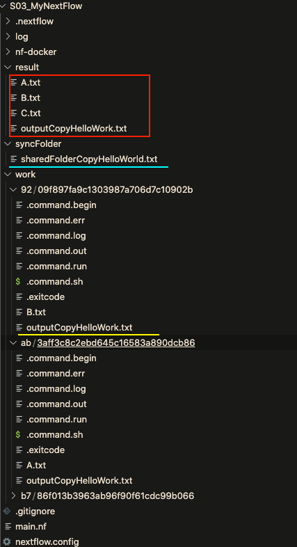

Now I have leanred nextflow and docker. The next task is to integrate them. My purpose is to write each docker for each process. So call "componentization", or "modularization". So that in the future, I can "form" or "assembly" nextflow pipeline quickly with these components. This is possibly a bad idea, as Bioinformatics softwares have ton's of parameters, it's may not work to have just a container to run everydata...

I need to say that until now (March 2022), there is still limited resource online about integration between nextflow and docker, though this is a "selling point" for nextflow. For example, when I google "nextflow docker example" on google, there are only 8 pages example. Most examples are directly using `--with-docker` parameter to pull a dockerhub, then run everything in it, without showing how file system looks like in both hostmachine and container.

## Create a Docker Image

Firstly, I create a docker image, which containes a file named "helloworld.txt" in a folder called "imageResource". This is a file created in docker, not in the host machine.

```docker
# Download base image ubuntu 20.04
FROM ubuntu:20.04

WORKDIR /app

ENV PATH "$PATH:/app/software"

RUN  apt-get update \
  && apt-get install -y wget \
  && rm -rf /var/lib/apt/lists/*

# Install fastp in this docker
RUN wget http://opengene.org/fastp/fastp -P software/ \
    && chmod a+x  software/fastp \
    && mkdir imageResource \
    && echo "Hello World" > imageResource/helloworld.txt
```

The purpose of "helloworld.txt" file here equals to a file pre-COPIED into docker image for software usage. For instance, a reference genome for mapping, a target-region.csv for mapping .etc. Then create the docker with below comamnd, name it as `nf_fastp`:

```bash
docker build -t nf_fastp ./nf-docker/docker_fastp
```

We can test the docker image like:

```bash
tian@slms-ci-beck-02 $ docker run -it nf_fastp
root@c98b2ac172b6:/app# ls
imageResource  software
root@c98b2ac172b6:/app# ls imageResource/
helloworld.txt
root@c98b2ac172b6:/app# 
```

It is working, the WORKDIR is `/app`, software `fastp` is installed in folder `software`, resource needed for calculation (not exist in host machine) is placed in `imageResource`.

## Create a Nextflow script

The script is super simple, it only do one thing, copy the helloworld.txt file to `/data` folder. And `/data` folder is the share folder between host machine and container. **The docker image is imported directly in process.**

```
stringArray = Channel.from("A", "B", "C" )

process 'test_docker_image' {
    container 'nf_fastp'
    publishDir "./result", mode: 'copy'
    
    input:
      val x from stringArray

    output:
      file "*.txt" into result_ch
    script:

    """
    cp /app/imageResource/helloworld.txt /app/data/sharedFolderCopyHelloWorld.txt
    cp /app/imageResource/helloworld.txt outputCopyHelloWork.txt
    echo ${x} > ${x}.txt
    """
}
```

Since here I need to use docker, `nextflow.config` file need to be modified a bit. **A simple way is to create a file named nextflow.config in the same folder. Then add below content:**

```
docker {
    enabled = true
    runOptions = " -v /scratch1/Tian/Cansor/Nextflow/S03_MyNextFlow/syncFolder:/app/data"
}
```

The important here is runOption, the `-v` parameter means mounting volumn of host machine to consider, as a shared space. The `/app/data`  is the folder in container, that's where the first `cp` command target for. Then run the nextflow script as:

```bash
nextflow -log ./log/debugLog run main.nf -resume
```

The output is like below. I exported the 4 results:

1. **sharedFolderCopyHelloWorld.txt (light-blue)**. This is achived by copy the pre-created helloworld.txt file into sharedFolder. The sharedFolder is created in `nextflow.config`, which mount /scratch1/Tian/Cansor/Nextflow/S03_MyNextFlow/syncFolder folder in hostmachine on /app/data folder in container. In this case, docker can directly write/read file in shared folder, all export files can be put there, it has nothing to do with nextflow. **Note that the syncFolder MUST pre-exist in current folder. Otherwise it will trigger error.**

2. **outputCopyHelloWork.txt (yellow) in work folder**. This is the working folder for nextflow. It looks like after integration between nextflow and docker, when container start it's automatically located in this "work/31/XXX" folder. So if any command in container produce any file in current folder, it falled into control of nextflow. **Thus, I suspect nextflow will do another mount for the work directory into docker**. In theory, this folder is not easy accessible for user, thus the main purpose to create file here, is to export into channel for downstream analysis.

3. **outputCopyHelloWork.txt (red)**. This file is copy-exported by nextflow. It is achived by firstly export the work-directory-created outputCopyHelloWork.txt file into nextflow channel. Then use publishDir to export it.

4. **A/B/C.txt**. These files are created by docker, by taking the input from channel,


