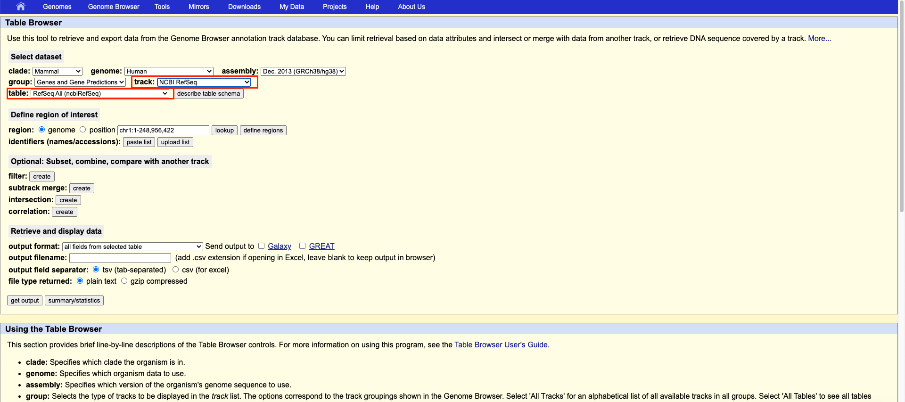
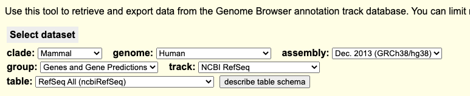
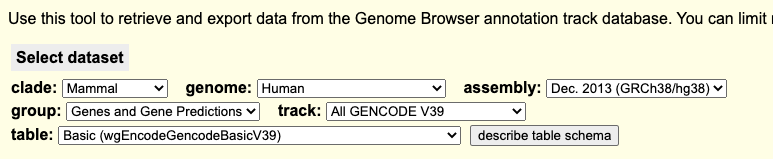
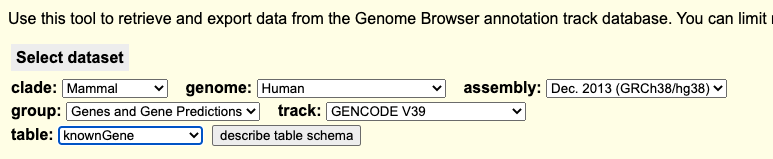
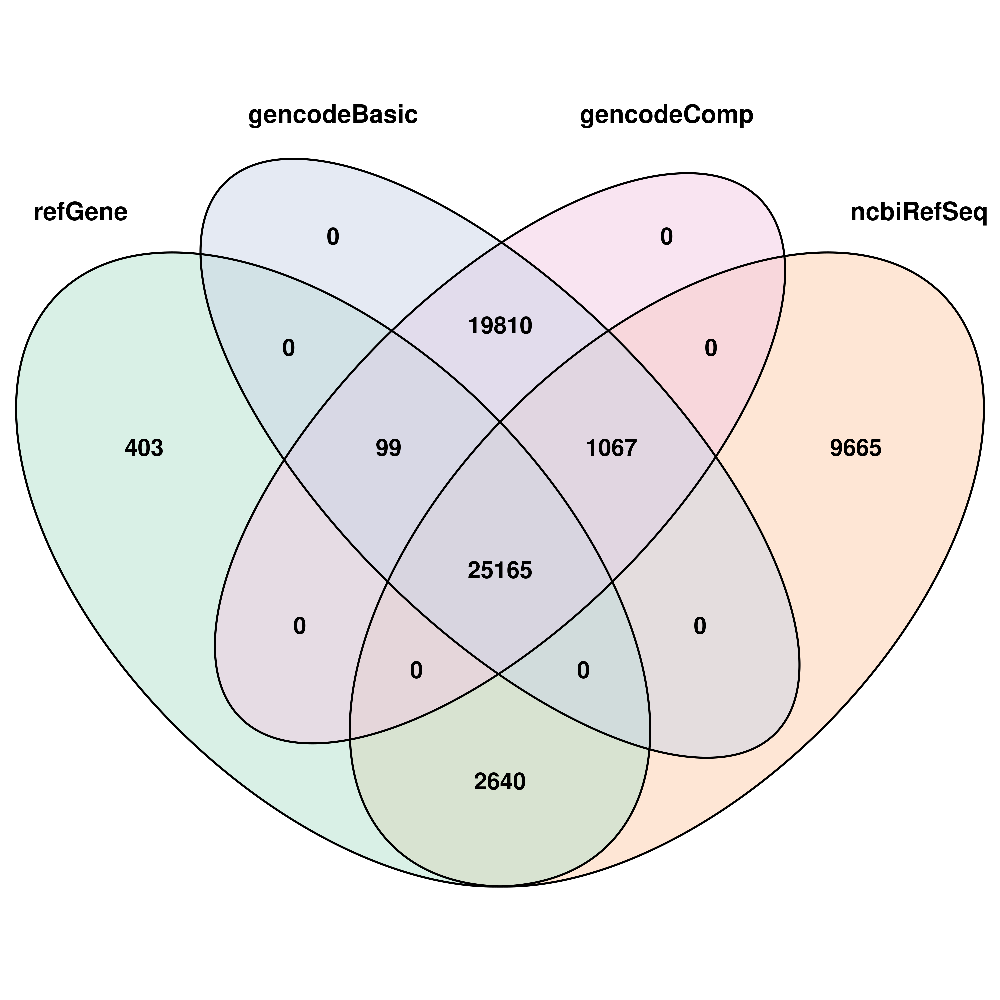

Genome Annotation is the one of the most vital part for Bioinformatics. In many many cases, researchers can found some interesting signals, like methylated CpGs, anti-body bounded peaks .etc on human or other genome. We want to know what genes these "signals" are mathced. Or are they matched on CpG Islands, Transcript Start Sites. etc. 

The way to do it is mapping, purely map the genome coordinates of those signals to genome. Thus, we need a "reference annotation" for mapping to. This reference annotaiton should contains gene information, transcripts information, or even intron/exon information.

**However, nowadays there are too many version of reference genome.**  Someone use RefSeq, while others is Ensembl, but they are not alreayd matching. The biggest trouble is in big R pacakges like ChAMP, which integrated multiple methods and algorithms. Sometimes in function A, the method use RefSeq, in function B, the method use GENCOD, which will leads to inconsistency annotation result in the last.

Another problem is now there are many "annotation packages" in R (any Python), for example: [Txdb.hsapiens.ucsc.hg38.knowngene](https://bioconductor.org/packages/release/data/annotation/html/TxDb.Hsapiens.UCSC.hg38.knownGene.html), which actually use KnownGene Table from UCSC. So where is the KnownGene Table comes from? How well the KnownGene table match with RefSeq or GENCOD? I don't know. Another example, [org.Hs.eg.db](https://bioconductor.org/packages/release/data/annotation/html/org.Hs.eg.db.html), which is so commonly used globally, but I did not found where the annotation is based for...

On top of them, there are other "Annotation Packages" wrap genome annotation layer by layer, then provided to users. For example [AnnotationDbi](https://bioconductor.org/packages/release/bioc/html/AnnotationDbi.html), [biomaRt](https://bioconductor.org/packages/release/bioc/html/biomaRt.html) .etc.

In other word, while different researcher use their own-picked annotation file (or wrapped packages), it's become harder and harder to unify genome annotation. A worse problem is after layer by layer wrapping of genome annotation, mistake may happen if certain package is not updated properly.

Some people say, genome annotations are similar, that's depend on exactly how do define similar. According to [this paper](https://genomebiology.biomedcentral.com/articles/10.1186/s13059-019-1715-2#ref-CR10).

*"In a recent comparison of all the protein-coding and lncRNA transcripts in the RefSeq and GENCOD human gene databases, only 27.5% of the GENCOD transcripts had exactly the same introns as the corresponding RefSeq genes."*

## Genome Annotation Sources

Fistly, I need to find where the raw genome annotations are come from?

### Organisation publish Genome Annotation

Firstly, there is a place called [GenBank](https://www.ncbi.nlm.nih.gov/genbank/).
* This is a place where global researchers can upload their sequence result on it, which means some results in this database may not be reliable. 
* Also this database is redundant, as possibly different labs sequenced the same animal, then uploaded their similar results on to the database. 
* Thirdly, GenBank sequence records are owned by the original submitter and cannot be altered by a third party.

After researchers upload data information to GenBank, groups of scientist start try to get a "most reliable" version of genome from GenBank. They develop algorihms. methods, critirials for this "reliable genome information", then publish it.

Based on my searching, **there are at least 4 main organisation published genome annotation**. 
1. [NCBI RefSeq](https://www.ncbi.nlm.nih.gov/refseq/): The full name of NCBI is National Center for Biotechnology Information, based in USA. In other word, a group of scientist extract and analised data from GeneBank, only select those they believe are accurate, then organised into a new database, called "NCBI RefSeq".
2. [UCSC](https://genome.ucsc.edu/): It's famouse of the browser, that I almost forget the full name is University of California Santa Cruz Genome Browser. For a long time I think this is a place provide a very nice Genome Browser, and downloads of Genome Sequence/Annotation. Until recently after googling, it seems this organising also generated their own version of Genome Annotation: "RefGene" is one of them.
3. [EBI](https://www.ensembl.org/index.html): The full name is European Molecular Biology Laboratory's European Bioinformatics Institute, seems this is the only one based on EU. It **released Ensembl database**, which is also provide sequence and genome annotation download. I think it's a bit similar to NCBI RefSeq.
4. [ENCODE (GENCOD)](https://www.encodeproject.org/): Seems start by National Human Genome Research Institute USA and European Molecular Biology Laboratory in EU togather. It relase genome annotation as Basic and Comprehensive version. However, based on my checking, the GENCOD is more similar to Ensembl then RefSeq. **Thus, I personally think it's the successor of Ensembl**. [The official website on GENCOD said, the only difference are some annotaiton on chrXY, and more attributes](https://www.GENCODgenes.org/pages/faq.html#:~:text=What%20is%20the,reference%20chromosomes%20only.).

Maybe there are other organisations create their own genome annotation, but here I think above are main organisations that Bioinformatician knows.

### Main Stream Genome Annotation

After above , some "main stream" genome annotation ares: **ncbiRefSeq, refGene, GENCOD, knownGene**. I want to compare them, and select one I like most. As I explained above, refGene and ncbiRefSeq is similar, they are both generated by NCBI/UCSC (USA), but GENCOD is merely generated by EBI (EU). The most distingwish patten is transcript name. RefSeq/refGene (USA) style is NR_XXXXX, NM_XXXX, while GENCOD Style is ENSTXXXXXX.

> I personally think, to simplify long-term work, I better always stick on one system only.

## How to access Genome Annotation?

Below are 3 approches I found to access Genome Annotation.

### MySQL Access

Fistly, I found the best way to acccess these data is via UCSC MySQL. Below I am using the R version mySQL tool:

```R
library(RMySQL)
library(GenomicRanges)
library(stringr)
library(glue)

db <- 'hg38'

con_ucsc <- dbConnect(RMySQL::MySQL(), db = db, user = "genome", host = "genome-mysql.soe.ucsc.edu")

refGene <- suppressWarnings(dbGetQuery(con_ucsc, stringr::str_interp(glue("SELECT * FROM refGene"))))
ncbiRefSeq <- suppressWarnings(dbGetQuery(con_ucsc, stringr::str_interp(glue("SELECT * FROM ncbiRefSeq"))))
knownGene <- suppressWarnings(dbGetQuery(con_ucsc, stringr::str_interp(glue("SELECT * FROM knownGene"))))
GENCODBasic <- suppressWarnings(dbGetQuery(con_ucsc, stringr::str_interp(glue("SELECT * FROM wGENCODGENCODBasicV39"))))
GENCODComp <- suppressWarnings(dbGetQuery(con_ucsc, stringr::str_interp(glue("SELECT * FROM wGENCODGENCODCompV39"))))

dbDisconnect(con_ucsc)
```

By using this way, I can ge the format nicely as:

```R
> knitr::kable(head(knownGene))
|name              |chrom |strand | txStart| txEnd| cdsStart| cdsEnd| exonCount|exonStarts         |exonEnds           |proteinID |alignID    |
|:-----------------|:-----|:------|-------:|-----:|--------:|------:|---------:|:------------------|:------------------|:---------|:----------|
|ENST00000619216.1 |chr1  |-      |   17368| 17436|    17368|  17368|         1|17368,             |17436,             |          |uc031tla.1 |
|ENST00000473358.1 |chr1  |+      |   29553| 31097|    29553|  29553|         3|29553,30563,30975, |30039,30667,31097, |          |uc057aty.1 |
|ENST00000469289.1 |chr1  |+      |   30266| 31109|    30266|  30266|         2|30266,30975,       |30667,31109,       |          |uc057atz.1 |
|ENST00000607096.1 |chr1  |+      |   30365| 30503|    30365|  30365|         1|30365,             |30503,             |          |uc031tlb.1 |
|ENST00000417324.1 |chr1  |-      |   34553| 36081|    34553|  34553|         3|34553,35276,35720, |35174,35481,36081, |          |uc001aak.4 |
|ENST00000461467.1 |chr1  |-      |   35244| 36073|    35244|  35244|         2|35244,35720,       |35481,36073,       |          |uc057aua.1 |
>
```

The format is very nice, for each transcript (not gene), it will list the TSS (txStart), TTS (txEnd), and each exon/intron. This is much easiler for downstream mapping. I preivously have used this format to write a nice genome feature function in this [post](https://yuantian1991.github.io/notes/A-ChAMP-function-to-generate-various-Gene-Features).

Also, below command will list all avaliable tables for correponding database (`db` in my code):

```R
dbGetQuery(con_ucsc, stringr::str_interp("SHOW TABLES;"))
```
Totally there are 2000+ tables for download.

I will rely on this mySQL access for all genome annotation development in the future. As it's comparabily raw (not been wrapped over and over again), and a easy to understand format.

### UCSC Table Browser Access

Apart from above mySQL way, another way is to get the data via [UCSC Table Browser](https://genome.ucsc.edu/cgi-bin/hgTables).



By selecting the `track` and `table`, we can get different tables (genome annotations) from UCSC website. Honestly I did not found the clear explaination of Track and Table, however, I think track is similar to "database" published by different organisations. For example, If select "NCBI RefSeq" as Track, all tables avaliable are generated based on NCBI RefSeq database. I tested, ths output of Genome Annotation here is exactly the same as Genome Annotation from UCSC mySQL.

The advantage for UCSC Table Browser is that it can provide some additional informaiton.

### Website Download

Third way to download genome annotation is from [this link](http://hgdownload.soe.ucsc.edu/goldenPath/hg38/database/), this is hg38. The advantage for Website link is to show the time one genome annotation is created. For example, I found knownGene is release on 2022-01-18, right two days after GENCOD release.

Finally, below is my record a bit my searching on different genome annotation.

## NCBI RefSeq

**mySQL table name:** `ncbiRefSeq`



* NCBI RefSeq is generated from GenBank, by NCBI Team, by only selection curated annotations. 
* Part of the record are manually curated, but also some are computationally generated. The gene ID for NCBI RefSeq are like protein-coding 'NM' transcripts and non-coding 'NR' transcripts. 
* It contains 172809 transcripts.
* Based on [this paper](https://bmcgenomics.biomedcentral.com/articles/10.1186/1471-2164-16-S8-S2). RefSeq is similar to GENCOD, but GENCOD is better:


*"The GENCOD Comprehensive transcripts contain more exons, have greater genomic coverage and capture many more variants than RefSeq in both genome and exome datasets, while the GENCOD Basic set shows a higher degree of concordance with RefSeq and has fewer unique featuresd"*


## RefGene (UCSC RefSeq)

**mySQL table name:** `refGene`


**This is a very confusing one**. According the UCSC website:

*"UCSC RefSeq – annotations generated from UCSC's realignment of RNAs with NM and NR accessions to the human genome. This track was previously known as the "RefSeq Genes" track."*

In other word:
* **This genome annotation have 3 names: RefGene, UCSC RefSeq, and RefSeq Genes**.
* It is listed under the hood of NCBI RefSeq, but RefSeq specially mentioned that this RefGene is not from RefSeq.
* it is produced by UCSC, what UCSC? The university? Some lab in the university? The team who developed genome browser? I don't know...
* It only contains 88,819 transcript. 
* The gene ID is similar (same) as NCBI RefSeq: NM_XXXX, NR_XXXX. However, I found that a lot of Long-non-coding transcripts are not included.
* RefGene (UCSC RefSeq) is more suitable for hg19, not hg38.

A more detail explaination is [here on UCSC F&Q](https://genome.ucsc.edu/FAQ/FAQgenes.html#ncbiRefseq).

## All GENCOD V39 (Complete) &bigstar;
**mySQL table name:** `wGENCODGENCODCompV39`

For a long time I though this is the official version of GENCOD, but actually maybe it's not. As I compared the origin GTF file, which contains more transcript than this one. This file have very similar number of transcript with origin GENCOD, but still some are missing.


I don't know why it's named as wGENCODGENCOD...The track name is `ALL GENCOD V39`, I guess it's related to GENCOD, but not sure what the relationship is...

* It contains all GENCOD coding and non-coding transcript annotations, including polymorphic pseudogenes. This includes both manual and automatic annotations.
* It contains 244143 transcripts. I can't find any gtf file from GENCOD website reach exactly this transcript number.

Accoring to [this paper](https://bmcgenomics.biomedcentral.com/articles/10.1186/s12864-015-1308-8).

One feature for this table is Attribute for GENCOD. If use wGENCODGENCODCompV39, it’s important to use wGENCODGENCODAttrsV39 to add additional attribute annotation to GENCOD 39.

```R
GENCODComp <- suppressWarnings(dbGetQuery(con_ucsc, stringr::str_interp(glue("SELECT * FROM wgEncodeGencodeCompV39"))))
GENCODAttri <- suppressWarnings(dbGetQuery(con_ucsc, stringr::str_interp(glue("SELECT * FROM wgEncodeGencodeAttrsV39"))))
```

## All GENCOD V39 (Basic)
**mySQL table name:** `wgEncodeGencodeBasicV39`



This is a subset of GENCOD comprehensive that contains only transcripts with full-length CDS. For non-coding loci, GENCOD basic includes the smallest number of transcripts that cover 80% of the exonic features, while ensuring all loci are represented by at least 1 transcript.

To me this version is not very useful, it’s similar to RefGene, and RefGene. It also contains transcript, but not all transcript, only transcript small but enough to cover gene range. I think it’s pointless...Some research said that Basic version of GENCOD is actually similar to NCBI RefSeq.

## KnownGene &bigstar;&bigstar;
**mySQL table name:** `knownGene`



> Based on my check, this is highly possibly to be the very origin version of GENCOD anntoation, though still there are some tiny difference, like the start side is one bp after GTF from GENCOD. The origin annotation like hgnc_id is missing, some new and seems useless column like alignID is added.

This is the default genome annotation recommand by UCSC Table Browser. Any one search hg38 genome annotation will get this first. I am very surpsie that this knownGene contains actually more transcripts than above `wgEncodeGencodeCompV39`, and it use GENCOD gene ID style. All transcript exist in GENCOD Comprehensive are exist in knownGene, and knownGene contains 21902 more transcripts. This is more similar with origin GENCOD manifest.

The track of this "knownGene" in UCSC is "GENCOD V39", which is very confusion with the "ALL GENCOD V39" track. According to the [USCS F&Q](https://genome.ucsc.edu/FAQ/FAQgenes.html#hg38). One thing very hard to be found is that **`knownGene` is just a table name, and for hg19 version genome, the knownGene is from UCSC RefSeq (RefGene above) track, but in hg38, knowGene table is located in GENCOD**. The only understanding I get is that `knownGene` should never be seens as a source of genome annotation, it's just a label of most recommanded genome annotation at different time.

Interestingly, as most recommand genome annotation, the default table does not contain gene symbol...Only GENCOD style ENSGXXXXXX .etc Similarly, there is a table called `knownAttrs` provide annotation information for knownGene. But even in the attribute table, there is no gene symbol...so sad.

*"It is clear that there are significant differences between the GENCOD and RefSeq genesets. The GENCOD Comprehensive set contains more AS, more novel CDSs, more novel exons and a higher genomic coverage than the full RefSeq annotation. "*

*"The GENCOD Comprehensive transcripts contain more exons, have greater genomic coverage and capture many more variants than RefSeq in both genome and exome datasets, while the GENCOD Basic set shows a higher degree of concordance with RefSeq and has fewer unique features. **We propose that the GENCOD Comprehensive set has great utility for the discovery of new variants with functional potential**, while the GENCOD Basic set is more suitable for applications demanding less complex interpretation of functional variants."*

## Compare between Genome Annotation

Firstly, this is a key paper for this question:

> Frankish, A., Uszczynska, B., Ritchie, G.R. et al. Comparison of GENCOD and RefSeq gene annotation and the impact of reference geneset on variant effect prediction. BMC Genomics 16, S2 (2015). https://doi.org/10.1186/1471-2164-16-S8-S2

This paper only compared protain coding genes, and even only one protain coding gende, GENCOD is compeletely outperform NCBI Refseq.

Also, I plotted the contained transcript between 4 of the 5 annotations.



Apparently NCBI RefSeq and GENCOD are using two different system. RefGene looks very similar with NCBI RefSeq but still contains 500+ more gene, I don't know where are they come from... A intesting thing is, I checked the genes exist only GENCOD Comprehensive or NCBI Refseq, and I found both "unique" genes are Long non-coding RNA. So what happened here? NCBI and EBI seems have even two sepearated branchs of Long non-coding RNA...So sad.

## Summary

I spend 2-3 days, still can't find there is the very origin version of GENCOD genome annotation from UCSC Browser. Too many layers of "wrapper", "modification", "alignment", "re-alignment" have been done even from the GENCOD step to UCSC step, that I can't find even one avaliable genome annotation table that exactly match origin GTF from GENCOD.

Based on my searching, **for hg38 research, KnownGene > wgEncodeGencodeCompV39 > NCBI RefSeq > RefGene**. OK I will use knownGene for downstream development.

Honestly, I think such fundamental and Essential knowledge should has long be extremly well explained, and rectified, and published because standard...