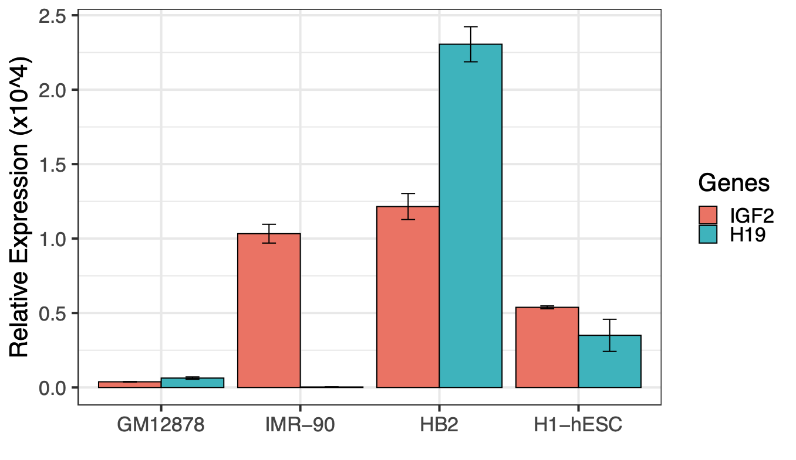
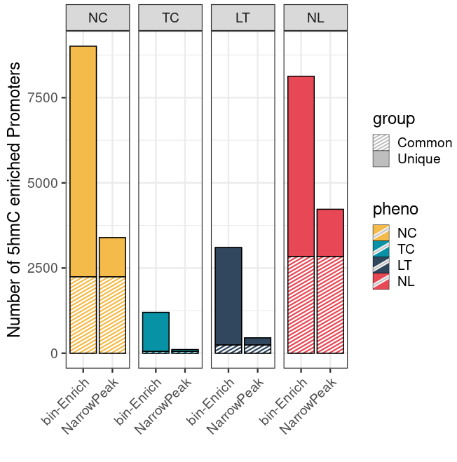

Here are some nice figure I draw with ggplot2, I collect them here for future copy-paste.

## Basic Barplot

Below is an example of quick and simply barplot, which:

A good example for me to copy-paste in the future.

```R
> df
           V1           V2      V3 Genes
1 0.038144115 0.0015615045 GM12878  IGF2
2 0.063070041 0.0076605731 GM12878   H19
3 1.032926070 0.0630352717  IMR-90  IGF2
4 0.003074519 0.0004062534  IMR-90   H19
5 1.215367031 0.0874954574     HB2  IGF2
6 2.305351688 0.1178677524     HB2   H19
7 0.538315946 0.0097037059 H1-hESC  IGF2
8 0.350083002 0.1079638997 H1-hESC   H19
>
```

```R
library("ggplot2")

df <- read.csv("./data1.csv", head=F, sep="\t")
df$V1 <- df$V1 * 10000
df$V2 <- df$V2 * 10000
df$V3 <- factor(df$V3 , c("GM12878", "IMR-90", "HB2", "H1-hESC"))
df$V4 <- factor(df$V4, c("IGF2", "H19"))
colnames(df)[4] <- "Genes"

p <- ggplot(df, aes(x=V3, y=V1, fill=Genes)) +
     geom_bar(stat="identity", position=position_dodge(), color="black") +
     geom_errorbar(aes(ymin=V1-V2, ymax=V1+V2), width=.2, position=position_dodge(.9)) +
     xlab("") + ylab("Relative Expression (x10^4)") +
     theme(strip.text.x = element_blank()) +
     theme_bw(base_size=22)

pdf("BaiscBarplot.pdf", width=10, height=6)
print(p)
dev.off()
```



## Barplot with both Stack and Besides

In my project, I need to draw a barplot with both Stack and Besides bars. I never thought it's so hard but eventually I made it work. And also I added pattern on it.

The input is a data frame `df`:

```R
> head(df)
     TranscriptType      Feature Count PhenoType
NC.1         coding         Exon    77        NC
NC.2      nonCoding         Exon     0        NC
NC.3           none         Exon     0        NC
NC.4         pseudo         Exon     0        NC
NC.5         coding Intergenetic     0        NC
NC.6      nonCoding Intergenetic     0        NC
```

Some key points in this figure:
* Draw patterns on stacks.
* Use `facet_grid` to join barplots.
* How to remove text border/strip after joined facet figure.

```R
library("ggplot2")
library("ggpattern")

ggplot(data=df, aes(x=PhenoType, y=Count, fill=PhenoType)) +
     geom_bar(stat="identity", color="black") +
     scale_fill_manual(values=c("#f4bb4a", "#0892a5", "#30475e")) +
     # Below three lines are for patterns.
     geom_bar_pattern(aes(pattern = TranscriptType), stat = "identity",
                   pattern_color = "white", color = "black") +
     scale_pattern_manual(values = c(coding = "stripe", nonCoding = "circle", pseudo="crosshatch", none="none"),
                          labels = c("Protein Coding", "Non-Coding", "Pseudo", "None")) +
     guides(pattern = guide_legend(override.aes = list(fill = "grey",
                                                       pattern=c("stripe", "circle", "crosshatch", "none"),
                                                       pattern_spacing=0.01))) + # The "pattern_spacing" is vital here, otherwise the legend is wrong.
     theme_bw(base_size=22) + xlab("") + ylab("Count of 5hmC Peaks") +
     facet_grid(~Feature, switch='x') +
     # strip parameters in theme function is used to remove box for groups draw by facet.
     theme(axis.title.x=element_blank(), axis.text.x=element_blank(), axis.ticks.x=element_blank(), axis.line.x.bottom=element_blank(),
           strip.text = element_text(size=16, colour="black"), strip.background = element_rect(colour="white", fill="white"))
```

Below is the nice plot.


### Another Example

```R
> PromoterCompare
   count  group     method pheno
1   2245 Common bin-Enrich    NC
2   6764 Unique bin-Enrich    NC
3   2245 Common NarrowPeak    NC
4   1146 Unique NarrowPeak    NC
5     52 Common bin-Enrich    TC
6   1146 Unique bin-Enrich    TC
7     52 Common NarrowPeak    TC
8     56 Unique NarrowPeak    TC
9    243 Common bin-Enrich    LT
10  2859 Unique bin-Enrich    LT
11   243 Common NarrowPeak    LT
12   207 Unique NarrowPeak    LT
13  2842 Common bin-Enrich    NL
14  5287 Unique bin-Enrich    NL
15  2842 Common NarrowPeak    NL
16  1382 Unique NarrowPeak    NL
>
```

```R
library(ggplot2)
library(ggpattern)
library(ggpubr)

myCol <- c(NC="#f4bb4a", TC="#0892a5", LT="#30475e", NL="#e84855")

PromoterCompare$group <- factor(PromoterCompare$group, levels = c("Unique", "Common"))
PromoterCompare$pheno <- factor(PromoterCompare$pheno, levels = c("NC", "TC", "LT", "NL"))


ggplot(PromoterCompare, aes(x = method, y = count, fill = pheno)) +
  geom_bar(stat = 'identity', position = 'stack', color="black") +
  scale_fill_manual(values=myCol) +
   geom_bar_pattern(aes(pattern = group), stat = "identity",
                   pattern_color = "white", color = "black") +
  scale_pattern_manual(values = c(Common = "stripe", Unique = "none"), labels = c("Common", "Unique")) +
  guides(pattern = guide_legend(override.aes = list(fill = "grey",
                                                       pattern=c("stripe", "none"),
                                                       pattern_spacing=0.01))) + # The "pattern_spacing" is vital here, otherwise the legend is wrong.
  facet_grid(~ pheno) +
  ylab("Number of 5hmC enriched Promoters") + xlab("") +
  theme_bw(base_size=18) +
  theme(axis.text.x = element_text(angle = 45, vjust = 1, hjust=1))
  theme(axis.title.x=element_blank(), axis.text.x=element_blank(), axis.ticks.x=element_blank(), axis.line.x.bottom=element_blank(),
        strip.text = element_text(size=16, colour="black"), strip.background = element_rect(colour="white", fill="white"))
```

