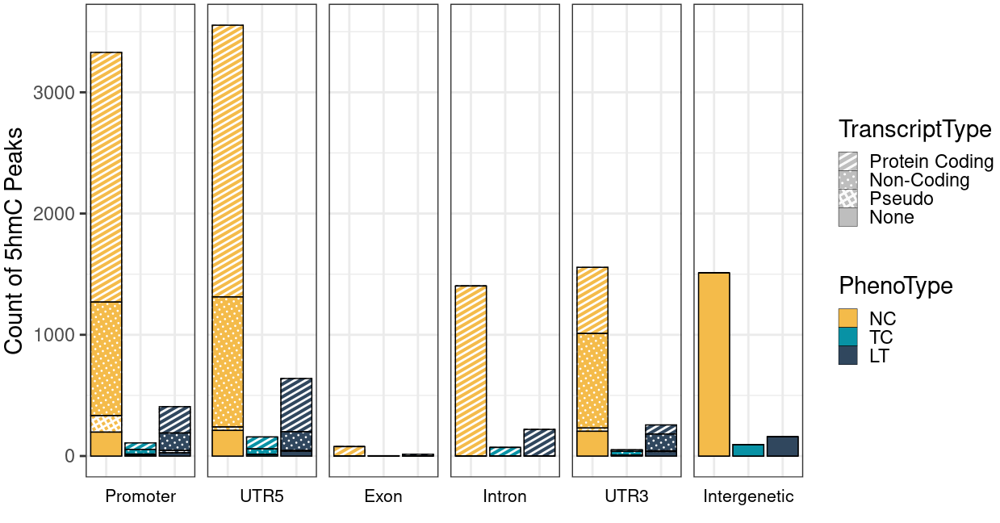

Here are some nice figure I draw with ggplot2, I collect them here for future copy-paste.

## Barplot with both Stack and Besides

In my project, I need to draw a barplot with both Stack and Besides bars. I never thought it's so hard but eventually I made it work. And also I added pattern on it.

The input is a data frame `df`:

```R
> head(df)
     TranscriptType      Feature Count PhenoType
NC.1         coding         Exon    77        NC
NC.2      nonCoding         Exon     0        NC
NC.3           none         Exon     0        NC
NC.4         pseudo         Exon     0        NC
NC.5         coding Intergenetic     0        NC
NC.6      nonCoding Intergenetic     0        NC
```

Some key points in this figure:
* Draw patterns on stacks.
* Use `facet_grid` to join barplots.
* How to remove text border/strip after joined facet figure.

```R
library("ggplot2")
library("ggpattern")

ggplot(data=df, aes(x=PhenoType, y=Count, fill=PhenoType)) +
     geom_bar(stat="identity", color="black") +
     scale_fill_manual(values=c("#f4bb4a", "#0892a5", "#30475e")) +
     # Below three lines are for patterns.
     geom_bar_pattern(aes(pattern = TranscriptType), stat = "identity",
                   pattern_color = "white", color = "black") +
     scale_pattern_manual(values = c(coding = "stripe", nonCoding = "circle", pseudo="crosshatch", none="none"),
                          labels = c("Protein Coding", "Non-Coding", "Pseudo", "None")) +
     guides(pattern = guide_legend(override.aes = list(fill = "grey",
                                                       pattern=c("stripe", "circle", "crosshatch", "none"),
                                                       pattern_spacing=0.01))) + # The "pattern_spacing" is vital here, otherwise the legend is wrong.
     theme_bw(base_size=22) + xlab("") + ylab("Count of 5hmC Peaks") +
     facet_grid(~Feature, switch='x') +
     # strip parameters in theme function is used to remove box for groups draw by facet.
     theme(axis.title.x=element_blank(), axis.text.x=element_blank(), axis.ticks.x=element_blank(), axis.line.x.bottom=element_blank(),
           strip.text = element_text(size=16, colour="black"), strip.background = element_rect(colour="white", fill="white"))
```

Below is the nice plot.

