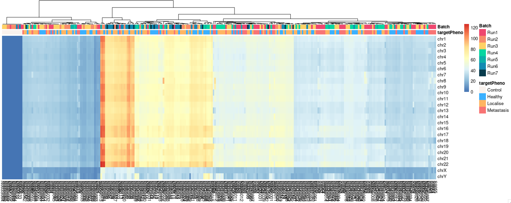

## 1. Pheatmap

Pheatmap is such a wonderful R package, and easy to use, it can be used to generate middle-complex level heatmap, like Heatmap with **annotation bars**.

In below code, data must be matching with SampleSheet, and SampleSheet is a dataframe with each row is one sample, and each column is one attributes.

```R
library("pheatmap")

col_anno <- SampleSheet[,c("targetPheno", "Batch")]
col_anno[is.na(col_anno)] <- "NA"
rownames(col_anno) <- SampleSheet$ID

my_colour = list("targetPheno" = c(Control="#F9F2ED", Healthy="#3AB0FF", Localise="#FFB562", Metastasis="#F87474"),
                 "Batch" = c(Run1="#EF476F", Run2="#F78C6B", Run3="#ffd166",
                             Run4="#06D6A0", Run5="#0cb0a9", Run6="#118ab2", Run7="#073b4c"))

colfunc <- colorRampPalette(c("white", "#420039"))

ph <- pheatmap(t(data),
         # color = colfunc(100),
         annotation=col_anno,
         cluster_rows=FALSE,
         show_rownames=T,
         show_colnames=T,
         annotation_legend=TRUE,
         row_annotation_legend=FALSE,
         col_anno=col_anno,
         annotation_colors = my_colour)
```
