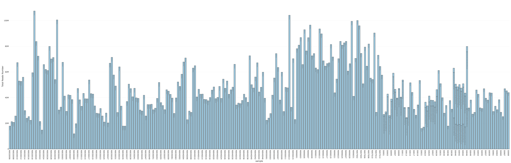

For years I believe when compared with interative figures like Echart.js, Ploly in R .etc, static figures are so weak. However, I did not spend time on it because in academic most figure have to be generated in static ways... Here is some of my corrections of Plotly code, I put them here for myself copy-paste.

Actually, I am thinking to wrap it in a better way, so that in the future I can directly run a simple command for interactive figures, like:

```R
fig <- myPlotly.bar(x=country, y=population, color=...)
```

**Note that I am using plotly version plotly_4.10.0 here.**

## StackBarplot

The code is similar to ggplot2, which is good. Assuming I have a data.frame as:

```R
> head(TotalReadCount)
    sample        fileID readsNumber
1 N002S006 N002S006.json    17922821
2 N002S007 N002S007.json    21331323
3 N002S008 N002S008.json    20830328
4 N002S009 N002S009.json    25751431
5 N002S010 N002S010.json    67328774
6 N002S011 N002S011.json    52996705
```
Then below code can be used to draw the figure:
```R
library("plotly")

fig <- plot_ly(TotalReadCount,
               x = ~sample,
               y = ~readsNumber,
               text=~fileID,
               type = 'bar',
               name = ~fileID,
               marker = list(color = 'rgb(158,202,225)', line = list(color = 'black', width = 1))) %>%
       layout(yaxis = list(title = 'Total Reads Number'),
              barmode = 'stack',
              title = 'Total raw reads across all samples',
              showlegend = FALSE)

htmlwidgets::saveWidget(as_widget(fig), "TotalReads.html")
```

Below is the generated HTML file, by click it I can check each sample's status very easily.




Some key point for this figure:

* Learn how to modify colour, especially line colour has to be set along with width.
* Learn how to export it into HTML. I will later see if I can merge multiple plotly interactive figures into one big HTML like fastQC do. If it works, it would be very cool...