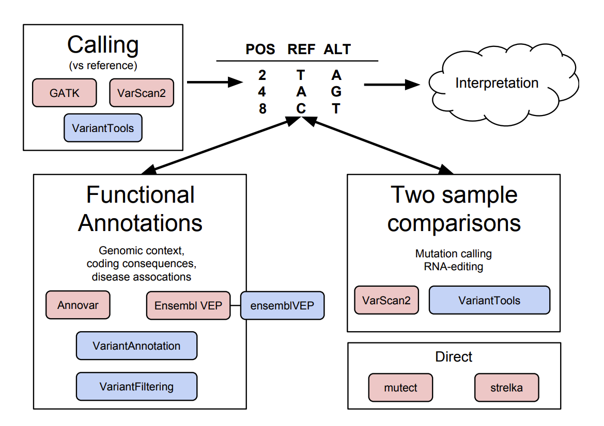

VCF (Variant Call Format) file is such a important file format in Bioinformatic, merely because it records the mutation information for each sample. However, I have never get chance to learn it (well...too lazy). Now it's the chance. Basically I need to understand the strucuture of `vcf` format, then find a way to read/load it into R.

I am using PGP-UK project for VCF generation (with nf-core/sarek pipeline), after getting VCF files, I now need to compare the VCF files with old-generated VCF files (short for **oldVCFs**), which can be downloaded based on [this API](https://www.personalgenomes.org.uk/api/v1.3/all_variant).

So I quickly wrote a R script to downloaded all oldVCFs, and also gathered new VCFs generated by latest Sarek.

## 1. Format of Meta Data

Meta data always start with `##`. I should learn from this as it's a very good action to include all parameters/software spec into final results. Note that the Contig includes chromosome information, I saw some file is chr1, chr2... while some other VCF files are 1,2,3...

## 2. Format of Variant

There are many web page show this information, but I quickly learned it from [here](https://samtools.github.io/hts-specs/VCFv4.2.pdf).

**Firstly, I found the VCF versions are difference between two batches of files.** And also the columns are slight not the same. Below is the old VCF files I downloaded from EBI's SRA.

```
#CHROM  POS     ID      REF     ALT     QUAL    FILTER  INFO    FORMAT  FR07961001
1       54712   .       T       TTTTC   231.8   PASS    .       GT:AD:DP:FT:GQ:PL:PP    1/1:0,6:6:lowGQ:18:269,18,0:269,18,0
1       55326   .       T       C       525.77  PASS    .       GT:AD:DP:GQ:PL:PP       1/1:0,18:18:38:554,54,0:528,38,0
1       66160   .       TTATATA T       134     PASS    .       GT:AD:DP:FT:GQ:PL:PP    1/1:0,4:4:lowGQ:12:171,12,0:171,12,0
1       713786  .       G       GGCT    241.73  PASS    .       GT:AD:DP:GQ:PL:PP       0/1:19,8:27:99:279,0,887:279,0,887
1       715348  .       T       G       1062.77 PASS    .       GT:AD:DP:GQ:PL:PP       1/1:0,33:33:99:1091,99,0:1195,163,0
1       718555  .       T       C       650.77  PASS    .       GT:AD:DP:GQ:PL:PP       1/1:0,22:22:66:679,66,0:679,66,0
...
```
Below is the VCF file for my newly-generated VCF file:

```
#CHROM  POS     ID      REF     ALT     QUAL    FILTER  INFO    FORMAT  uk35C650_uk35C650
chr1    10492   rs55998931      C       T       43.64   PASS    AC=1;AF=0.500;AN=2;BaseQRankSum=0.414;CNN_1D=-2.066;DB;DP=8;ExcessHet=0.0000;FS=0.000;MLEAC=1;MLEAF=0.500;MQ=39.09;MQRankSum=0.619;QD=5.45;ReadPosRankSum=2.100;SOR=0.169       GT:AD:DP:GQ:PL  0/1:6,2:8:51:51,0,179
chr1    13273   rs531730856     G       C       254.64  PASS    AC=1;AF=0.500;AN=2;BaseQRankSum=-1.726;CNN_1D=-2.270;DB;DP=24;ExcessHet=0.0000;FS=0.000;MLEAC=1;MLEAF=0.500;MQ=37.09;MQRankSum=-0.211;QD=10.61;ReadPosRankSum=0.174;SOR=0.495   GT:AD:DP:GQ:PL  0/1:13,11:24:99:262,0,345
chr1    13417   rs777038595     C       CGAGA   358.60  PASS    AC=1;AF=0.500;AN=2;BaseQRankSum=0.048;CNN_1D=-4.390;DB;DP=31;ExcessHet=0.0000;FS=0.000;MLEAC=1;MLEAF=0.500;MQ=30.14;MQRankSum=-0.172;QD=12.81;ReadPosRankSum=1.512;SOR=0.512    GT:AD:DP:GQ:PL  0/1:18,10:28:99:366,0,720
chr1    13668   .       G       A       288.64  PASS    AC=1;AF=0.500;AN=2;BaseQRankSum=2.895;CNN_1D=-3.825;DP=31;ExcessHet=0.0000;FS=3.180;MLEAC=1;MLEAF=0.500;MQ=24.69;MQRankSum=1.779;QD=9.31;ReadPosRankSum=-0.541;SOR=0.560        GT:AD:DP:GQ:PL  0/1:18,13:31:99:296,0,419
chr1    13813   .       T       G       58.64   PASS    AC=1;AF=0.500;AN=2;BaseQRankSum=-0.674;CNN_1D=-6.022;DP=9;ExcessHet=0.0000;FS=0.000;MLEAC=1;MLEAF=0.500;MQ=26.19;MQRankSum=-2.100;QD=7.33;ReadPosRankSum=0.000;SOR=0.693        GT:AD:DP:GQ:PL  0/1:6,2:8:66:66,0,212
...
chr1    54712   rs568927205     T       TTTTC   210.92  PASS    AC=2;AF=1.00;AN=2;CNN_1D=-0.948;DB;DP=8;ExcessHet=0.0000;FS=0.000;MLEAC=2;MLEAF=1.00;MQ=60.00;QD=27.24;SOR=3.611        GT:AD:DP:GQ:PL  1/1:0,5:5:15:225,15,0
...
```

> Note that I found the same mutation detected. The first row in old VCF file is the same as the row I highlighted in new VCF file. This is great, which indicates my result is correct.

Below are some key columns:
1. **CHROM**, **POS** indicates the position.
2. **ID** is mapped with `dbSNP`, if it's "`.`", it means it's a variant not been recorded in the DB.
3. **REF** indicates the sequence in reference genome. If there are multiple letters (like `TTATATA` in the third line), it means a deletion that sequence changed from `TTATATA` to `T`.
4. **ALT** Comma separated list of alternate non-reference alleles. Note that according to [this figure](https://www.mun.ca/biology/scarr/Transitions_vs_Transversions.html#:~:text=DNA%20substitution%20mutations%20are%20of,ring%20%26%20two%2Dring%20structures.): `A<->G`, `C<->T` mutations is called Transitions, while other mutations are called as Transversions.
5. **QUAL** indicates quality of this mutation, it's a -10log10(false probability). The higher this value is, the less chance this mutation is wrongly detected. For example, 20 means the P value is 0.01, and this site is 99% likely to be correctly identified. **This is a metrics will be used for high-quality mutation filtering.**
6. **FILTER** is a simple column indicates this mutation is PASSED or not.
7. **INFO**, it contains a lot of information. It seems most important three are `AC(allele count)`, `AF(allele frequency)` and `AN(total number of alleles in called genotypes)`. Apart from this, I think `DP` is an important metrics, which indicates sequence depth.

> It's vital to crystally understand those 3 attribtues. This is an example: 
>
> In below example, the reference allele at that position is `G`, but the two alleles detected after alignment are `A` and `GA`. Since there is only one sample here, thus the total allele number is 2 (human have two strands, or to say, haplotypes). Thus, the AC (allele count) is 1,1. And the AF (allele frequency) is 0.5 and 0.5.
>
> **Thus, I know that VCF file actually can represent mutation information for a list of human samples, in that case, AN would be $n_{sample} * 2$, AC would be count number of each mutation, and AF would be AC/AN.** This triggers another idea, and yes multiple VCF files can be merged togather into a big one, with AC/AF/AN recalculated. For example [vcf-merge](http://vcftools.sourceforge.net/perl_module.html#vcf-merge).

```
#CHROM  POS     ID      REF     ALT     QUAL    FILTER  INFO    FORMAT  uk35C650_uk35C650
chr1    49515   .       G       A,GA    174.06  PASS    AC=1,1;AF=0.500,0.500;AN=2;CNN_1D=-0.615;DP=7;ExcessHet=0.0000;FS=0.000;MLEAC=1,1;MLEAF=0.500,0.500;MQ=32.12;QD=29.01;SOR=1.329 GT:AD:DP:GQ:PL  1/2:0,3,3:6:93:191,93,100,105,0,97
```

8. **FORMAT** , this column will exist on if genotype information is present. Just for clarify, **genotype here means combination of these two alleles in each sample.** Genotype is a word that has been widely used in genomic research that could mean anything... And I found [this post](https://www.biostars.org/p/86321/) is useful to understand it.

Basically,

* **GT** is an important metrics here. It means genotype, encoded as allele values separated by either of ”/” or “|”. The allele values are 0 for the reference allele (what is in the REF field), 1 for the first allele listed in ALT, 2 for the second allele list in ALT and so on. For diploid calls examples could be 0/1, 1|0, or 1/2, etc.

* **AD** is an attribute on my VCF file but not listed on the document, it means Allele Specific Depth. i.e in above sample. REF is 'G' and ALT are 'A' and "GA", then AD value is is '0,3,3', I got 0 G reads, 3 A reads and 3 GA reads.

* **DP** number of reads used to call the variant. So it is the sum is AD, 6 in my example column above.

## 3. How to Analysis VCF file?

Then, I want to know how normally people analysis VCF file in R. For example, how to load it into R. [vcfR](https://cran.r-project.org/web/packages/vcfR/index.html) looks like a good choice. [This is a good post](https://grunwaldlab.github.io/Population_Genetics_in_R/reading_vcf.html) for the usage of vcfR package. Basically I think it's a good way to load data into R session, but for the downstream, detail coding is inevitable.

```R
> library("vcfR")
> vcf <- read.vcfR("./FR07961001.pass.recode.vcf.gz", verbose = FALSE )
> head(getFIX(vcf))
     CHROM POS      ID REF       ALT     QUAL      FILTER
[1,] "1"   "54712"  NA "T"       "TTTTC" "231.8"   "PASS"
[2,] "1"   "55326"  NA "T"       "C"     "525.77"  "PASS"
[3,] "1"   "66160"  NA "TTATATA" "T"     "134"     "PASS"
[4,] "1"   "713786" NA "G"       "GGCT"  "241.73"  "PASS"
[5,] "1"   "715348" NA "T"       "G"     "1062.77" "PASS"
[6,] "1"   "718555" NA "T"       "C"     "650.77"  "PASS"
> vcf@gt[1:6, ]
     FORMAT                 FR07961001
[1,] "GT:AD:DP:FT:GQ:PL:PP" "1/1:0,6:6:lowGQ:18:269,18,0:269,18,0"
[2,] "GT:AD:DP:GQ:PL:PP"    "1/1:0,18:18:38:554,54,0:528,38,0"
[3,] "GT:AD:DP:FT:GQ:PL:PP" "1/1:0,4:4:lowGQ:12:171,12,0:171,12,0"
[4,] "GT:AD:DP:GQ:PL:PP"    "0/1:19,8:27:99:279,0,887:279,0,887"
[5,] "GT:AD:DP:GQ:PL:PP"    "1/1:0,33:33:99:1091,99,0:1195,163,0"
[6,] "GT:AD:DP:GQ:PL:PP"    "1/1:0,22:22:66:679,66,0:679,66,0"
>
```

I have tested that both old and new version VCF files can be loaded with vcfR package. I just don't know normally what analysis direction I should go from VCF files...

## 4. Downstream Analysis for VCF Files

To be continue if I have time... But I found a nice figure [here](http://bioconductor.org/help/course-materials/2014/CSAMA2014/3_Wednesday/lectures/VariantCallingLecture.pdf) shows some commonly downstream ways. It seems like VCF files can be used for annotation (like find what mutation would lead to which disease), and comparison analysis (like find mutation signals between cancer and normal).

