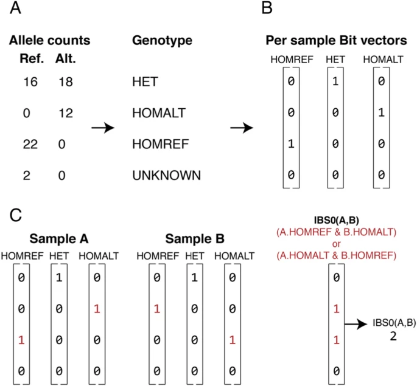
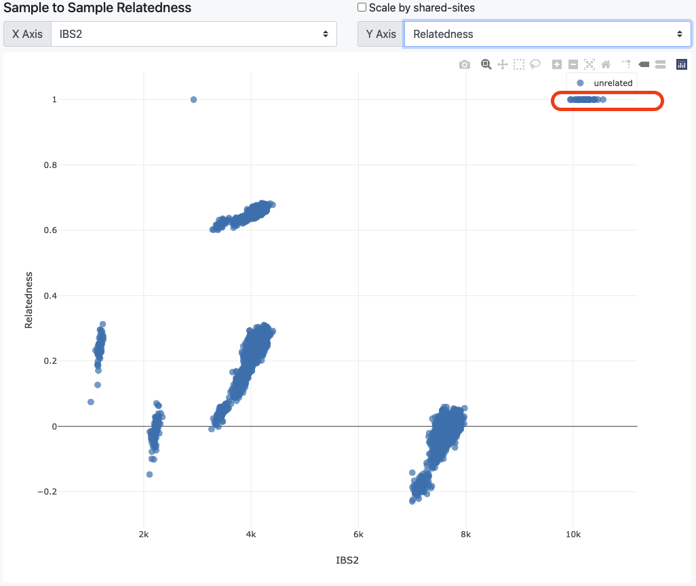

Following the [last blog](https://yuantian1991.github.io/notes/Liftover-VCF-from-hg37-to-hg38-with-Picard), now what I want to do is to compare similarities between a seires of VCF files. So what I need to to is to compare newly-generated VCF files ([from nf-core Sarek](https://yuantian1991.github.io/notes/Nextflow:-nf-core-sarek)), with old generated VCF files. Here I am analysing [PGP-UK project](https://www.personalgenomes.org.uk/) data. All old VCF files can be download **based (not through)** on [this API](https://www.personalgenomes.org.uk/api/v1.3/all_variant).

Totally, I successfully downloaded 100 sample's old VCF files. Then I need to run the [somalier](https://github.com/brentp/somalier) program.

## 1. How somalier work?

I just quickly scanned the paper, the somalier works by: 
1. Compare a set of well-selected polymorphic loci. For each sample's VCF or BAM file.
2. (A & B below) For each loci in the selected list. It will define if a loci is `HET (heterozygous)`, `HOMALT (homozygous alternate)`, `HOMREF (homozygous reference)`. Thus, for each sample, it will be converted to a $n_{snp} * 3$ matrix.
3. (C below) Then, for each two sample, compare their 3-column matrix row by row, count `IBS0 (identity-by-state zero)` or `IBS2 (identity-by-state two-sample share same status)`. IBS0 is number of rows that does not have any difference. Thus, smaller IBS0 means higher similarity. While IBS2 count rows do have difference, thus higher IBS2 means higher similarity.



4. Finally, based on above metrics, other measurements like relatedness can be calculated:

$$
(𝚜𝚑𝚊𝚛𝚎𝚍-𝚑𝚎𝚝𝚜(𝚒,𝚓)-𝟸∗𝚒𝚋𝚜𝟶(𝚒,𝚓)) / min(𝚑𝚎𝚝𝚜(𝚒),𝚑𝚎𝚝𝚜(𝚓))
$$$

My math is bad, but I roughtly can understand the meaning is to calculate the fraction of number of shared HET among all HET, based on the sample with less HET on its metric data frame. `ibs0` is treated as something like penalty here. That's the principle of somilarity.

> somilarity is pretty fast to run, merely because it applied **bitwise operations** for 1-0 comparison. Cool, remind me old undergraduate age that we competing for faster ACM solutions...I should indeed try to impelement more bitwise operation in future coding.

## 2. Run somalier.

Firstly it does not need to be installed, at least not on Linux system. Just download from [the release page from Github](https://github.com/brentp/somalier/releases).

Below is the command to generated 3-column matrix for each sample from VCF.

```bash
somalier extract -d extracted/ --sites sites.hg38.vcf.gz -f ./Homo_sapiens_assembly38.fasta your_vcf_file.vcf.gz
```
Below that for these parameters:
* `--sites` requires the somalier curated SNP list, which can be downloaded from above link as well.
* `-f` reference must be unzipped. And **it's vital to find the correct version of reference, the way I do it is by checking VCF file meta data**.
* For VCF files, it's fine there are multiple samples' variant information in one VCF file, or you can do it separately one by one.

In my case, I have totally 3 batches of VCF files, generetaed from different reference, thus I have to separately run them with corresponding reference.

After the run, for each sample, a binary object will be created in corresponding folder (`\extracted`). Then below code will calculate the metrics like IBS0, IBS2, Relatedenss .etc.

```bash
somalier relate extracted/*.somalier
```

The generated `somalier.html` file is really good for scatter plot visualisation. As it shows below, on the top right conor, it successfully identified VCFs generated from different time or batch, but from same sample. These samples have nearly 1 Relatedness and high IBS2.



However, I noticed it will use the sample name listed in VCF file. Well...it make sense, but I need to change it a bit. Thus, finally, I need to draw the figure myself. I can get detailed output from `somalier.pairs.tsv` file. Modify the name, add some column for colour, then draw with ggplot2.

## 3. PED file support

This part I have not figure out yet since I don't need to do it in my work. It seems the user can support a PED file indicates sample's relationship, like parent, identical .etc. Like a list of phenotype to "colour" the scatter plot.