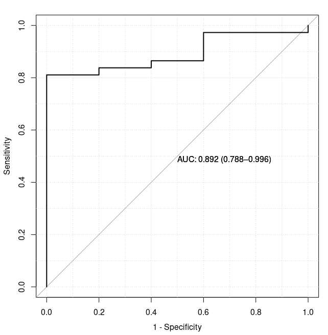

AutoML is a process that you feed data into a machine, then it will automatically run a series of machine learning, and pick the best model for you. Still you need to do feature engineering, but it saves a lot of time for model establish, cross validation, testing .etc

Since in my work, I constantly need to build machine learning models for classification or prediction, I want to write down a quick post here for using [H2O.ai for AutoML](https://docs.h2o.ai/h2o/latest-stable/h2o-docs/welcome.html) R package. Thus in the future I can quickly apply it to various scenarios. Basically, I followed [this tutorial](https://docs.h2o.ai/h2o/latest-stable/h2o-docs/automl.html#).

## 1. Prepare Data

This step normally includes data cleaning, organise all data into a matrix. Below is my example, I have a `mlDF` data.frame, with rows are features, in my case a CpG, and columns as samples. Here I have done some feature engineering, like select most informative CpGs across whole genome.

```R
> dim(mlDF)
[1] 1993  216
> mlDF[1:5,1:5]
                    S0008     S0011     S0012     S0013     S0014
chr12_617678    0.3750000 0.5686275 0.8500000 0.8026316 0.7200000
chr7_149415251  0.2000000 0.6231884 0.7631579 0.7887324 0.8600000
chr12_113478838 0.1714286 0.6938776 0.8500000 0.6756757 0.4035088
chr12_114736100 0.1159420 0.6455696 0.5731707 0.6363636 0.5609756
chr4_173501213  0.1363636 0.6216216 0.5333333 0.6310680 0.6444444
>
```

> In my case, all rows are in same data distribution and have the same biolgical mearnings. Thus, I am not sure if we have multiple features from various sources, like Gender, Income, Race .etc, how to normalisaed them into a data.frame. This worth to look into.

Also, I have a quite simple PD (patient data) object:

```R
> head(mlPD)
         ID    MLPheno
S0008 S0008 Metastasis
S0011 S0011 Metastasis
S0012 S0012 Metastasis
S0013 S0013 Metastasis
S0014 S0014 Metastasis
S0015 S0015 Metastasis
```

**Then, I merge them into one data.frame. A data frame contains both features and labels.** After merging, each row is one sample, and each column is one feature (or label).

```R
dfForH2O <- data.frame(t(mlDF), "Label"=mlPD[, "MLPheno"]) # This MUST be data frame, Matrix will trigger error later.
```

This is my starting point. In the future, no matter what autoML task I met, I just need to prepare two data.frame like this.

## 2. AutoML Training

R package `h2o` can be very easily installed via command `install.package("h2o")`.

Then I can load and start to use it. The `h2o.init()` function will automatically connect to the H2O cluster I have previously download and started.

```R
library("h2o")
h2o.init(max_mem_size = "150G")
h2o.clusterStatus()
```

Then, I need to conver data.frame into H2O format. There seems many ways to do it. The one I am using is:

```R
all_data <- as.h2o(dfForH2O)
all_data[, "Label"] <- as.factor(all_data[, "Label"]) # For classification purpose, change it to factor.
```

Then, I split it into 80% vs 20%.

```R
data_split <- h2o.splitFrame(all_data, ratios = 0.8)
trainData <- data_split[[1]]
testData <- data_split[[2]]
```

Then, run training data. Here I specify to estimate 20 models, and maxium run for 5 mins.

```R
y <- "Label"
x <- setdiff(colnames(all_data), "Label")
aml <- h2o.automl(x = x, y = y, training_frame = trainData, max_models = 20, seed = 1, max_runtime_secs = (5*60))
```

## 3. Check Training Result

After training, we can collect some results.

**Leader Board** is the most important result, which shows us which model return best performance. In below result, it shows "GLM_1_AutoML_9_20220818_02649" model shows best.

```R
> # View the AutoML Leaderboard
> lb <- aml@leaderboard
> knitr::kable(lb)

|model_id                                            |       auc|   logloss|     aucpr| mean_per_class_error|      rmse|       mse|
|:---------------------------------------------------|---------:|---------:|---------:|--------------------:|---------:|---------:|
|GLM_1_AutoML_9_20220818_02649                       | 0.8916667| 0.3746547| 0.9507870|            0.1737179| 0.3483954| 0.1213793|
|DeepLearning_grid_1_AutoML_9_20220818_02649_model_1 | 0.7966346| 0.7616403| 0.9149747|            0.3698718| 0.4541096| 0.2062156|
|DeepLearning_grid_2_AutoML_9_20220818_02649_model_1 | 0.7956731| 0.8362677| 0.9047624|            0.3012821| 0.4853948| 0.2356081|
|DRF_1_AutoML_9_20220818_02649                       | 0.7539263| 0.5219917| 0.8798744|            0.4217949| 0.4216856| 0.1778187|
|DeepLearning_1_AutoML_9_20220818_02649              | 0.7333333| 0.8538869| 0.8815236|            0.4272436| 0.4958518| 0.2458690|
|XGBoost_grid_1_AutoML_9_20220818_02649_model_2      | 0.7314103| 0.5313998| 0.8687330|            0.3794872| 0.4262241| 0.1816670|
|GBM_grid_1_AutoML_9_20220818_02649_model_2          | 0.7165064| 0.5639670| 0.8663521|            0.4464744| 0.4389549| 0.1926814|
|XGBoost_3_AutoML_9_20220818_02649                   | 0.7163462| 0.5853086| 0.8590006|            0.4205128| 0.4410992| 0.1945685|
|XGBoost_grid_1_AutoML_9_20220818_02649_model_3      | 0.6935897| 0.6025834| 0.8501436|            0.4560897| 0.4508583| 0.2032732|
|GBM_3_AutoML_9_20220818_02649                       | 0.6850962| 0.5758231| 0.8457580|            0.4096154| 0.4426083| 0.1959021|
|GBM_2_AutoML_9_20220818_02649                       | 0.6825321| 0.5725574| 0.8396044|            0.4615385| 0.4423293| 0.1956552|
|XRT_1_AutoML_9_20220818_02649                       | 0.6822917| 0.5526121| 0.8399612|            0.4259615| 0.4363727| 0.1904211|
|GBM_grid_1_AutoML_9_20220818_02649_model_1          | 0.6788462| 0.5787583| 0.8417618|            0.4807692| 0.4450885| 0.1981038|
|XGBoost_2_AutoML_9_20220818_02649                   | 0.6741987| 0.6278788| 0.8372321|            0.4041667| 0.4600278| 0.2116256|
|GBM_4_AutoML_9_20220818_02649                       | 0.6665064| 0.5807562| 0.8455535|            0.4464744| 0.4473208| 0.2000959|
|XGBoost_grid_1_AutoML_9_20220818_02649_model_4      | 0.6439103| 0.6080102| 0.8175586|            0.4807692| 0.4550132| 0.2070370|
|XGBoost_grid_1_AutoML_9_20220818_02649_model_1      | 0.6397436| 0.6268736| 0.8186473|            0.4108974| 0.4644690| 0.2157314|
|GBM_5_AutoML_9_20220818_02649                       | 0.6346154| 0.6279713| 0.8233465|            0.4711538| 0.4633673| 0.2147093|
|XGBoost_1_AutoML_9_20220818_02649                   | 0.6283654| 0.5879242| 0.8236014|            0.5000000| 0.4494019| 0.2019621|
>
```

## 4. AutoML Testing

After getting the best model, now it's time to test the performance with the `testData` data previously splitted. Then, the best model will be used for prediction. 

```R
pred <- h2o.predict(aml, testData)
pred <- as.data.frame(pred)

testResut <- cbind(as.data.frame(testData$Label), as.data.frame(pred))
```

Note that, the returned "prediction" result may not be very realible. The below result shows, the threshold of Metastasis is not 0.5. Below result shows, the threshold cutoff is actually between 0.8675005 and 0.9052808.

```R
> testResut
        Label    predict      Healthy Metastasis
1  Metastasis Metastasis 1.092303e-04  0.9998908
2  Metastasis Metastasis 0.000000e+00  1.0000000
3  Metastasis Metastasis 0.000000e+00  1.0000000
...
40 Metastasis    Healthy 2.331741e-01  0.7668259
41 Metastasis    Healthy 3.078612e-01  0.6921388
42 Metastasis    Healthy 8.539778e-01  0.1460222
>
> range(testResut$Metastasis[testResut$predict == "Metastasis"]) # Show the probability range for Metastasis.
[1] 0.9052808 1.0000000
>
> range(testResut$Metastasis[testResut$predict == "Healthy"]) # Show the probability range for Healthy.
[1] 0.1347490 0.8675005
>
```

Apart from above prediction. Performace is also useful.

```
perf <- h2o.performance(aml@leader, test_dt)
print(perf)
# plot(perf)
```

The performance will tell you the threshould should be used to achive different targerts. Like max Specificity, max Accuracy .etc

```R
> print(perf)
H2OBinomialMetrics: glm

MSE:  0.09460848
RMSE:  0.3075849
LogLoss:  0.2679102
Mean Per-Class Error:  0.3135135
AUC:  0.8918919
AUCPR:  0.9854978
Gini:  0.7837838
R^2:  0.09789538
Residual Deviance:  22.50445
AIC:  4010.504

Confusion Matrix (vertical: actual; across: predicted) for F1-optimal threshold:
           Healthy Metastasis    Error   Rate
Healthy          2          3 0.600000   =3/5
Metastasis       1         36 0.027027  =1/37
Totals           3         39 0.095238  =4/42

Maximum Metrics: Maximum metrics at their respective thresholds
                        metric threshold     value idx
1                       max f1  0.318830  0.947368  28
2                       max f2  0.126710  0.973684  31
3                 max f0point5  0.862650  0.955414  19
4                 max accuracy  0.318830  0.904762  28
5                max precision  1.000000  1.000000   0
6                   max recall  0.126710  1.000000  31
7              max specificity  1.000000  1.000000   0
8             max absolute_mcc  0.862650  0.581238  19
9   max min_per_class_accuracy  0.862650  0.810811  19
10 max mean_per_class_accuracy  0.862650  0.905405  19
11                     max tns  1.000000  5.000000   0
12                     max fns  1.000000 26.000000   0
13                     max fps  0.277832  5.000000  30
14                     max tps  0.126710 37.000000  31
15                     max tnr  1.000000  1.000000   0
16                     max fnr  1.000000  0.702703   0
17                     max fpr  0.277832  1.000000  30
18                     max tpr  0.126710  1.000000  31
```

## 5. Draw ROC Curve

```R
library("pROC")

roc(testResult$Label, testResult$Metastasis, percent=F, boot.n=1000, ci.alpha=0.9,
    stratified=FALSE, plot=TRUE, grid=TRUE, show.thres=TRUE, legacy.axes = TRUE,
    reuse.auc = TRUE, print.auc = TRUE, print.thres.col = "blue", ci=TRUE, ci.type="bars", print.thres.cex = 0.7)
```



Another way to draw ROC curve is this:

```R
library("ROCit")

roc_empirical <- rocit(score = testResult$Metastasis,
                       class = testResult$Label,
                       negref = "Healthy")

plot(roc_empirical, values = F)
```