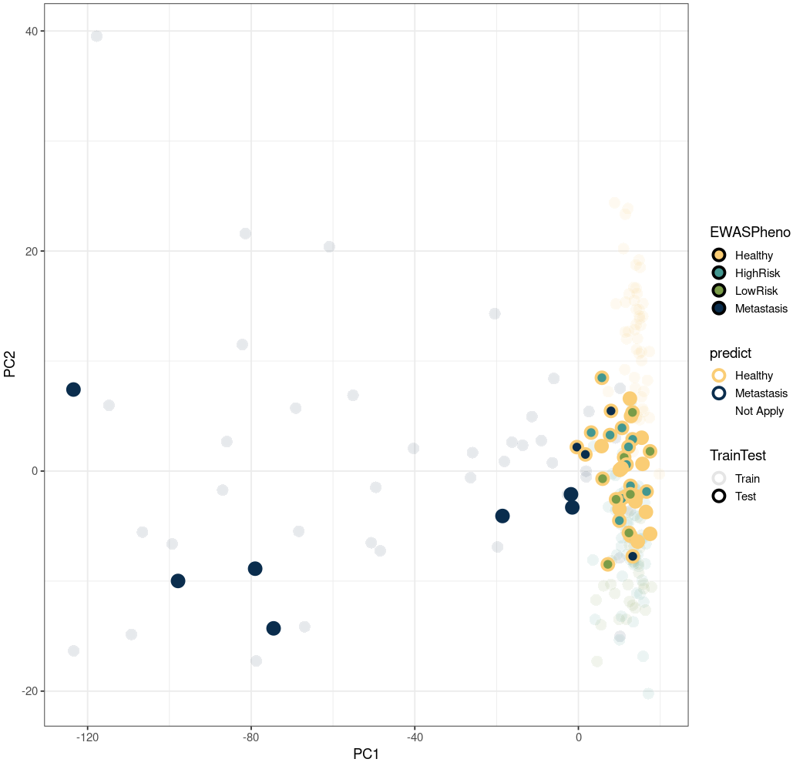

## 1. Scatterplot with Border Color

This is a perfect figure for PCA visualisation. It shows:

1. Opacity for training data.
2. Show border and fill with different colours, indicates real and predicted results.
3. Use PCA to show "closeness" between samples.

The input looks like below:

```R
> head(df)
         ID         PC1       PC2        PC3  EWASPheno    MLPheno  ID.1
S0008 S0008   -5.985626  8.414588  -9.432979 Metastasis Metastasis S0008
S0011 S0011  -86.974332 -1.732162   5.223689 Metastasis Metastasis S0011
S0013 S0013 -117.764057 39.525690 -44.215540 Metastasis Metastasis S0013
S0015 S0015  -55.114703  6.884066  -9.145402 Metastasis Metastasis S0015
S0016 S0016  -69.095200  5.725585  -4.339255 Metastasis Metastasis S0016
S0017 S0017  -81.434750 21.591336 -23.918500 Metastasis Metastasis S0017
        predict TrainTest
S0008 Not Apply     Train
S0011 Not Apply     Train
S0013 Not Apply     Train
S0015 Not Apply     Train
S0016 Not Apply     Train
S0017 Not Apply     Train
```

And the code is below:

```R
library("ggplot2")

ggplot(df, aes(x=PC1, y=PC2, color=predict, fill=EWASPheno, alpha=TrainTest)) +
    geom_point(size = 4, shape = 21, stroke = 2) +
    scale_fill_manual(values = c("Healthy" = "#facd75", "HighRisk" = "#439790", "LowRisk" = "#7a9c48", "Metastasis"="#0a2d4d")) +
    scale_color_manual(values = c("Healthy" = "#facd75", "Metastasis" = "#0a2d4d", "Not Apply" = "white")) +
    theme_bw(base_size=14)
```

