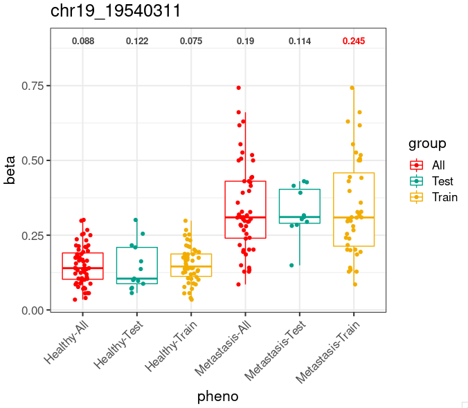

## 1. Boxplot with text above

A basic version of boxplot with ggplot2.

* This plot use `wesanderson` R package, which contains a color I really like: `Darjeeling1`.
* This plot shows an exmple for `geom_text`.

```R
library(wesanderson)
library(ggplot2)

# df is the data.frame above

IQR <- aggregate(df$beta, by=list(df$pheno), function(x) IQR(x))
colnames(IQR) <- c("Pheno", "IQR")
IQR$colour <- "#424242"
IQR$colour[IQR$IQR >= 0.2] <- "red"

p <- ggplot(df, aes(x=pheno, y=beta, color=group)) +
    geom_boxplot(outlier.shape = NA) +
    geom_jitter(width=0.15) +
    scale_color_manual(values=wes_palette(n=3, name="Darjeeling1")) +
    geom_text(data=IQR, aes(x=Pheno, y=0.9, label=round(IQR,3)), col=IQR$colour, size=3.5, fontface = "bold") +
    ggtitle(i) +
    theme_bw(base_size=16) +
    theme(axis.text.x = element_text(angle = 45, vjust = 1, hjust = 1))

print(p)
```

The input df is looks like below:

```R
> head(df)
           beta          pheno group
S0008 0.2386364 Metastasis-All   All
S0011 0.5057471 Metastasis-All   All
S0012 0.5000000 Metastasis-All   All
S0013 0.5178571 Metastasis-All   All
S0014 0.4415584 Metastasis-All   All
S0015 0.3586957 Metastasis-All   All
```

