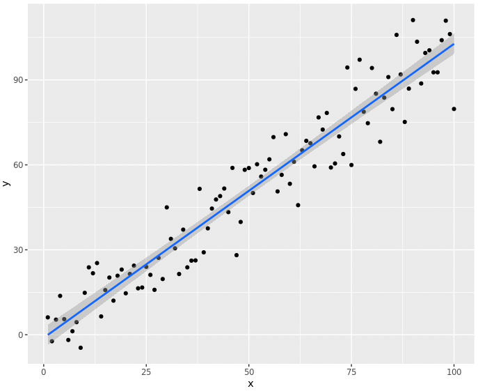

I am following the [Regression Model Course on Coursera](https://www.coursera.org/learn/regression-models). This note is just a collection of high-dense knowledge I absorbed from the course, and my understanding/key-code .etc. A super-mini summary. Also, One book I should read along with the course is [this one](https://leanpub.com/regmods) (maybe later one day 😅), which can be freely downloaded.

Why we still need to learn regression in nowadays where machine learning (ML) is surging up? One key advantage of regression against machine learning is the highly interpretable model fits.

## Some Types of Regressions

Three common concepts: **Least Squares Regression (LSR)**, **Multivariable Regression (MVR)** and **Generalized Linear Models (GLM)**. The difference between them is subtle: 

* `Least Squares Regression` seems most commonly represents the situation fitting one dependent variable (y) with one independent variable (x) with a **straight line**. The key is to find the minium residual (quite intuitive). I personally think this principle also works even if we have multiple x, however, according to some posts like [this](https://www.real-statistics.com/multiple-regression/least-squares-method-multiple-regression/) and [this](https://stats.stackexchange.com/a/2363), if there are multiple x but only one y in a Least Squares Regression, it should be called as "Multiple Regression"...
* `MultiVariable Regression` seems to represent the situation that there are multiple dependent and 1-N independent variables, when compared with the Multiple Regression concept above. 
* `Generalized Linear Models` seems like it could represent other models more than straight lines, for example, $y = b_1x_1^2 + b_2x_2*3...$. According to ChatGPT, GLM does not require data distributions, normalisation .etc, which I am not sure about yet...

## Basic Notions

**Empirical Variance**: The equation for variant is $S^2 = sum((x - mean)^2) / n$, while **empirical variance** is $S^2 = sum((x - mean)^2) / (n - 1)$. They are so similar but not exactly the same. And there is "empirical standard deviation" as $S$. According to the lecture, SD is better to be used them normal variance, as variance represent the squared value of the data.

**Centering**: For a group of data, each value subtracts the mean value. $ X_{centering} = X_i - \bar{X}$. So after centring, their mean value is 0.

**Scaling**: For a group of data, each value divide by the SD. $X_{scaling} = X_i / S$. So the "scaled" data will have SD as 1.

**Normalisation**: For a group of data, substract the mean, then devide by SD, we can new data with 0 as mean and 1 as SD. equation is this $X_{normalisation} = (X_i - \bar{X})/S$. A good and simple way to understand normalised data is: If a data value is 2 after normalisation, this value is twice larger than the mean value in the original data. One value important functionality of normalisation is to make non-comparable data comparable.

> I guess normalisation is the most useful tool. Maybe worth looking up the different usage of centering, scaling and normalisation one day.

**Empirical Covariance**: $Cov(X, Y) = \frac{1}{n-1}\sum_{n=i}^{n}{(X_i - \bar{X})(Y_i - \bar{Y})}$. Intuitively, it means for two matched list, if $X_i$ is large, $Y_i$ is large, then their multiply would be positively very large. In another word, the two lists of data shall have the same "trend" up or down.

**Correlation:** $Cor(X, Y) = \frac{Cov(X, Y)}{S_xS_y}$. I thinks is the "scaled" version of Covariance, since it has been restricted into -1 and 1, so any two list of data (no matter what data range) can be used to find correlation status.

> In R, correlation function is `cor(x, y)`, and covariance function is `cov(x, y)`. I think I actually never use the covariance function at all...


## The Famous Linear Least Squares

The most famous and commonly used regression, I intuitively understand the principle of this regression method, which is to minimize below euqation:

$$
\displaystyle\sum_{i-1}^{n}{(Y_i - (B_0 + B_1X_i))^2}
$$

This is so important and easy to understand. Also, importantly, this equation also should works for higher dimensions, like 3 or more variables, by minimise the difference between real value $Y_i$ and "model predicted value" $(B_0 + B_1X_i)$. For simple two-variable regression, there is already equation for final result below:

$$
\hat{B_1} = Cor(Y, X) \frac{SD(Y)}{SD(X)}
$$


In the course, I just know that:

1. It represents that the slope ($B_1$) has the unit of $Y/X$, for example, you regression house-price with car-price, their unit varis a lot initially (Millions to Thousand), but still the regression will work, because **the slope contains the difference between the two units. In another word, the slope represent the increment of unit of Y, when 1 unit of X increased.**

2. Centering will not change the regression result, because centering just change the mean, not the SD, and slope is decided by the SD (difference between unit).

3. If we do normalisation for both X and Y, then do regression, both two new data have 0 as mean and 1 and SD, the slope would not be the original one, instead it will be the $Cor(Y, X)$. Intuitively, I can understand that after normalisation, both two data list are around 0 point, and with same SD, thus the slope we can estimate then just represent some changing of angles between them...

> The regression function for R is `lm(y ~ x)`, by default it includes a intercept. Then we use `summary` or `coef` function to get slopes.
> In ggplot2, to code to add regression line into plot is `g + geom_smooth(method="lm", formula=y~x)`

## Residuals

For a long time, I only know about the slope, but not very sure about those residuals. Firstly there is a concept here, residuals are in theory, not errors, errors are unobservable among population, thus we use residual as an estimation of error. In most case, the mean of residuals is 0, because we assume in nature, errors are normal distributed.

**Residuals are useful for investigating poor model fit.**

Also, **residuals can be seen as the outcome of Y, with linear association of predictor(X) removed.** This is the principle to use regression to remove the cell type effect. The the coursera, the author said it's very common to use this method, to remove a effect of X, and get the new outcome of Y, which contains other information.

Finally, residual variance somewhat represents the model bias or not. Then, the lecture shows some key figures from residual for regression diagnose.

The R function to get residual is `resid()`.
<br>
Compared with an intuitive solution that draw residual along the line, a better way to draw a plot is like below, which shows the variation of residual along the whole X. Blow are three figures can be used for residual analysis:

<div>
<div style="display:inline-block; width: 30%; margin: 10px">


</div>
<div style="display:inline-block; width: 30%; margin: 10px">


</div>
<div style="display:inline-block; width: 30%; margin: 10px">


</div>
</div>


The first one (left) shows us if the regression line match the data well. The second one shows us if the residuals are normal distributed, if not, there could be other hidden patterns inside. The third one shows we how many variants were explained by the current X since the left boxplot is residual against the mean value.


The above figure is a typical normal distributed regression line, which is good. However, in many cases, by using the above residual plot, we can find some pattern indicates there are other patterns in the data. For example, the below figure shows that the apart from regression model, there could have some other model hidden behind the data.

<div style="text-align: center">


</div>

So, the above residual come from a code like this:

```R
# The SD of y is larged with larger X.
x <- runif(100, 0, 6); y <- x + rnorm(100, mean = 0, sd = 0.001 * x)
```

A metrics for residual is **residual variation**, which is $\frac{1}{n}\sum_{i=1}^{n}e_{i}^{2}$. It's a metrics to estimate the "nice" of regression model, this value is also called "sigma"($\sigma$). In R, below result can see in `summary()` function.

Then, here comes another important metric, **R Squared**. So what is R2 exactly? It represent the fraction of variability explained by X and explained by Residual (error).

$$
\sum_{i=1}^{n}(Y_i - \bar{Y})^2 = \sum_{i=1}^{n}(Y_i-\hat{Y}_i)^2 + \sum_{i=1}^{n}(\hat{Y}_i - \bar{Y})^2
$$

In the equation, the left represent all the variable each Y have, against the mean Y. The middle part represent $\sigma$, the variant explained by error. And the right side is variant explained by X.

So, in our model, we hope that X could be strongly related with Y, in other word, most of the value variant in Y can be explained by X, thus, the higher fraction of variant explained by X (when compared with explained error), the better. 

The above is an intuitive explanation for R2. And since it's faction, the R2 must be between 0 and 1. Though it looks like the higher R2 is, the better model we get. However, the below figure shows that even totaly wrong and improper regressions can have the same R2 score. Thus, R2 is just one metric, but not the only one we can reply one in regression model assessment.

<div style="text-align: center">


</div>

> Note that, even if your regression model does not perfect fit the origin data, for example you can clearly see a hidden pattern in residual, regression still have value since it captured a certain level of trend in origin data.

## Inference in Regression

The inference is the step of drawing a conclusion. Basically, it means for example hypothesis validation. We can get some inferences from those parameters. For example, the variance of $B_1$ can be expressed as below, which represent the "confidential" of our estimated $B1$.

$$
\sigma_{\hat{B}_1}^{2} = Var(\hat{B}_1) = \sigma^2 / \sum_{i=1}^n (X_i - \bar{X})^2
$$

So, how to intuitively understand it? Firstly, the $\sigma^2$ represents the variant of error, the smaller this value is, it means most dots $Y$ are close to the regression line we get, Like below example:

```R
> library("ggplot2")
> A <- data.frame(x=1:100, y=rnorm(100, 0, 10) + 1:100)
> ggplot(A, aes(x, y)) + 
    geom_point() + 
    geom_smooth(method="lm", aes(x, y)) +
    geom_smooth()
>
> A <- data.frame(x=1:100, y=rnorm(100, 0, 40) + 1:100)
> ggplot(A, aes(x, y)) + 
    geom_point() + 
    geom_smooth(method="lm", aes(x, y)) +
    geom_smooth()
> 
```

In the below plot, the two regression lines have the same slope (1), but the left one has a smaller error variance ($\sigma^2$), while the right one has a larger one. **This is the intuitive explanation of the $\sigma^2$ in above equation, smaller error variance means higher confidence for the slope.**

<div>
<div style="display:inline-block; width: 40%; margin: 10px">


</div>
<div style="display:inline-block; width: 40%; margin: 10px">


</div>
</div>

The second part is $\sum_{i=1}^n (X_i - \bar{X})^2$, which is very interesting since it represents the distance of each X to the mean X. Intuitively, it means the X better to be evenly distributed. Below are some examples.

```R
> library("ggplot2")
> x <- rnorm(100, 50, 5)
> A <- data.frame(x=x, y=rnorm(100, 0, 10) + x)
> ggplot(A, aes(x, y)) + 
    geom_point() + 
    geom_smooth(method="lm", aes(x, y)) + xlim(0, 100) +
    geom_smooth()
> 
> x <- 1:100
> A <- data.frame(x=x, y=rnorm(100, 0, 5) + x)
> ggplot(A, aes(x, y)) + 
    geom_point() + 
    geom_smooth(method="lm", aes(x, y)) + xlim(0, 100) +
    geom_smooth()
> 
```

In below two figures, the slope is the same (1), but in the left figure, X are crowded together, but in the right X are evenly distributed. Intuitively we know the right one more reliable.

<div>
<div style="display:inline-block; width: 40%; margin: 10px">


</div>
<div style="display:inline-block; width: 40%; margin: 10px">


</div>
</div>

This is the meaning of variance of slope, it's decided by the distribution of X, and variance of error.

## Multivariable Regression (MR)

Finally, in the third week, we started to learn multi-variable regression. This is what exactly what I need to learn. A famous case here is insurance prediction. So insurance company have a huge dataset from a customer, their age, BMI, job, gender, race... And, what they want to predict is only one thing: The number of times the customer go to the hospital next year. In another word, we have multiple X here, but only one y.

There are at least a couple of challenges here:

1. **Model Search**, how to select the best and most suitable model? There are so many different types of regression models, like fixed-effect. etc.

2. **Feather Selection**, what variables (predictors) should we select into the model?

3. **Overfitting**, If we put enough variables into MR, we may get 0 residual, but that means some useless variables in the model, and **this will lead us to miss the actually-important variables.** Thus, in MR, it's not the more the better.

4. **[I added] Multicollinearity** is a statistical concept where several independent variables in a model are correlated. Two variables are considered to be perfectly collinear if their correlation coefficient is +/- 1.0. Multicollinearity among independent variables will result in less reliable statistical inferences.

> Here Brian mentioned two things: One if another useful Coursera class is Practical Machine Learning, which contains a lot more detail about model selection, feature selection .etc
>
> Another important thing is: Brian mentioned that in many Kaggle competitions, MR can already lead you to a pretty good result, though in general models like RandomForest, Boosting can do a bit better, but just really a little bit.
>
> **Thus, it is worth using MR as the starting point for most ML problems.**

Below is the starting equation for MR:

$$
Y_i = \beta_1X_{1i} + \beta_2X_{2i} + ... + \beta_pX_{pi} + \epsilon = \sum_{k=1}^pX_{ik}\beta_k + \epsilon_i
$$

Note that $X_{1i}$ is normally 1, so $\beta_1$ is intercept. So just like a one variable situation, the principle of this regression, is to minimise the residual:

$$
\sum_{i=1}^{n}(Y_i-\sum_{k=1}^{n}X_{ki}\beta_k)^2
$$

How to intuitively understand the above equation? If we have two variables, what the above equation estimating is the distance for each dot in a 3D space, to a flat plate we "insert" though them. Blew is an example I found online.

<div style="text-align: center; width: 60%">


</div>

Brian did a beautiful deduction to explain intuitively what $\beta_k$, is by exampling two variables. <b style=" background-color: #fcfaa7">That for one variable $X_{i}$, its slope $\beta_i$ is actually the slope(coef) estimated, by other variables' linear effect are removed. In another word, in MR, each variable's coef (slope) is adjusted for other variables (residuals).</b>

Below is the example of R code for MR:

```R
coef(lm(y ~ x + x2 + x3))
```

## Swiss Fertility Example

A perfect step-by-step guild for my regression task. The Github link is [here](https://github.com/bcaffo/courses/blob/master/07_RegressionModels/02_02_multivariateExamples/index.md).

Here the lecture included an example of the relationship between fertility of provinces and socie-economic indicators from a Switzerland database from 1888. It includes some interesting factors like the percentage of male jobs (agriculture or not), examination score, education level, and Catholic or not.etc. We want to find out if these factors are related to the fertility rate of provinces.

**Step1: use `ggpair` to draw regression plots for each two variables**


The above plot clearly shows us the relation between any two variables. **I need to find out how to do the similar thing to categorical variables.**

**Step 2: Through everything into the regression model**

The code is simple:
```R
> summary(lm(Fertility ~ . , data = swiss))

Call:
lm(formula = Fertility ~ ., data = swiss)

Residuals:
     Min       1Q   Median       3Q      Max 
-15.2743  -5.2617   0.5032   4.1198  15.3213 

Coefficients:
                 Estimate Std. Error t value Pr(>|t|)    
(Intercept)      66.91518   10.70604   6.250 1.91e-07 ***
Agriculture      -0.17211    0.07030  -2.448  0.01873 *  
Examination      -0.25801    0.25388  -1.016  0.31546    
Education        -0.87094    0.18303  -4.758 2.43e-05 ***
Catholic          0.10412    0.03526   2.953  0.00519 ** 
Infant.Mortality  1.07705    0.38172   2.822  0.00734 ** 
---
Signif. codes:  0 ‘***’ 0.001 ‘**’ 0.01 ‘*’ 0.05 ‘.’ 0.1 ‘ ’ 1

Residual standard error: 7.165 on 41 degrees of freedom
Multiple R-squared:  0.7067,	Adjusted R-squared:  0.671 
F-statistic: 19.76 on 5 and 41 DF,  p-value: 5.594e-10
```

It looks like we get a list of significant factors. Remember that the Estimate (slope, coef) above represent the meaning of units of Y change, while one unit of X change, with all other variable's linear effect removed.

<b style=" background-color: #fcfaa7"> Based one Step 1 and 2, one key question is, how we can decide what factors should be put into the model? And why? </b>

**Step 3: Change Models, use smaller number of factors**

In below example, it only take Agriculture as X.

```R
> summary(lm(Fertility ~ Agriculture, data = swiss))$coefficients
              Estimate Std. Error   t value     Pr(>|t|)
(Intercept) 60.3043752 4.25125562 14.185074 3.216304e-18
Agriculture  0.1942017 0.07671176  2.531577 1.491720e-02
```
And, we found that for Agriculture, the direction changed to positive, which means if we take other effect into consideration, Agriculture have negative effect on fertility, but if we only regression on it only, it's positive! This is called "Simpson's Paradox"
