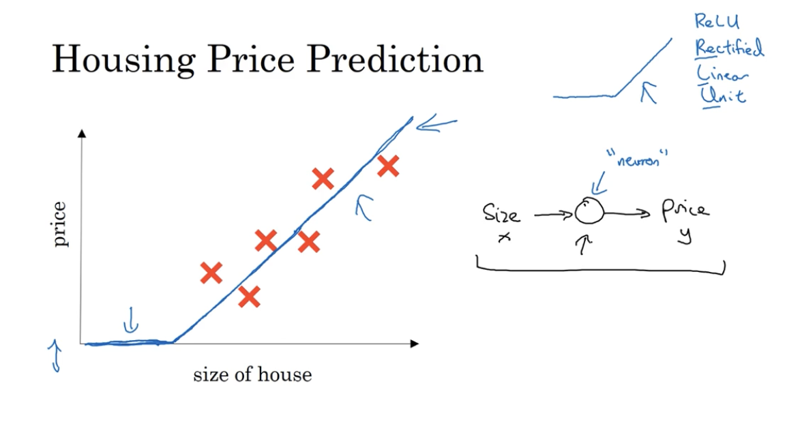
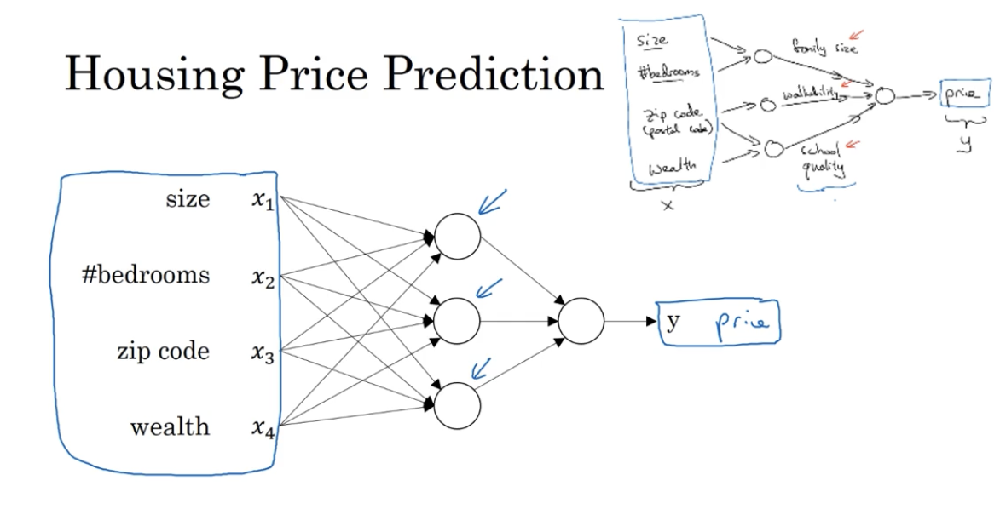
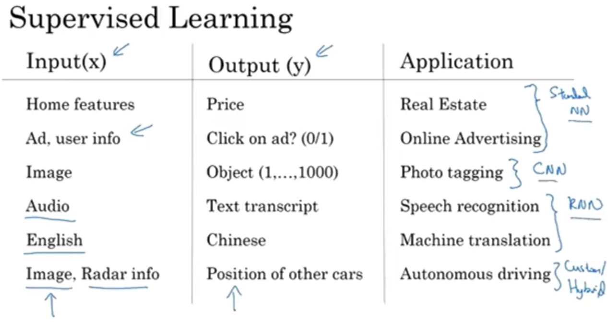
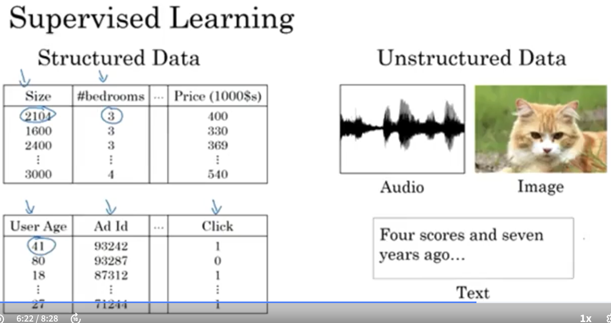
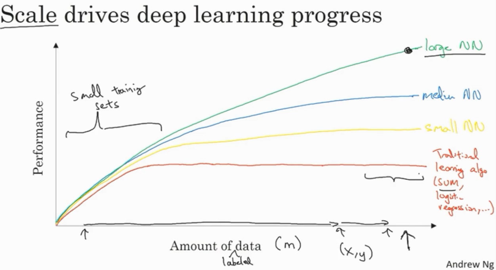

Knowledge need to be refreshed. After many years of Bioinformatics career, I now think it's time to refresh deep learning and think how this can benefit my work. I am here learning [Deep Learning Specialization via coursera](https://www.coursera.org/specializations/deep-learning), the material provided by Andrew Ng.

## Naive Understanding of Neural Network

Below is a very nice example to understand "neural", which can be a simply function to predict something. Nothing over complex yet.

And **Relu function** can be seems as kind of restriction function, to restrict the output function above 0. Based on one neural, more complex neural network can be trained. Below is an example of neural network, which take input like size/bedroom/zip/weath to predict house price.

Note that in the above network, even node in the middle actually take input from all the input. So not like the hand-draw figure on the top-right, where we expect "family size" is decided by Size and #bedroom, we DON't know which node actually more similar as the "family size" dot in the hand-draw figure. Also, secon point is all the node in the middle take input contribution from the features from the left.

## Types of Neural Network

Below is a nice table to show types of NN, and their application on various senarios.

The first two rows are using standard NN, while Image is using CNN (convoluted), and the Audio and English are using RNN (Recurrent Neural Network) because it takes a long sequence feather (like audio or text word as input) to do the prediction. **I am now thinking if DNA sequence is something serving similar structure, that if we can use RNN to do some prediction, for example improve homopolymer sequence accuracy.**

## Input Data Structure

Below figure shows types of data input, as Andrew introduced, most deep learning application nowadays actually using structured data, while actually a lot of the input in our life are actually unstructured data.

I think DNA related data can be seems mostly as structured data.

## Why Deep Learning Take Off now?

Below is a figure to show why deep learning take off now: because it requires data, also it requires us to train large and complex neural network.

On the left of the figure, as Andrew explained, if the data features are nicely prepared, maybe SVM is even better. So if we want to use deep learningt to reach good result, we need to have both large data sets (x axis) and large NN model.

## Next Step

A very good intruction from Andrew about deep learning. For the next step, I want to implement a NN myself with R or Python, and think about below questions:

1. Difference between NN, CNN, RNN, I need to understand the principle to decided which one should be applied in Bioinformatics Industry.
2. Try some R/Python based Deep Learnng packages, but they need to be clearly understand before using.
3. I want to know how can I observe each layer/node in an NN after training? This is important for me to debug and improve NN network.
4. Try to think out of a question that can be improved with deep learing, I am thinking homopolymer sequence maybe a good way to try...