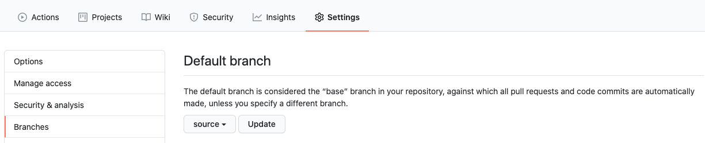
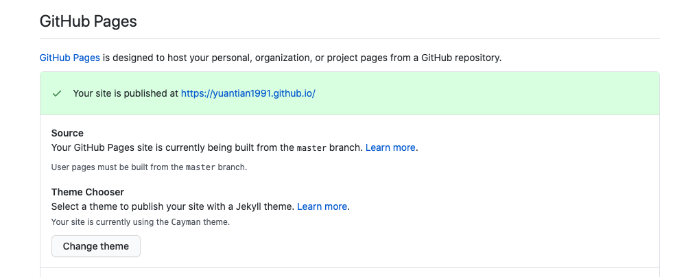

After development, I want to deploy it on my github domain, in my case, it's https://yuantian1991.github.io/. However, it's kind of special to for user github page. Based on my previous trying, such domain page would directly take html files from the master, so you can't just push your code here.

According the [Gatsby Docs](https://www.gatsbyjs.org/docs/how-gatsby-works-with-github-pages/). There are two ways to do it.
 1. Push the code to another branch, but generate builded file into master branch.
 2. Put the code into another repo, then everytime you need to copy-paste builded static files into user page repo.

 I want to try the first one here, hopefully it works.

Firstly I installed a npm library:
```bash
npm install gh-pages --save-dev
```

it would be used to directly push builded static file to master.


Then I created a repo with my name: `YuanTian1991.github.io`. Then `git init`, `git add .`, `git commit -m "Initial Commit"` current project. Then push everything to master branch.

```bash
git remote add origin https://github.com/YuanTian1991/YuanTian1991.github.io.git
git push origin master
```

According to Gatsby's suggestion, I created a new branch `source`, then put all my Gatsby files into it. Then modified this file a bit (I am writing during the process), then committed and pushed to source branch.

```bash
git checkout -b source master
git add .
git commit -m "Modified markdown file a bit."
git push origin source
```

Then changed default branch to `source`.



Then modified *package.json* file, added `deploy` in it. It should tell the project, to build the static pages, then publish them to master branch.
```json
{
  "scripts": {
    "deploy": "gatsby build && gh-pages -d public -b master"
  }
}
```

Then in theory, if I type `npm run deploy`, it should work, then I tried... it's not working, why? It shows a Gatsby default README file. After searching intensively online, someome mentioned that if randomly select a theme for Github page, it would work. I tried, like below page, and...incredably it works.



Then after about 10 seconds, the website is online, perfectly. With all the fonts, style, assets, url, image included. It looks good, much better than my last time next.js development experience.

For now, the first milestone has reached. In the future I can constantly update this blog, learn how to improve SEO, how to add features, how to created css animation, etc.

In the future, the steps to update notes are:
1. Open the project with vscode, run `gatsby develop`
2. I can review the result on localhost:8000
3. After writing, run `npm run develop`
4. Push the code to github, run 'git add .', `git commit -m "Update"`, and `git push origin source`

