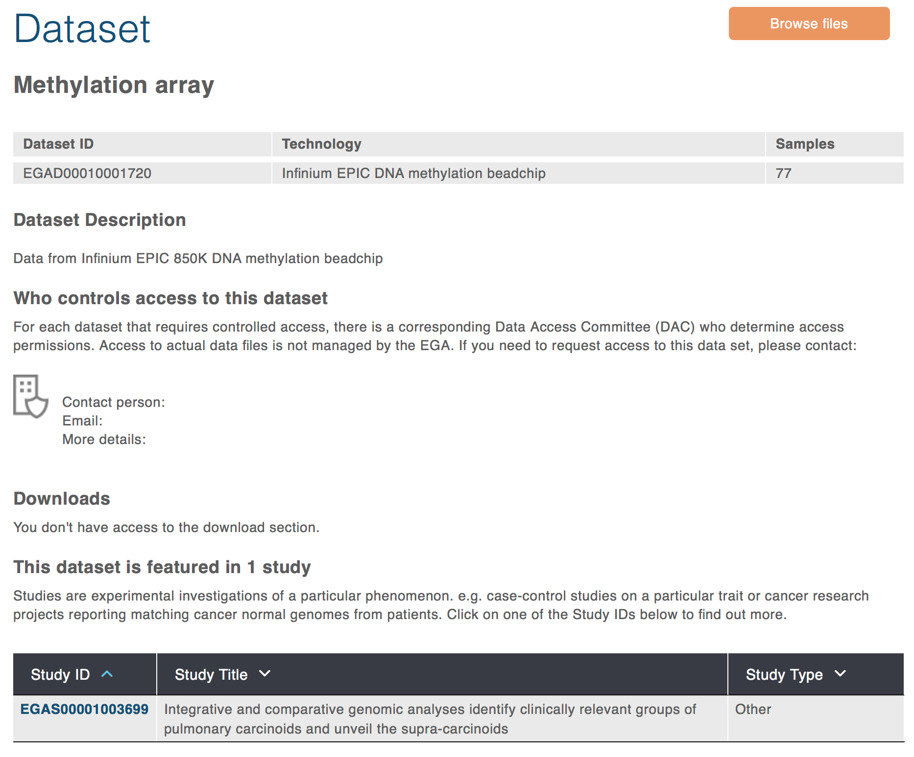

In my project, I need to download some data from The European Genome-phenome Archive (EGA), I have no idea why they placed the data there, but I know it's not easy to download data from there.

Firstly I waited for couple weeks to get the credential. Then After I log into the system I can only find a label that "You don't have access to this data"



After emailing EGA, I know that the data can only be download via Python, and it's quite easy.

Firstly install a Python library called `pyega3`, which would be used to see and fetch data.

```bash
sudo pip3 install pyega3
```

Then, I created a folder, named EBI-Data, then created a very simple JSON file `my_credential_file.json` in it:

```bash
{
    "username": "XXX",
    "password": "XXX"
}
```

Then, just one command it should be working:

```bash
pyega3 -c 5 -cf ./my_credential_file.json fetch EGAD00010001720 --saveto ./EPIC/
```

I think the `-c` means parallel, but I did not find the speed is significantly better, but anyway it's working...