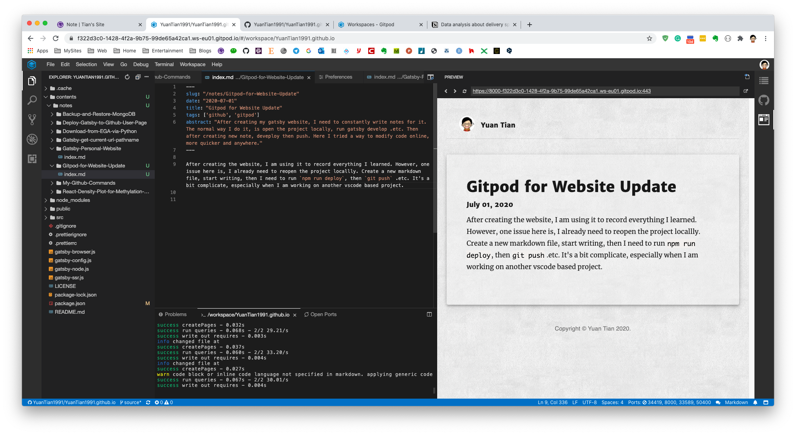

After creating the website, I am using it to record everything I learned. However, one issue here is, I already need to reopen the project locallly. Create a new markdown file, start writing, then I need to run `npm run deploy`, then `git push` .etc. It's a bit complicate, especially when I am working on another vscode based project, I need to constantly shifting between two vs-code, which is annoying.

So I search online, find a tool called [Gitpot](https://www.gitpod.io/). It seems like s online coding tool, which can allow me to online modify code.

I registered one and seems working so well. After register with my Github account. I need to create a workspace. A very convinient way to do it from my github is [this](https://www.gitpod.io/docs/getting-started/).

Basedon above instruction. I just need to open below url link in Chrome:

```
https://gitpod.io/#https://github.com/YuanTian1991/YuanTian1991.github.io/tree/source
```
Then everything is done. In below terminal, I typed in `npm install & npm run develop`. Then I can open a preview on the right.

Below Screenshot is how I creating a note.



Note that I installed gatsby with command, which `npm run install` seems not working.

```bash
npm install -g gatsby-cli

```


This is quite convinient that I can even do it with my ipad, but apparently it's harder to select, put figure, or even simple copy-paste. This paragraph was typed in, deployed and pushed up with iPAD, but the expereicne is not too good.

---

I think I will try use other feature for Gitpod.