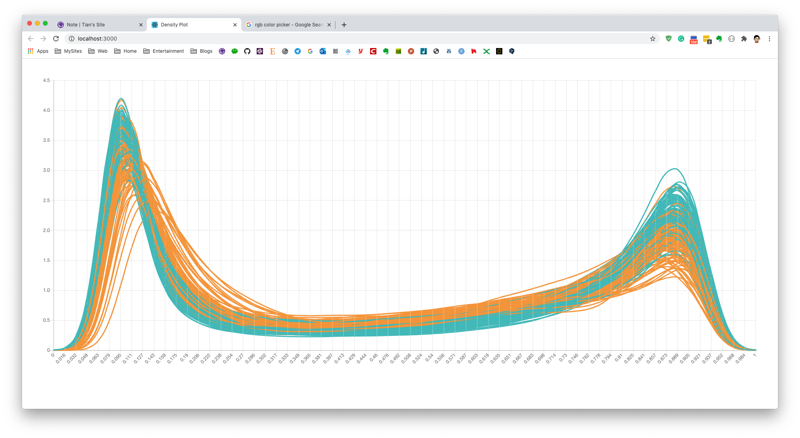

Here I want to create a quick react APP to show density plot for Human Methylation array data. I know it's kind of like reinventing wheel, but I think it's better than already give my collegeus R plot.

### Create React Density Plot

Firstly I need to created a react app [on my github](https://github.com/YuanTian1991/densityPlot). I just used the most simply `react-cli` tool to create the site:

```javascript
npx create-react-app densityPlot
```
After enter the densityPlot folder, I can start the project now:
```
npm start 
```

Then website should be running now on http://localhost:3000/. Then I need to create a density plot line component. Here I used the `react-chartjs-2` package. Charts.js is a light-weight pacakge for quick data visualization. I modified the `App.js` file as below: Removed all extra functionality but LineChart page.

```jsx
import React from 'react';

import LineChart from "./page/LineChart"

function App() {
  return (
    <div className="App">
      <header className="App-header">
        <LineChart />
      </header>
    </div>
  );
}

export default App;
```

Then, the hard part is here, **create a line chart page**. After trying a while, I implemented a simple version in `/page/LineChart.js` below. We can see that the key part is `data` in state, merely which contains a `labels`, and a `data`. Then, one object in data should indicates one online. In other word, we just need to organise the density plot for methylation data into the `data` format, then fit into this page.

```js
import React from 'react';
import { Line } from 'react-chartjs-2'

class LineChart extends React.Component {
  constructor(props) {
    super(props);
    this.state = {
      data: {
        labels: ['January', 'February', 'March', 'April', 'May', 'June', 'July'],
        datasets: [
          {
            label: 'My First dataset',
            fill: false,
            lineTension: 0.1,
            backgroundColor: 'rgba(75,192,192,0.4)',
            borderColor: 'rgba(75,192,192,1)',
            borderCapStyle: 'butt',
            borderDash: [],
            borderDashOffset: 0.0,
            borderJoinStyle: 'miter',
            pointBorderColor: 'rgba(75,192,192,1)',
            pointBackgroundColor: '#fff',
            pointBorderWidth: 1,
            pointHoverRadius: 5,
            pointHoverBackgroundColor: 'rgba(75,192,192,1)',
            pointHoverBorderColor: 'rgba(220,220,220,1)',
            pointHoverBorderWidth: 2,
            pointRadius: 1,
            pointHitRadius: 10,
            data: [65, 59, 80, 81, 56, 55, 40]
          }
        ]
      }
    }
  }

  render() {
    return (
      <div style={{ height: '80vh', padding: '3em' }}>
        <Line
          data={this.state.data}
          width={100}
          height={40}
          options={{ legend: { display: false } }}
          redraw />
      </div>
    );
  }
}

export default LineChart;
```

Then the page should show a simple line already.


The React part is nearly done, now we need to generate density plot for DNA Methylation Array.


### Prepare Density Plot Line

Then I need to prepare the methylation array data. It could be normalized, Combat corrected, etc. In my case, I saved the matrix and pd file into a R file:

```R
save(myCombat, QC, pd, file="myCombat.rda")
```

Here QC/pd are phenotypes for myCombat matrix, which contains some categorical information, which could be used to separate colour.

If we want to calcualte/plot density plot, we need to firstly calculate this line. The density line is a fitted line based on dots you have. Manye people knows in R, we can use `plot(density(data))` to generate a density plot. So actually, the `density()` function could indeed return you the x and y data for each fitted line.

Here I wrote a function to calcualte density line for each sample. You can see it's actually a bit stupid but I just actually using R to create a list for each sample. The attibute in above JS code is exactly the same here as name in below oneSample list object.

```R
load("./myCombat.rda")

beta <- myCombat

getPoints <- function(i) {
    tmp <- density(beta[, i])

    if(QC[i,"Density Plot - Manaually Removed (Agreed)"] == "Accept") {
        tmpCol <- "rgba(75,192,192,1)"
    } else {
        tmpCol <- "rgba(245,158,66,1)"
    }
    oneSample <- list(label = colnames(beta)[i],
                      fill = FALSE,
                      backgroundColor = tmpCol,
                      borderColor = tmpCol,
                      borderCapStyle = "butt",
                      borderDashOffset = 0,
                      borderJoinStyle = "miter",
                      pointBorderColor = tmpCol,
                      pointBackgroundColor = "#fff",
                      pointBorderWidth = 1,
                      pointHoverRadius = 1,
                      pointHoverBackgroundColor = tmpCol,
                      pointHoverBorderColor = "rgba(220,220,220,1)",
                      pointHoverBorderWidth = 2,
                      pointRadius = 1,
                      pointHitRadius = 2,
                      data = tmp$y[seq(1, 512, by = 8)])

}

datasets <- list()
for (i in 1:ncol(beta)) {
    datasets[[i]] <- getPoints(i)
}

library(jsonlite)

sink("density.json")
toJSON(datasets, auto_unbox = TRUE, pretty=TRUE)
sink()
```

In above code, since I have two phenotypes in "Density Plot - Manaually Removed (Agreed)" column. I assigned different colour in it. I iterated the all sample, calculated the density with R `density()` function: `tmp$y[seq(1, 512, by = 8)]`. Then selected 64 points along the density line (too much dots would slow down the page, but the line trend would looks similar). After calculation of everything, I exported the list into `density.json` file, which looks like below:

```json
[
  {
    "label": "UCL03",
    "fill": false,
    "backgroundColor": "rgba(75,192,192,1)",
    "borderColor": "rgba(75,192,192,1)",
    "borderCapStyle": "butt",
    "borderDashOffset": 0,
    "borderJoinStyle": "miter",
    "pointBorderColor": "rgba(75,192,192,1)",
    "pointBackgroundColor": "#fff",
    "pointBorderWidth": 1,
    "pointHoverRadius": 1,
    "pointHoverBackgroundColor": "rgba(75,192,192,1)",
    "pointHoverBorderColor": "rgba(220,220,220,1)",
    "pointHoverBorderWidth": 2,
    "pointRadius": 1,
    "pointHitRadius": 2,
    "data": [0.0036, 0.0335, 0.2013, 0.7826, 1.9933, 3.4099, 4.0842, 3.6472, 2.6644, 1.7891, 1.2217, 0.8922, 0.6995, 0.5815, 0.5059, 0.4553, 0.4202, 0.3946, 0.3748, 0.3603, 0.351, 0.3444, 0.3392, 0.3364, 0.3365, 0.3383, 0.3407, 0.3431, 0.346, 0.3509, 0.3592, 0.3703, 0.3832, 0.3976, 0.4146, 0.4345, 0.457, 0.4808, 0.5044, 0.5275, 0.5505, 0.574, 0.602, 0.6396, 0.6862, 0.7388, 0.7974, 0.8651, 0.9469, 1.0487, 1.1763, 1.3379, 1.5404, 1.7746, 2.0001, 2.1382, 2.0848, 1.7642, 1.2268, 0.6633, 0.2651, 0.0751, 0.0147, 0.0019]
  },
  {
    "label": "UCL05",
    "fill": false,
    "backgroundColor": "rgba(245,158,66,1)",
    "borderColor": "rgba(245,158,66,1)",
    "borderCapStyle": "butt",
    "borderDashOffset": 0,
    "borderJoinStyle": "miter",
    "pointBorderColor": "rgba(245,158,66,1)",
    "pointBackgroundColor": "#fff",
    "pointBorderWidth": 1,
    "pointHoverRadius": 1,
    "pointHoverBackgroundColor": "rgba(245,158,66,1)",
    "pointHoverBorderColor": "rgba(220,220,220,1)",
    "pointHoverBorderWidth": 2,
    "pointRadius": 1,
    "pointHitRadius": 2,
    "data": [0.0001, 0.0015, 0.0144, 0.0861, 0.3295, 0.8453, 1.541, 2.1423, 2.451, 2.4676, 2.2959, 2.0427, 1.7799, 1.5411, 1.3392, 1.1749, 1.0396, 0.9238, 0.8211, 0.73, 0.6519, 0.5858, 0.5318, 0.4926, 0.4681, 0.4551, 0.4503, 0.4526, 0.4608, 0.4713, 0.4828, 0.4961, 0.5105, 0.5264, 0.5439, 0.5612, 0.5791, 0.5983, 0.6169, 0.6347, 0.6536, 0.6714, 0.6851, 0.6951, 0.7041, 0.7156, 0.7316, 0.7555, 0.7975, 0.8763, 1.0198, 1.238, 1.4913, 1.7068, 1.8331, 1.86, 1.7923, 1.6159, 1.2909, 0.8332, 0.3936, 0.1256, 0.0256, 0.0032]
  },
  ...
```

Now I have get the density line data for all sample, and nicely in JSON format. Finally I want to integrate them into react website code.

### Integrate JSON into React

Create a path as `assets/js` under `src` folder of React project, create a new file name as `dataset.js`. Then copy-paste the density.json file in. (Or just copy the file into the path, then rename it as dataset.js). Finally, open the dataset.js file, add two letter at head: 'export default'

```js
export default [
  {
    "label": "UCL03",
    "fill": false,
    "backgroundColor": "rgba(75,192,192,1)",
    "borderColor": "rgba(75,192,192,1)",
    "borderCapStyle": "butt",
    ...
```

Then we can modify the `/page/LineChart.js`, load the data. And assign this value to the `datasets` key in data object.

```jsx
...
import mydata from "../assets/js/datasets"

class LineChart extends React.Component {
  constructor(props) {
    super(props);
    this.state = {
      data: {
        labels:  ['January', 'February', 'March', 'April', 'May', 'June', 'July'],
        datasets: JSON.parse(JSON.stringify(mydata))
      }
    }
  }
  ...
```

Finally, we need to modify the `labels` in LineChart.js page. Here I used the R to generate 64 x axis between 0 and 1. I used below R code:

```R
> paste(round(seq(0,1,length.out=64),3),collapse=",")
[1] "0,0.016,0.032,0.048,0.063,0.079,0.095,0.111,0.127,0.143,0.159,0.175,0.19,0.206,0.222,0.238,0.254,0.27,0.286,0.302,0.317,0.333,0.349,0.365,0.381,0.397,0.413,0.429,0.444,0.46,0.476,0.492,0.508,0.524,0.54,0.556,0.571,0.587,0.603,0.619,0.635,0.651,0.667,0.683,0.698,0.714,0.73,0.746,0.762,0.778,0.794,0.81,0.825,0.841,0.857,0.873,0.889,0.905,0.921,0.937,0.952,0.968,0.984,1"
```

Just copy-paste above result into label. Now I have:

```jsx
class LineChart extends React.Component {
  constructor(props) {
    super(props);
    this.state = {
      data: {
        labels: [0, 0.016, 0.032, 0.048, 0.063, 0.079, 0.095, 0.111, 0.127, 0.143, 0.159, 0.175, 0.19, 0.206, 0.222, 0.238, 0.254, 0.27, 0.286, 0.302, 0.317, 0.333, 0.349, 0.365, 0.381, 0.397, 0.413, 0.429, 0.444, 0.46, 0.476, 0.492, 0.508, 0.524, 0.54, 0.556, 0.571, 0.587, 0.603, 0.619, 0.635, 0.651, 0.667, 0.683, 0.698, 0.714, 0.73, 0.746, 0.762, 0.778, 0.794, 0.81, 0.825, 0.841, 0.857, 0.873, 0.889, 0.905, 0.921, 0.937, 0.952, 0.968, 0.984, 1],
        datasets: JSON.parse(JSON.stringify(mydata)),
      }
    }
  }
  ...
```

Now the it works:

